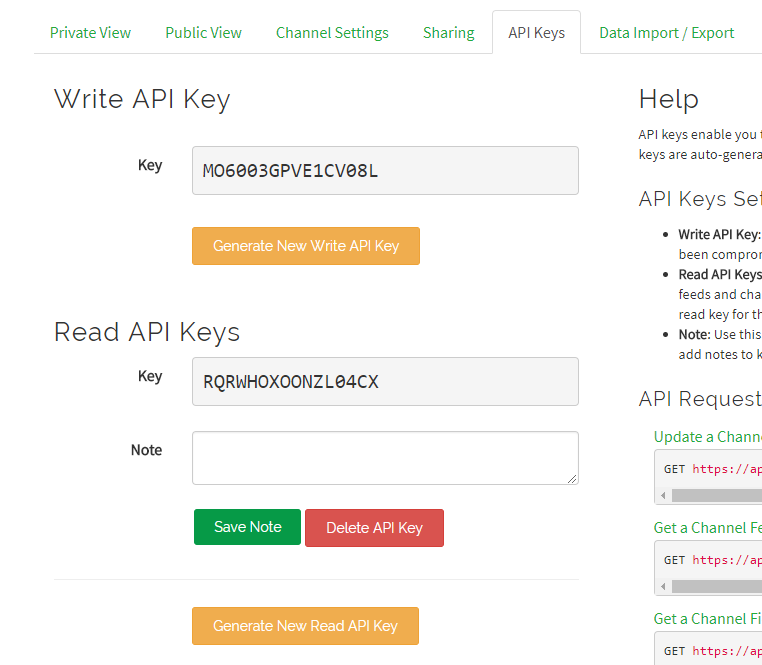
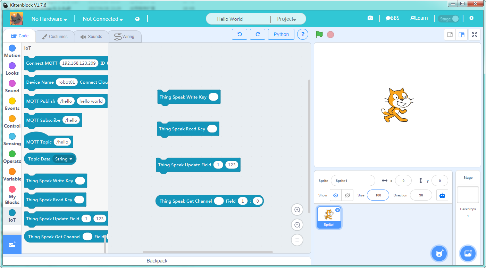
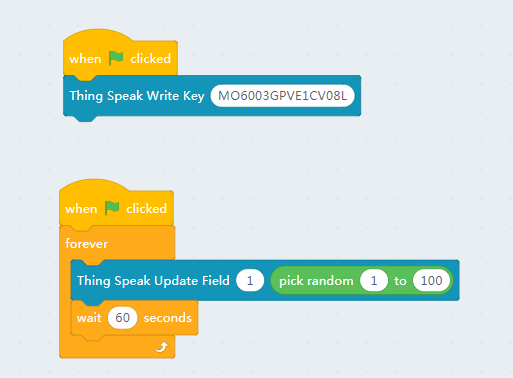
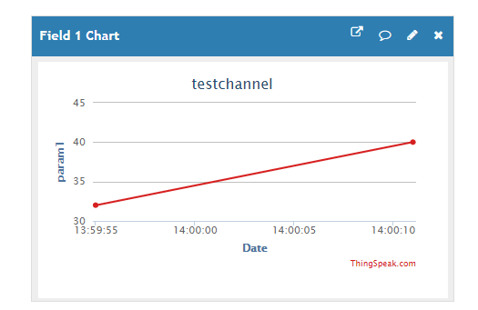

# Thing Speak使用介绍

Kittenblock 1.76版本加上了由开发了Matlab的大名鼎鼎Mathwork开发的Thing speak接口。

目前支持直接在Kittenblock内的IOT模块上报和读取数据。

## Thing Speak 注册

Thingspeak账号的注册激活大家请执行前往他们的网站完成

[https://thingspeak.com](https://thingspeak.com)

注册完成后可以新建一个channel，channel用来收集数据并提供接口做进一步的处理，不同的channel之间相互之间独立。

每个channel可以设置不同的field，相当于不同的参数。

注册完成后，可以打开Kittenblock，在左下角的插件面板中导入**IOT**插件

## Thing Speak 配置

打开channel的控制面板，将读写api key填入kittenblock对应的方块之中。

## Kittenblock中使用ThingSpeak模块

这里以最基本的读写操作为例子，写模块需要我们首先设置API key，只要程序初始化的时候执行一次就行了。

写模块的field中的序号对应我们channel中设置的参数序号，大家可以在channel setting中查看

我们随机发送一些数字到thing speak的服务器，注意发送频率有限制，默认是60s。

回到thing speak的控制台我们就可以看到刚刚上发的数据了：

读取操作类似，唯一区别是如果你将你的chennel设置为公开模式，可以不用设置读取api key，还需要设置正确的channel ID。

这里我们的channel id是546917，大家可以在浏览器地址中找到，或者前往channel view查看id号码。

读取框的最后一个参数是目标field数据的序号，具体取决于你有多少数据。

## Arduino 支持

目前我们的wifi模块固件还在改版中，所以目前不能下载到arduino主板并上报的服务器上。

