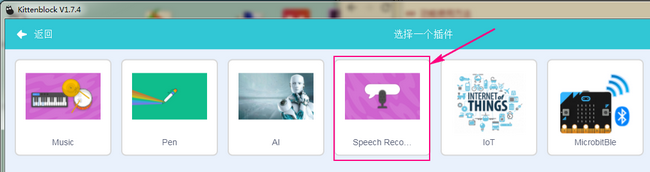

# 让Microbit听说英文  

在kittenblock 1.74版本中小喵家工程师挖掘了让Microbit开口说话和听话（英文语音识别）的功能，特别是小bit开口说话，相信这对于大家来说真的趣味十足！ 
    
## 英文语音识别功能使用方法   

**麦克风调试** 
  
首先确保你的麦克风是可以使用的，测试方法开始-所有程序-附件-麦克风，录制一段看看是否有声音。 

  
  
**使用步骤**  
  
1.调出语音识别插件  

  
   
  
  
2.可以看到左下角多出了Google Speech插件包  
  
   
   
3.简单介绍功能块的使用方法 

   
  
   
   
  
## Microbit开口说英文功能操作方法  
这个功能可是咱们喵家特有的，在其他软件上若不是使用python另外编程是没人实现的哦~现在小喵就将这些黑科技全都献给喵迷们，希望你们能与小喵一同走下去，你们正是小喵坚持不断创新的动力！  
  
 
**音响设备接线**  
  
   
  
   
  
   
  
**当然，带电源USB线的耳机也是完全可以的，与上面音响的接线一样**   
  
**使用步骤**    
  
在MicroBit插件包里找到，如果按照上述接线没错，直接拉出来就可以用了

   
 
## 综合示例  
  
**将小bit的听说功能结合起来实现一个互动功能**  
    
   
  
是不是很简单又很有趣呢？还有小bit那奇特的发声简直不要太搞笑了哈哈。玩起来吧，期待你有更有趣的玩法，比如给他更复杂的逻辑完成AI对话形式和各种控制,唱歌又未尝不可呢~  
  
  
如果操作不成功，请检查：   
    
- 检查接线是否正确   
- Microbit是否更新固件 
- 是否按了复位键

