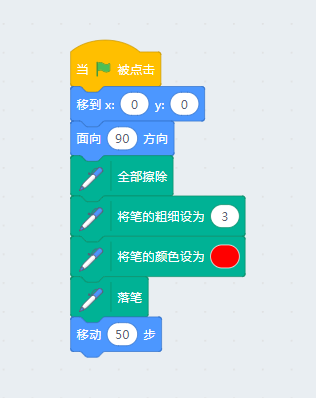
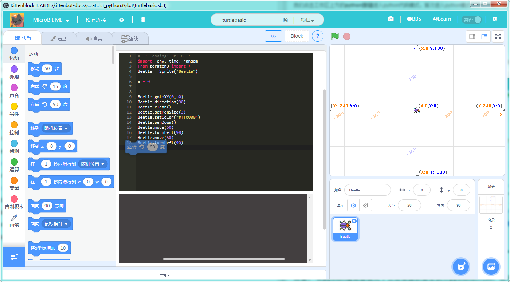
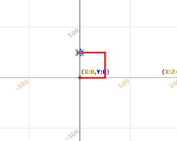

# Kittenblock中的python3

kittenblock在很早的版本迭代中就引入了python3的引擎，但是一直只是一个引擎的状态。就像我们给大家准备了一个厨房，但是没给大家对应的菜谱，而这个系列的教程就是我们Kittenblock中的python3的cookbook。

## 海龟作图的准备工作

我们打算以logo语言中最经典的海龟作图来开始我们的教程，logo语言中的海龟作图功能可以使用python全部实现并且能够有更好的效果。

但是开始前我们需要做一些准备工作，相当于给海龟作图提供一个开发的基本环境。

### 新建项目
首先新建一个空的项目，在背景菜单（backdrop）中选择数学坐标系作为背景。

由于scratch3中没有海龟的素材库，我们就用一个小bug甲虫代替海龟，这样我们的项目就变成了bug作图了：）

- 将默认的猫咪精灵删除
- 在精灵库中找到bettle并添加
- 并且在精灵设置选项中将bug的比例调节到20%，位置设置到x=0，y=0
- 由于我们使用了作图的功能，我们需要从扩展插件中添加画笔（pen）插件
- 将项目保存为turtlebasic.sb3

我们的初始项目效果如下：

## 第一个图形化的绘图程序

我们先拖入如下的图形化程序

接下来讲解一下每个方块的用意：

- 前两个方块是保证bug的初始位置和朝向，因为我们程序重复调试可能让bug处在一些奇怪的位置和朝向
- 接下来我们将舞台清除，保存我们每次开始都是一张崭新的画布
- 之后设置笔的大小和颜色，大家可以根据自己的喜好调整
- 从落笔开始每次小bug移动的过程中都会留下对应的轨迹，这就是海龟绘图的核心思想

我们点击舞台上的绿旗帜并执行上述代码，大家可以看看效果

## 将图形化方块转换成python并重新执行

我们点击工作区上方的**python按钮**进入python代码模式，首次进入python模式会自动将图形化方块转换成python代码。

后续需要大家自行点击**</>**这个按钮进行转换，因为这个操作会覆盖掉你python编辑区的劳动成果。

大家可以点击绿色的旗帜启动python程序

### 注意： 在python编辑器模式下点击绿旗帜都是执行python的代码，而不是原本舞台的代码

但是好像跟之前图形化方块的效果一样啊。。 没关系我们可以改造下我们的程序

## 直接拖方块到python编辑区

为了方便大家学习python程序，kittenblock中可以将方块直接拖到python代码编辑器并实时生成对应的python代码，需要注意的是代码插入的位置。

我们将代码改造成如下，并重新点击绿旗帜

	# -*- coding: utf-8 -*-
	import _env, time, random
	from scratch3 import *
	Beetle = Sprite("Beetle")
	
	x = 0
	
	
	Beetle.gotoXY(0, 0)
	Beetle.direction(90)
	Beetle.clear()
	Beetle.setPenSize(3)
	Beetle.setColor("#ff0000")
	Beetle.penDown()
	Beetle.move(50)
	Beetle.turnLeft(90)
	Beetle.move(50)
	Beetle.turnLeft(90)
	Beetle.move(50)

最后大家记得保存程序，那么我的python代码到底保存到哪里去了呢？

其实每一个sb3文件都是一个压缩包，大家可以把后缀名从.sb3改为.zip，用系统的解压工具打开就可以看到里面的东西。而你刚刚写的python代码就保存为**stagepy.py**这个文件中。

好了，这节就到这里结束，其实目的是大家对kittenblock的python3环境有个大致的了解。下一节开始我们会循序渐进地详细讲解海龟作图。