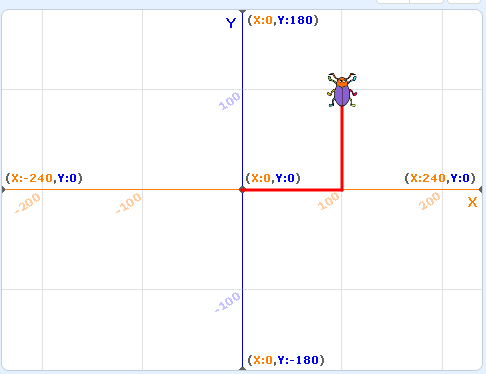

# 基础绘图

## LOGO语言

Logo语言跟scratch一样，来自于美国麻省理工学院。它的初衷是教会儿童基本的计算机技能和思想，但是后面随着scratch的出现慢慢淡出了大家的视野。 而且logo语言并不是针对生产的语言，也就是学完它之后你并不能直接将它应用到实际工作中，而python就没有这个问题。而且经过kittenblock的整合，将python语言的特点和scratch简易上手的图形化界面很好地结合到一起，让python的代码学习变得更加有趣。

这一系列教程主要目的是向大家传授python相关的基本知识，并且结合scratch引擎得到更加直观和友好的表现。因此大部分时间是鼓励大家使用python代码进行编辑，当然图形化方块也能完成系列教程中的大部分功能。

## 让bug动起来

我们重新打开上一节的示例项目，程序最后一行penDown就为整个海龟作图的环境做好了准备，并且在其移动的路径中留下画笔的轨迹。

	# -*- coding: utf-8 -*-
	import _env, time, random
	from scratch3 import *
	Beetle = Sprite("Beetle")
	
	x = 0
	
	
	Beetle.gotoXY(0, 0)
	Beetle.direction(90)
	Beetle.clear()
	Beetle.setPenSize(3)
	Beetle.setColor("#ff0000")
	Beetle.penDown()

在左侧的运动目录中有各种各样的运动控制方块，理论上任意运动方式都会留下其对应的轨迹。

我们从左侧拖一个**移动10步**的方块到python代码区域，并且将其中的10改为100

	Beetle.move(100)

点击绿旗帜后可以看到bug精准的停在了x=100的坐标轴上：

整个scratch的舞台大小是宽480个像素，也就是x轴最大运动范围是-240到240。舞台高360像素，运动范围就是-180到180。

### 让bug转弯

除了让bug直线前进，我们还可以让bug转弯。从左侧拖一个**左转15度**的方块到python代码区，并将参数改为90度。之后让它继续前进

	Beetle.move(100)
	Beetle.turnLeft(90)
	Beetle.move(100)

### 让bug写字

我们学会了移动和转弯两条基本指令就可以做很多事情了，首先让bug在舞台上写一个Z字吧。

- 这里我们首先需要思考的是我们的bug初始化位置是（0，0），如果要写一个Z字需要先让它移动到（0，100）作为笔画的初始位置。
- 向前移动100个像素后我们需要让它掉头45度指向（0，0）坐标
- 根据勾股定理我们知道（100，100）到（0，0）的直线距离是141个像素
- 当bug回到了（0，0）后我们又需要让bug掉头45度并重新指向x正方向，并向前移动Z的最后一笔

完整的代码如下：

	# -*- coding: utf-8 -*-
	import _env, time, random
	from scratch3 import *
	Beetle = Sprite("Beetle")
	
	x = 0
	
	
	Beetle.gotoXY(0, 100)
	Beetle.direction(90)
	Beetle.clear()
	Beetle.setPenSize(3)
	Beetle.setColor("#ff0000")
	
	Beetle.move(100)
	Beetle.turnRight(180-45)
	Beetle.move(141)
	Beetle.turnLeft(180-45)
	Beetle.move(100)

### 坐标系与对象的思考

是不是觉得上面的过程异常麻烦呢？实际上我们一直以bug的视角来思考，如果我们以整个坐标系的视角来思考的话，实际上我们的目的变得很简单。就是让bug从（0，100）分别移动到（100，100）、（0，0）最后（100，0）这几个点.

实际上scratch3也有类似的方块实现：

大家可以将下面的方块拖到代码区，并修改相对应的参数。

	Beetle.gotoXY(0, 100)
	Beetle.direction(90)
	Beetle.clear()
	Beetle.setPenSize(3)
	Beetle.setColor("#ff0000")
	
	Beetle.gotoXY(100, 100)
	Beetle.gotoXY(0, 0)
	Beetle.gotoXY(100, 0)

看看是不是简洁了很多呢？

注意编程中大部分问题都不是唯一解，会有各种各样的实现方法。这就是算法所在的地方了，当然日常工作并不会用到很高深和生涩的算法，除非你碰到了1%的效率就有几百万上下差距的场景。

当然我们鼓励大家从开始就培养严谨的逻辑和最优实现的思维，去思考和探索怎样才可以做的更好，但是作为刚刚入门的初学者也可以不需要太在意这些细节。
