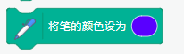
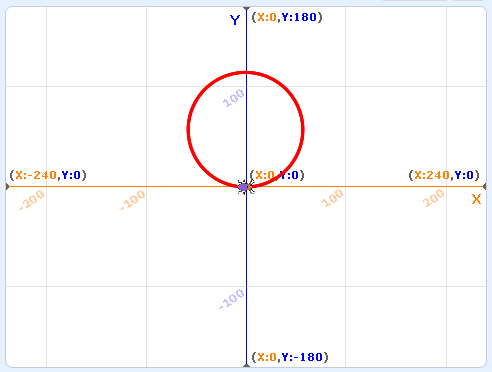
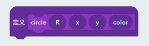
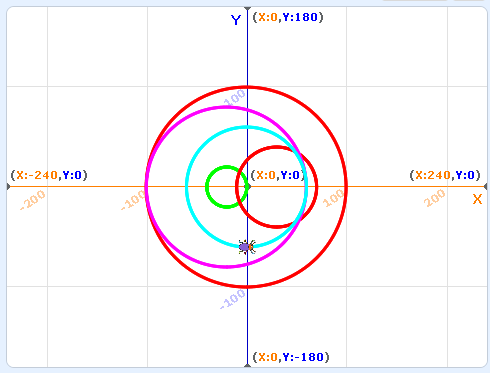

# 画笔控制

通过前面两节的学习，大家可能会感觉到实际上的编程相当于我们手握一直笔，通过各种指令控制笔的路径。

没错，我们平时写字或画画的各种操作都能够用代码实现。包括抬起笔或者落下笔，改变笔的颜色，改变笔的粗细等等。。

## 抬笔落笔的控制

我们可以在画笔的扩展插件中看到两个笔控制的方块

其对应的python代码就是：

	Beetle.penDown()
	Beetle.penUp()

通过这两个指令的组合我们可以画一条虚线：

	Beetle.penDown()
	Beetle.move(10)
	Beetle.penUp()
	Beetle.move(10)
	Beetle.penDown()
	Beetle.move(10)
	Beetle.penUp()
	Beetle.move(10)
	Beetle.penDown()
	Beetle.move(10)
	Beetle.penUp()
	Beetle.move(10)
	Beetle.penDown()
	Beetle.move(10)
	Beetle.penUp()
	Beetle.move(10)

实际上我们可以看到当画笔抬起来后我们依然可以让我们的bug移动，只不过不留下路径了。

## 改变画笔的颜色

我们当然也可以改变我们的画笔颜色

大家可以点击颜色框打开颜色选择的框框，选择好自己喜欢的颜色再拖入python编辑器，

对应的代码如下：

	Beetle.setColor("#5900ff")

其中setColor函数中的参数 **"#5900ff"**是颜色值的16进制表达，井号后面每两个字母分别对应红绿蓝三个颜色的值大小，从0到ff（0~255）。

我们改造一下上一节的Z字代码，让它画一个彩色的字母：

	Beetle.gotoXY(0, 100)
	Beetle.direction(90)
	Beetle.clear()
	Beetle.setPenSize(3)
	
	Beetle.penDown()
	Beetle.setColor("#FF0000")
	Beetle.gotoXY(100, 100)
	Beetle.setColor("#00FF00")
	Beetle.gotoXY(0, 0)
	Beetle.setColor("#0000FF")
	Beetle.gotoXY(100, 0)

大家注意观察下setColor中FF的位置变化如何控制颜色的变化。

## 改变画笔的大小

在每一笔画完之后我们将笔的大小增加5个像素。

	Beetle.gotoXY(0, 100)
	Beetle.direction(90)
	Beetle.clear()
	Beetle.setPenSize(3)
	
	Beetle.penDown()
	Beetle.setColor("#ff0000")
	Beetle.gotoXY(100, 100)
	Beetle.changePenSize(5)
	Beetle.setColor("#00FF00")
	Beetle.gotoXY(0, 0)
	Beetle.changePenSize(5)
	Beetle.setColor("#0000FF")
	Beetle.gotoXY(100, 0)

## 画一个圆

我们先从数学上来思考一个圈的属性。我们都知道一个圆有360度，如果我们每前进一步转1度，最后不就是一个圆了吗？

我们先回到图形化模式快速验证下我们的想法。

点击绿旗帜看看最后的运行结果，注意这里我们使用了循环方块。

对应的python代码如下：

	# -*- coding: utf-8 -*-
	import _env, time, random
	from scratch3 import *
	Beetle = Sprite("Beetle")
	
	x = 0
	
	
	Beetle.gotoXY(0, 0)
	Beetle.direction(90)
	Beetle.clear()
	Beetle.setPenSize(3)
	Beetle.setColor("#ff0000")
	Beetle.penDown()
	for count in range(360):
		Beetle.turnLeft(1)
		Beetle.move(1)

但是我们平时我们做算术题的时候都是使用半径和原点来定义一个圆的，这种bug作图完全没办法控制呀~

我们知道圆的周长是**2x3.14x半径**，如果我们要画一个半径为100的圆，那么每一步就应该是（2x3.14x100/360）= 1.745

我们来验证一下我们的想法，将for循环中移动的代码改造一下

并让bug一开始就处在负Y轴的（0，-100）位置

	Beetle.gotoXY(0, -100)
	Beetle.direction(90)
	Beetle.clear()
	Beetle.setPenSize(3)
	Beetle.setColor("#ff0000")
	Beetle.penDown()
	for count in range(360):
		Beetle.turnLeft(1)
		Beetle.move(2*3.14*100/360)

大家看看最终效果是不是一个圆心就在（0，0），半径为100的圆呢？

## 函数化

我们上面画了一个完美的圆圈，但是我想让我们的代码更加通用，可以在任意位置，任意半径画圈圈，最好还可以改变颜色。。

这时候就需要祭出python的函数功能了。

如果对python函数不熟悉的同学可以先用scratch3的自定义函数上手，我们点击**自制积木->制作新的积木**

之后定义一个具有四个输入参数的积木，分别对应圆的半径，原点x，原点y，颜色。

这里我们首先用图形化方块描述这个函数的功能，基本就是把我们前面画圆的代码重新使用输入参数抽象化：

之后转到python代码编辑器，注意点击**</>**按钮重新生成python代码：

	# -*- coding: utf-8 -*-
	import _env, time, random
	from scratch3 import *
	Beetle = Sprite("Beetle")
	
	x = 0
	
	def circle(R, x, y, color):
		Beetle.gotoXY(x, -1 * R)
		Beetle.setColor(color)
		Beetle.penDown()
		Beetle.direction(90)
		for count in range(360):
			Beetle.turnLeft(1)
			Beetle.move((2 * (3.14 * R)) / 360)
		Beetle.penUp()
	
	
	
	Beetle.setPenSize(3)
	Beetle.clear()
	circle(100, 0, 0, "#ff0000")

其中`def circle(R, x, y, color):`就是python下的函数定义了，其中def就是definition的缩写，表示后面是一个函数定义。紧接着是函数的名字，括号内对应的是函数的参数。图形化只是带领大家入门，关于python函数的花式玩法有很多，大家可以参考我们另外一篇micropython系列教程或者其他python教材都有详细的阐述。

注意函数或者其他带作用域的定义均**需要以冒号结尾**，并且在下一行需要使用空格或者tab缩进。同样作用域的代码需要具有同样的缩进，不然python解释器运行的时候会报错,更糟糕的情况是完全给出错误的执行结果。

最后我们在python代码中加入随意的几个circle函数调用，并看看效果。

	circle(100, 0, 0, "#ff0000")
	circle(20, -20, 0, "#00ff00")
	circle(40, 30, 30, "#ff0000")
	circle(80, -20, 20, "#ff00ff")
	circle(60, 0, 0, "#00ffff")

