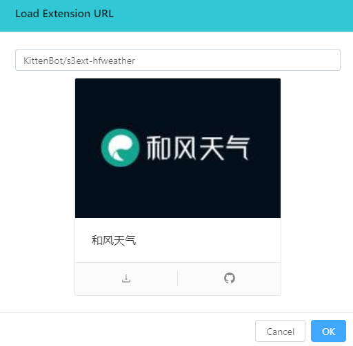
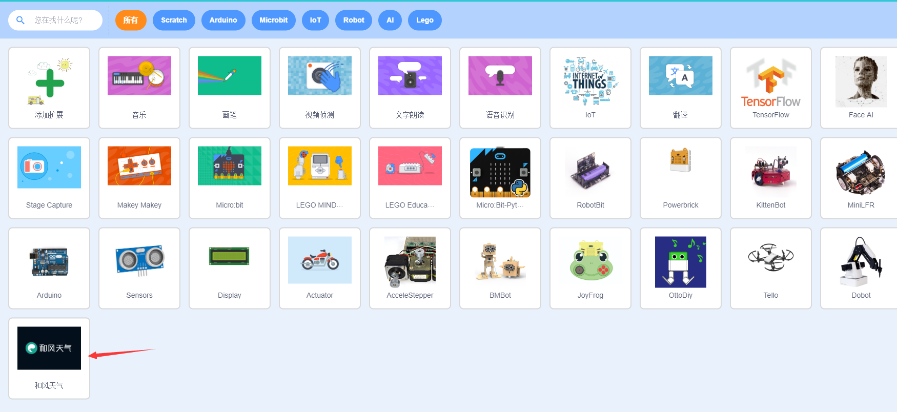

# Kittenblock加载Github插件

在kittenblock 1.83k的版本推送中我们加入了直接加载基于github仓库的插件，类似makecode的插件加载机制。

* 当大家的kittenblock在线增量更新到1.83k或以上版本后，可以在插件添加界面中点击下面这个按钮。

* 之后再弹出来的提示框中输入仓库的github地址（例如： `https://github.com/KittenBot/s3ext-hfweather`），或者仓库地址简写(例如：`KittenBot/s3ext-hfweather`)

  

* 插件信息加载完成后点击卡片左下角的下载按钮就行了，插件下载会在后台执行，下载完成后会自动重启kittenblock

* 重启完成后就可以在左下角看到插件的图标了，剩下的就跟其他内置插件使用方式一样了~

PS：插件实际上下载到kittenblock的用户文件，windows下一般是`C:\Users\用户名\AppData\Roaming\Kittenblock\extensions`

