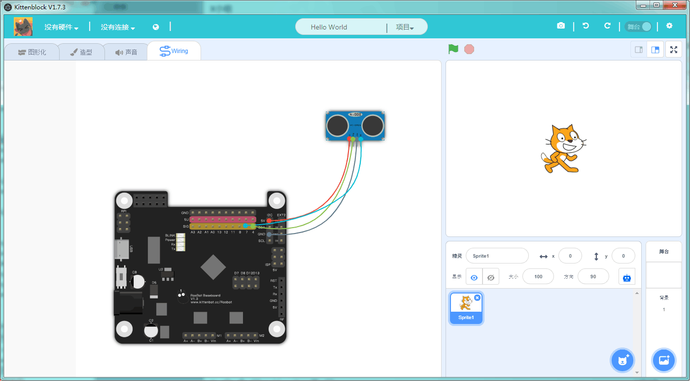
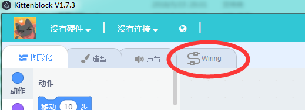
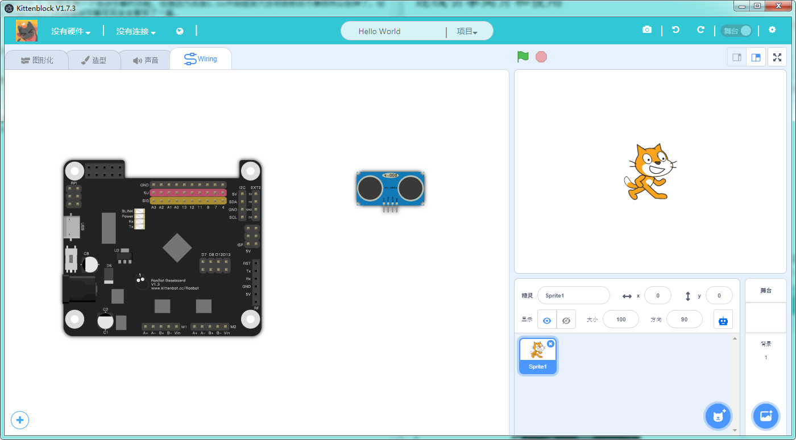
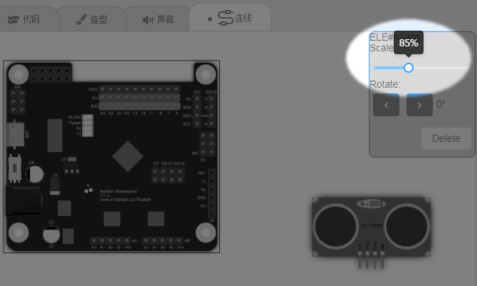
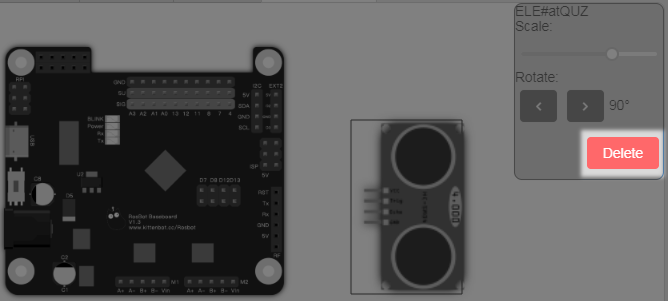
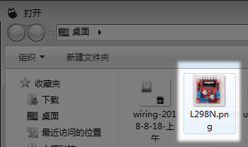
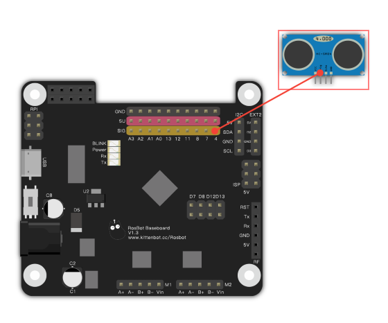
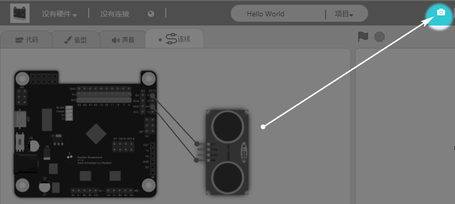

# 连线引擎简介和使用

前言：

小喵家早期的天使用户可能知道在kittenblock 1.4x版本有一个连线引擎的功能，但是因为后面1.5x开始框架大改导致前后不兼容所以删掉了。但是随着现在软件慢慢稳定下来，我们在1.73迭代花了3天将连线引擎完完全全重写了一遍。1.77版本后又被PMCC喵强烈要求改进了

## 连线引擎基本使用介绍

Kittenblock是一个专注于硬件编程的平台，但是硬件编程少不了连线的步骤，Kittenblock内的连线引擎设计的初衷就是多少简化这个步骤，给用户更加直观的电路连接的概念。

如果只是为了做个可沟通交流容易修改的连线图，那么喵家的这个连线引擎就非常合适。它没有Fritzing一定是svg图条条框框定义引脚，它没有PS那种门槛专业要求。

特色：

1. 使用简单，容易上手，导入图片后，进行连线即可，无需设置
1. 包容开放，除了内置喵家常用电子模块，还支持用户导入其他家模块图片
1. 可编辑性，连线是根据软件坐标点计算的，所以其他用户打开后，这个连线图依然是可编辑的。
1. 可保存PNG，为了方便各位老师写书，右上角的截图图标可以将连线区域截图下来存成png用作其他用途。

## 具体使用

### 打开软件，点开连线标签

### 打开喵家电子模块库

### 选择需要的电子模块

这里以rosbot和SR04超声波为例，打开库后，直接点选

### 可对图片进行移动，缩放，旋转

放大缩小

正转，反转角度

选中某个图片，删除

### 添加其他家模块图片

加载：

选择：

### 连线操作
之后我们来模拟一下连线过程，步骤基本如下：

1. 在电子模块针脚处双击鼠标，生成线路引脚点。
2. 按着引脚点可以拖动一条导线出来。
3. 在另一个引脚释放鼠标可以将两个点用导线连接起来。

### 改变颜色

当两个引脚连接上后即使我们拖动电子模块也会自动跟随更新新的位置。目前引脚和导线可以更换颜色，具体操作是先点击导线或者引脚，在右上角弹出来了一个颜色选择框点击对应颜色就可以了~

### 曲线设置
我们也可以给导线添加拐点，将连接从直线变成曲线：

- 双击某一条导线，大家应该可以看到会新增一个控制点
- 拖动控制点就可以弯曲导线了

### 输出png图

软件右上角的相机图标进行界面截图，这样就方便一些用户要进行写帖子交流或者写书需求

## 连线结果保存和打开

目前保存项目为sb3的时候自动将连线引擎的内容打包到sb3内，所有电子模块的图片也会自动打包进去。当打开这个sb3的时候，连线内容会自动重新加载进来。

由于电子模块图片是打包在sb3文件内的，即使你把文件给其他小伙伴，他们电脑中没有这个电子模块的图片也能正常打开。

目前连线引擎还处于比较雏形的阶段，有什么新的功能和需求请尽管提出来吧，就看大家脑洞有多大了 ~

   