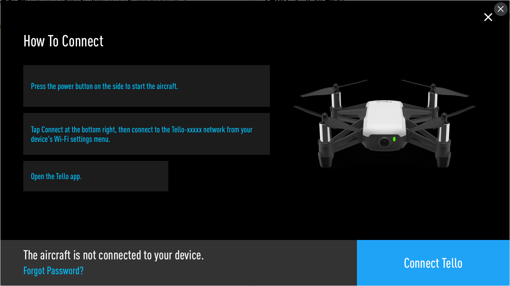

# Tello 无人机编程

在广大老师和同学的强烈要求下我们在1.73版本迭代中加入了tello无人机的支持，Tello是大疆家的，小喵没收广告费，如果你想打赏喵家，可以在淘宝店购买喵家的其他产品。

## 必要的准备工作

1. 由于Tello无人机出厂的时候不一定是最新的版本，需要用大疆tello的app将无人机固件更新到最新版本。（一般不需要操作，可以先按照往下操作，如果连接不上，再回来更新最新版本）

2. 需要一部能连接上tello热点的电脑（如台式电脑机配一个USB wifi设备器或者用一台笔记本）

3. Kittenblock更新到最新版本。

## 加载tello插件

Kittenblock最新版本，由于体积的问题，没有集成tello的插件，所以需要自己手动加载。

Tello插件连接地址：

https://github.com/KittenBot/s3ext-tello

插件加载后，软件会自动重启。

重启后，重新进入到扩展里面，可以看到Tello飞机的图标了，点击加载，即可成功加载Tello插件

## Hello Tello

1. 首先将Tello电源打开（请自行查看说明书），Tello就会产生一个wifi热点，名字就叫TelloXXXX类似的

2. 再在电脑上的无线wifi上选择连接Tello这个热点。

3. 再打开Kittenblock在硬件栏找到Tello, 在通信接口选择**192.168.10.1**，这个是固定地址不要选错了。

必须严格按照以上步骤，否则在Kittenblock中搜索不出来

要控制飞机，我们要明确地发一个控制飞机的指令。就像大家玩四轴的时候将两个遥杆向内扳一下表示我要控制你了。

这个方块要在所有的方块前面，并且每个程序只需要执行一次。

控制飞机之后就是要起飞喽~

接下来我们玩自动巡航：

几个需要注意的地方：

**飞线姿态方块中的单位都是厘米，而且都不是异步模块，需要手动加上一个合适的延时，转向的单位是度。**

整个程序的效果就是：起飞 > 转向 > 前进，如此循环4次，最后会飞回来并原地降落。

## 视频图传

由于DJI的视频流不是标准的H264格式，中间缺少了一些关键帧信息，具体也没有相关的开发SDK和文档。我们另外提供了一个小程序可以在pc上显示视频流，当然延时和效果都没有tello官方的app好。

而且将H264和ffmpeg集成到Kittenblock中会有版权风险，我们还没找到合适的方法，欢迎大家给我们意见。

视频推流目前需要下载这个软件，请先打开视频推流再开启kittenblock控制无人机编程。

[TelloDev](http://cdn.kittenbot.cn/tellodev.zip)

解压后请运行 tellodev.exe 而不是mplayer

