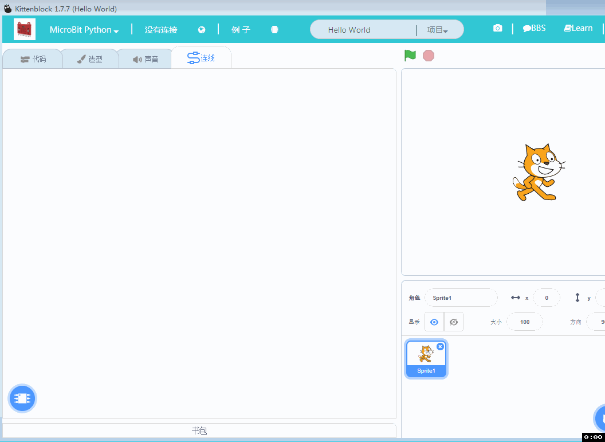
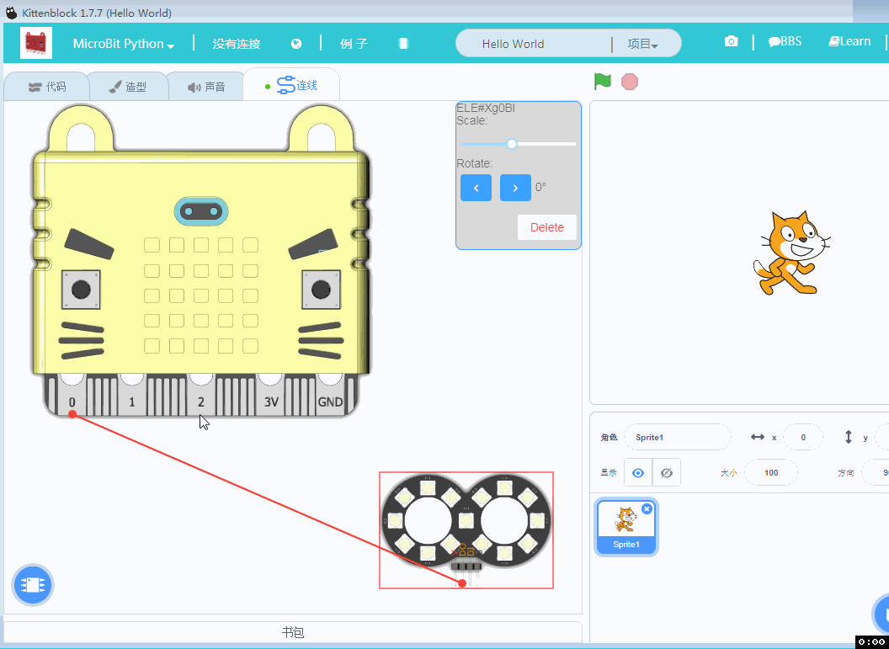
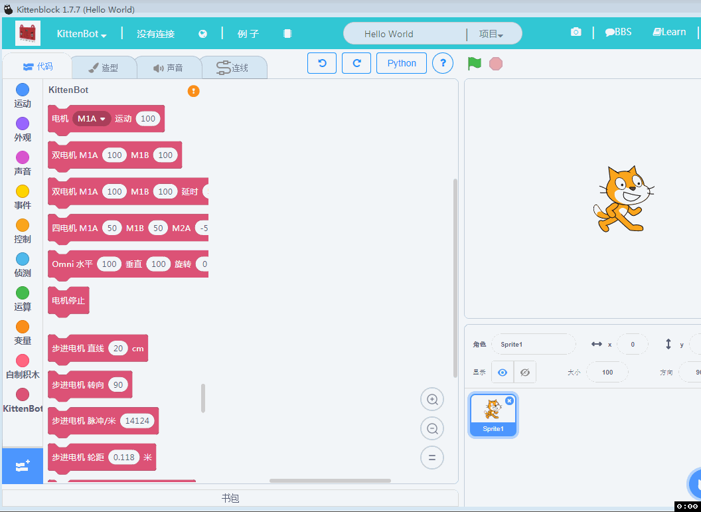
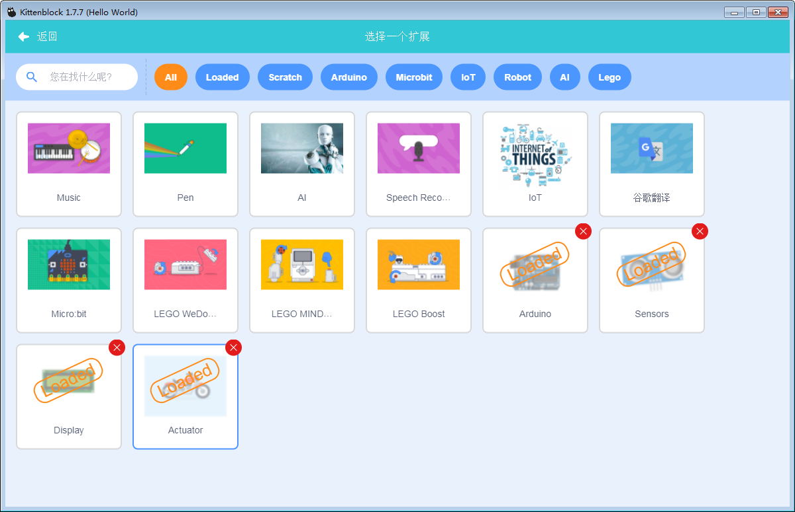
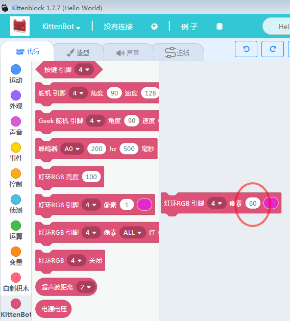

# V1.77 Kittenblock迭代说明   

更新内容如下   
重要程度和推荐程度排名分先后~

## 连线引擎改进提升   
连线引擎完整度已经很高了，非常适合普通用户对硬件接线进行示意。没有Fritzing那种条条框框限制，只需要打开喵家硬件图片或者导入其他图片，图片用线条快速连接。并且右上角还有截屏保存的功能。

### 内置喵家体系模块图片   
   

### 支持外部加载模块图片   
   

### 支持图片旋转与缩放   

   

### 标签栏中有连线标签提醒   

   

### 连线图直接保存在sb3
以后分享程序，就可以知道连线图了！再也不用再发什么说明提示了。
而且也便于大家修改与交流。

## 集成 MIT所做的Microbit   

   

### 只能使用蓝牙连接   
MIT为Microbit所做的积木块，只能使用蓝牙连接，而且只能在线跑（也就是Kittenblock软件要开着），不能离线下载到软件上。毕竟MIT的意思，就是做出来打通Microbit硬件与Scratch舞台的交互。   
   

小喵跟进时代潮流，所以推出配搭的蓝牙适配器，[购买请戳我](https://item.taobao.com/item.htm?spm=a1z10.3-c-s.w4002-17001215033.23.4df4762ezd8L0C&id=575550334097)   

### 需要烧录MIT为Microbit对应写的固件   

也就是Microbit使用蓝牙前需要提前烧录一个hex文件。   
为了方便用户，我们已经把hex文件内置到Kittenblock中的恢复固件图标。点一下就帮你恢复MIT的MICorbit固件，是不是很方便？   

   

## arduino积木块开源，另外已经开放API让用户接入自己插件   

### arduino积木块开源   

   

之前小喵这边自行修改了arduino的一些标准库，例如arduino那种常见bug，蜂鸣器与舵机一起会不行，占用同一个定时器。为了后续让大家交流之间比较好沟通，arduino积木分栏中全部回复成arduino的标准库。让大家按照标准来就好。arduino积木块图形化插件这块开源。有能力有技术的友友，可以参照这些代码进行改写，或者增加新的arduino模块。众人拾柴火焰高，有些小模块的需求，喵家实在忙不过来，授人以鱼不如授人以渔，爱好者可以自行实现，有bug喵家也会进行维护帮助。

### Kittenblock插件API开放   

   

后续用户可以根据我们所提供的开发帖子，自行加入自己的插件。喵家会一直维护好这个框架。插件API开放仅限于爱好者的学习交流，禁止用于商业用途。有商业用途需求请找我们的喵老板进行商业合作洽谈~
插件API具体使用方法，请参考Learn相关帖子。

## 硬件连接框架更改
对用户来说可能只是一个UI或者是用户习惯的改变，为了跟MIT对接与适配后面软件的发展，我们重构了软件的连接框架。大家使用的时候注意下，改变下习惯就好。

## ottoDIY插件翻译   

   

## Kittenbot灯条使用的颗数不限制

   

## 小bug的修改