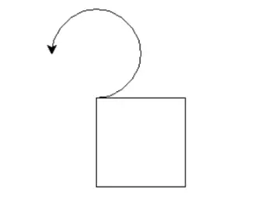
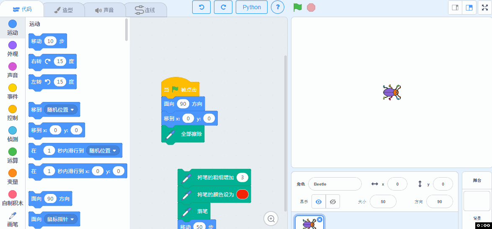
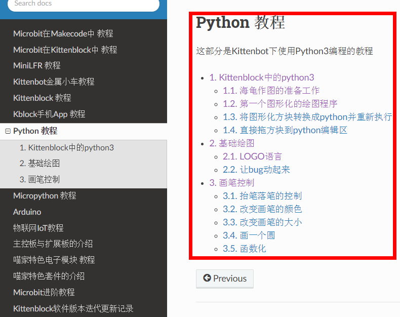
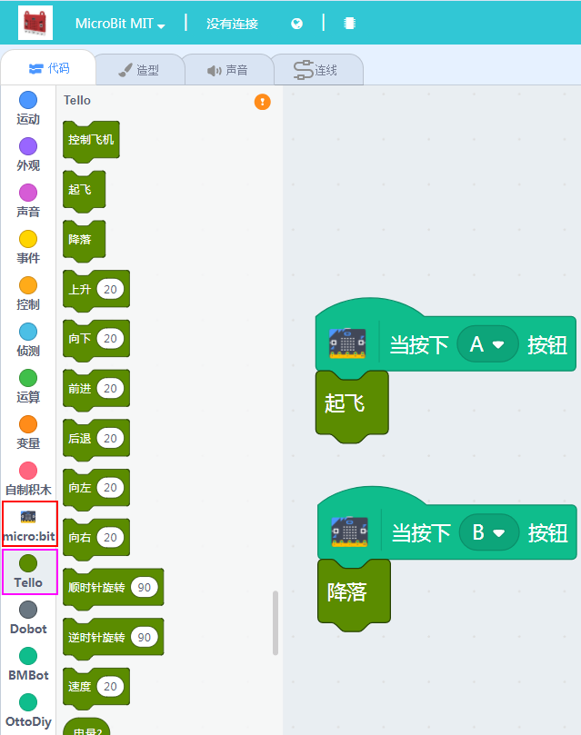
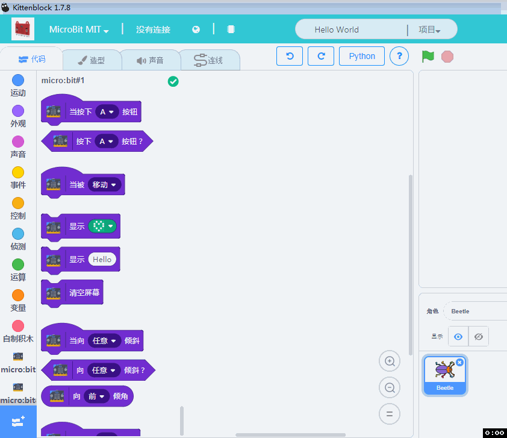
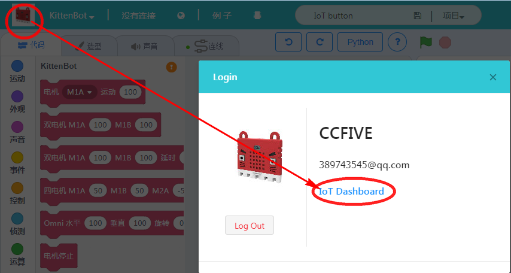

# V1.78 Kittenblock迭代说明   

更新内容如下   
重要程度和推荐程度排名分先后~

## python功能增强

### “海龟作图”   

对于一些学校缺经费，或者初级阶段不想买硬件，或者怕硬件管理麻烦，不妨试一试零硬件入门python，小喵黑科技为大家完善python这块学习。

如果之前有入门过python的朋友，肯定听过“海龟作图”。就是用python控制“海龟”来画画，它的效果是这样的：

   

咦？！海龟呢？

看下海龟作图的官方定义：在海龟作图中，我们可以编写指令让一个虚拟的（想象中的）海龟在屏幕上来回移动。
没错就是虚拟的海龟！全凭脑补！

   

对于初次接触python的中小学生，脑补真的不太好，无法引起他们的兴趣。所以我们用了具体的人物形象

所以小喵做了真·“海龟”作图，因为Scratch角色库缺了海龟，我们用个小虫子代替哈。角色形象与画笔颜色都可以由学生来定义！做出属于他们独特的海龟。这样零硬件试运行python学习，不怕硬件购买后用不上。

   

### 拖拽积木块实时转译python

对于中小学生刚刚接触python，如果让他们直接用代码控制，可能有一定难度，所以在此小喵科技做了循序渐进的，积木块转python，你还在担心学习Python的门槛高么？

   

### 首席工程师亲自上阵Scratch—python入门傻瓜教程

才不止这么一点点，[Scratch—python入门傻瓜教程](http://learn.kittenbot.cn/zh_CN/latest/scratch3_python3/index.html)，会持续更新，有兴趣的喵粉可以持续关注我们的Learn

   

## 同类硬件克隆并交互   

这期不得不隆重介绍另外一个黑科技，喵家Kittenblock正式打通多硬件交互。例如5块Microbit同时蓝牙连接在一台电脑上进行通讯。N台带喵家wifi的小车进行通讯、N台Dobot机械臂进行联动等等...充分释放用户的创意~！
我们的黑科技亮点不在于能连多少台小车或者板子，我们希望能让老师课堂互动更加有趣一些。例如两块Microbit板子连接在Kittenblock中，做一个Scratch舞台交互的赛跑游戏，这比各玩各的有趣多了。

   

## 不同硬件相互交互

很早之前有用户问过我们能不能用Microbit控制大疆小飞机Tello，相信有一部分有技术的网友，通过一些奇淫巧技成功控制起来。但是那也是一个人的狂欢。喵家一直秉承为用户提供更低门槛的软硬件。我们希望把软件做好，让用户轻而易举的，通过一个硬件电路板控制另外一个硬件电路板，释放更多的创意，而不是纠结与技术门槛中

   

   

## IoT插件更新与内置示例

IoT功能，喵家经过努力，已经非常完善，而且很好使！之前做了Makecode的IoT插件，这次又把Kittenblock的IoT插件完善了，只有你是arduino体系的（Rosbot、Uno、nano等等）都可以使用我们的IoT积木块，IoT对应的wifi模块就是喵家的wifi模块，之前已经拥有了喵家wifi模块的朋友可以自行升级到新版固件2.8支持IoT。

[wifi固件更新教程点我](http://learn.kittenbot.cn/zh_CN/latest/electronics/wifi.html)

[物联网IoT详细使用教程点我](http://learn.kittenbot.cn/zh_CN/latest/IoT/index.html)

   

接线图，请直接点开连线标签

   

软件内置IoT控制面板快速入口（你需要提前登陆，账号就是我们论坛BBS的账号）

   

进入IoT控制面板，你可以新建自己的话题，或者查看开放的话题

例如喵家做了个IoT测喵家办公室的温湿度，每隔5分钟上传一次，你可以大概看到喵家的生存环境

填入你要查看的公开话题，点击查看。这也是我们和其他家IoT不一样的地方，话题不是一串无意义的字符串，而是可以大家之间相互交流的话题了!

喵家办公室的温湿度话题分别是：

/kittenhome/temp

/kittenhome/humdity

   

## 软件其它bug修改   

例行bug修改~

