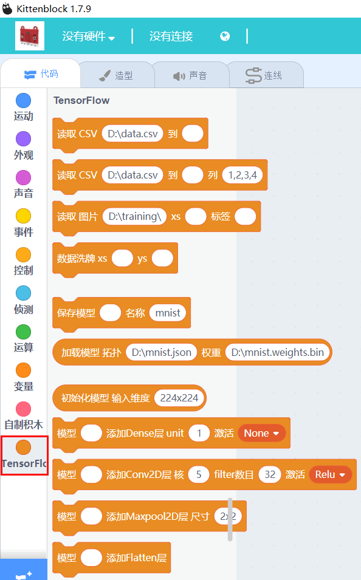

# V1.79 Kittenblock迭代说明   

## 重磅黑科技——TensorFlow

   

TensorFlow是谷歌所做的机器学习框架。特点在于——以不变应万变，只需要少量的代码就可以构建模型，通过应用模型进行扩展做出产品。
程序猿大神基本将TensorFlow挪到了Scratch上。有些友友很不解scratch貌似是小孩子玩的东西，TensorFlow貌似大神级别才能玩得转的东西，把两者结合在一起合适吗？

正因为TensorFlow让人感觉高不可攀，并且国家近年来大力提倡人工智能学习，小喵一直致力于将高大上的黑科技平民化，真正落地到实处。书籍上或者网络上也不断提供人工智能机器学习相关概念与知识。“读万卷书不如行万里路”，小喵就在Kittenblock整合了TensorFlow。让大家亲自跟着喵家的实例操作一遍，可以由浅入深理解机器学习。

相信在未来，TensorFlow有可能一元二次方程那么流行，而我们所要做的就是紧跟人工智能时代的潮流。

## Tensorflow教程奉上
有个软件，还是必须配上大家能看懂的教程。由喵家大神主刀写的[TensorFlow示例](http://learn.kittenbot.cn/zh_CN/latest/Tensorflow/index.html)。
