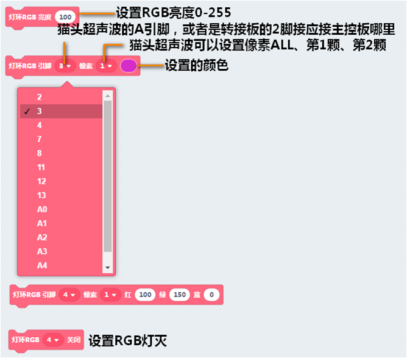
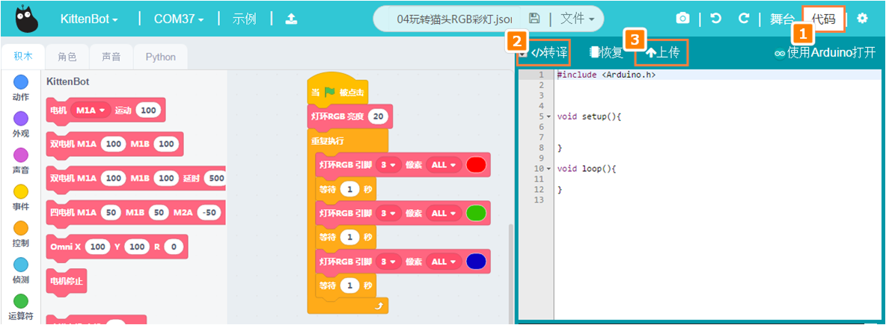
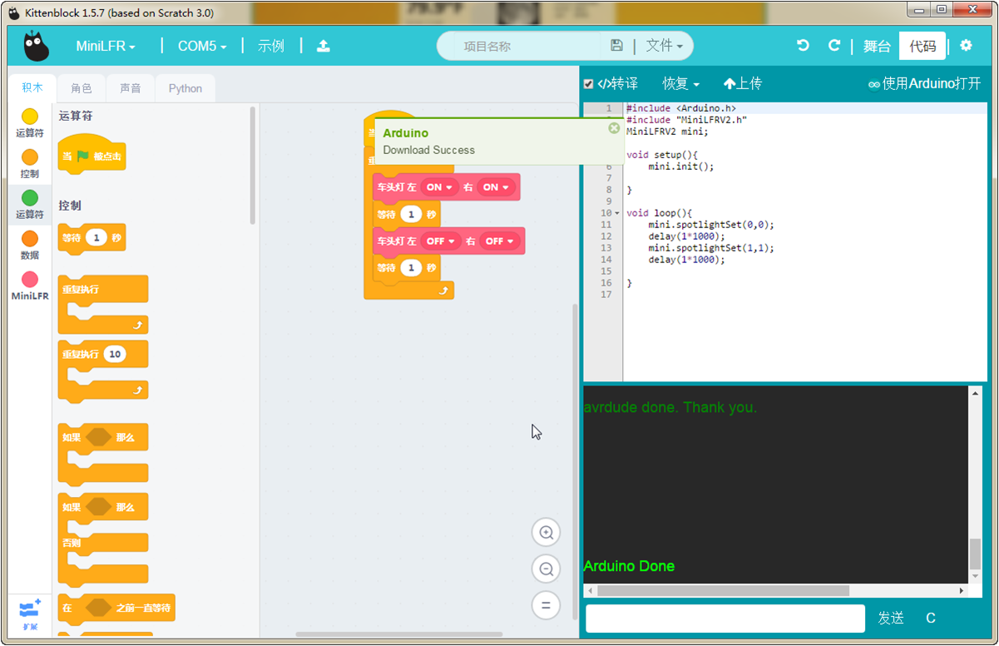
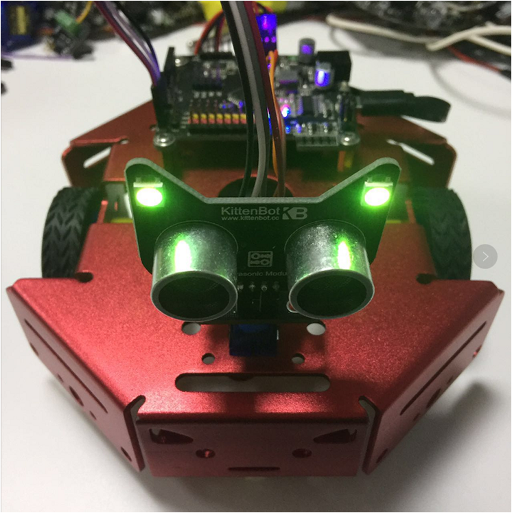

# 玩转猫头RGB彩灯

## 猫头超声波RGB硬件

## 猫头超声波接线

转接板->主控板

- V——5V
- 1——D2
- G——GND
- 2——D3

## 猫头超声波RGB积木说明

这个积木块就是控制猫头超声波RGB

## 在线模式测试

分别点积木块，可以看到猫头RGB显示的现象（保证小车已经恢复出厂固件）

所谓的在线模式，软件是必须打开，只要关闭了这个程序就是失效了。在线模式一般是用来调试的，可以快速看到编程的结果。即点就可以即运行。

另外一个是离线模式，当程序调试好了，这个时候就可以下载在电路板的芯片上，即使关闭电脑了，程序还是可以运行的。

大概测试了这个积木块的功能后，我们可以写一个猫头超声波RGB一闪一闪的程序。

## 编写猫头超声波RGB转译并下载程序

根据上图操作，把积木块拖出来，组成一个完整的程序。

**下载中**

**下载完成**

## 猫头超声波RGB一闪一闪现象

如果下载不成功，请检查：

- 板子类型是否选对？
- 是否连上COM口？
- USB线是否连接好？
- 程序是否正确？

如果以上都不能解决问题，请联系小喵科技，热诚为你服务
