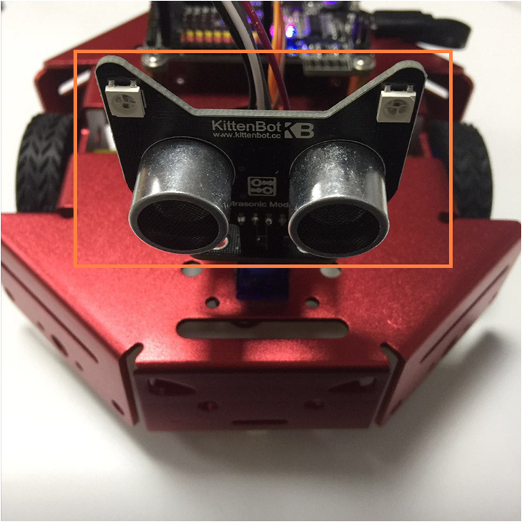
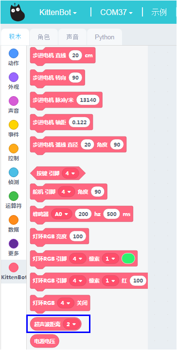

# 玩转猫头测距

## 猫头超声波测距硬件示意图

## 猫头超声波测距接线图

转接板-主控板

- V——5V
- 1——D2
- G——GND
- 2——D3

## 猫头超声波测距积木

这个积木块就是控制猫头超声波测距

## 在线模式测试

点积木块（保证小车已经恢复出厂固件!恢复出厂固件!）

可以看到超声波返回来的距离

## 编写猫头超声波测距程序转译并下载程序

根据上图操作，把积木块拖出来，组成一个完整的程序。

绿色旗子积木块是必须的！

**下载中**

**下载完成**

大概测试了这个积木块的功能后，我们可以写控制车底RBG灯的程序

## 手靠近舵机就会摇头现象

如果下载不成功，请检查：

- 板子类型是否选对？
- 是否连上COM口？
- USB线是否连接好？
- 程序是否正确？

如果以上都不能解决问题，请联系小喵科技，热诚为你服务

