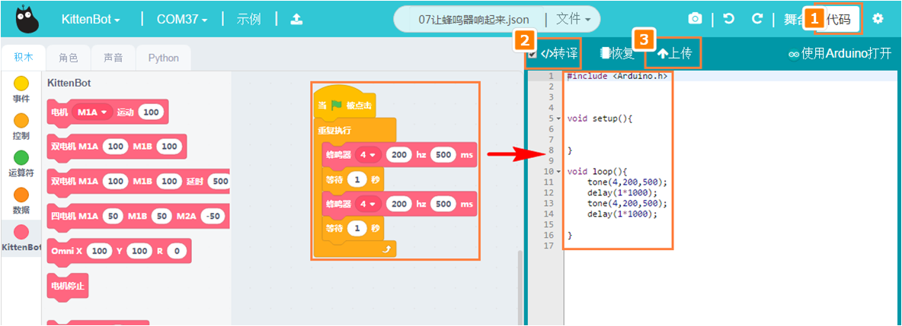
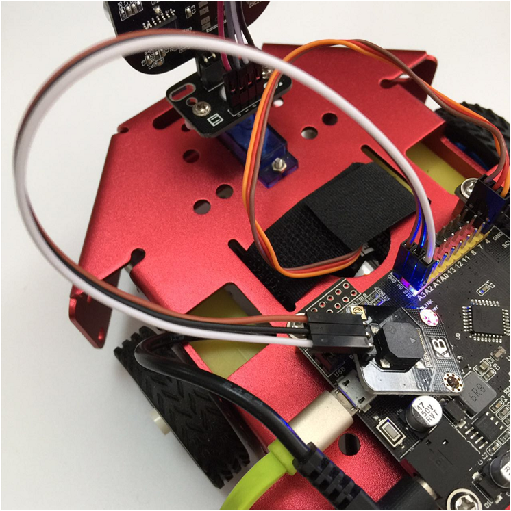

# 让蜂鸣器响起来

## 蜂鸣器硬件示意图

## 蜂鸣器积木

这个积木块就是控制蜂鸣器音调

## 蜂鸣器积木详解

把积木块拖到积木块编程区中，可以设置蜂鸣器的音调和延时，也可以编写简单的音乐

## 在线模式测试

点积木块（保证小车已经恢复出厂固件!恢复出厂固件!）

可以听到发出的音调是和积木块相对应的。现在这种模式就是在线模式，只要点积木块，就立马听到蜂鸣器发出响声。

**在线模式**

- 软件是必须打开，只要关闭了这个程序就是失效了。在线模式一般是用来调试的，可以快速看到编程的结果。即点就可以即运行。

**离线模式**

- 当程序调试好了，这个时候就可以下载在电路板的芯片上，即使关闭电脑了，程序还是可以运行的。

大概测试了这个积木块的功能后，我们可以写控制车底RBG灯的程序

## 编写蜂鸣器播放声音转译并下载程序

根据上图操作，把积木块拖出来，组成一个完整的程序。
绿色旗子积木块是必须的！

大概听到的音乐应该是，滴滴的声音

**下载中**

**下载完成**

## 蜂鸣器响的现象…好吧看不出来，脑补下

如果下载不成功，请检查：

- 板子类型是否选对？
- 是否连上COM口？
- USB线是否连接好？
- 程序是否正确？

如果以上都不能解决问题，请联系小喵科技，热诚为你服务

