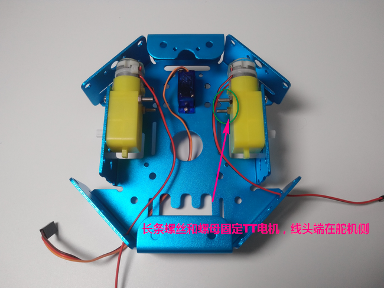
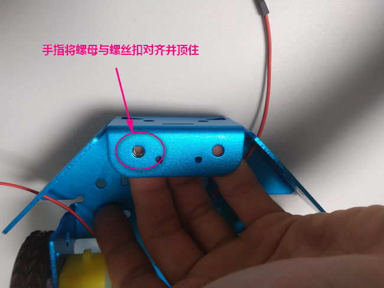
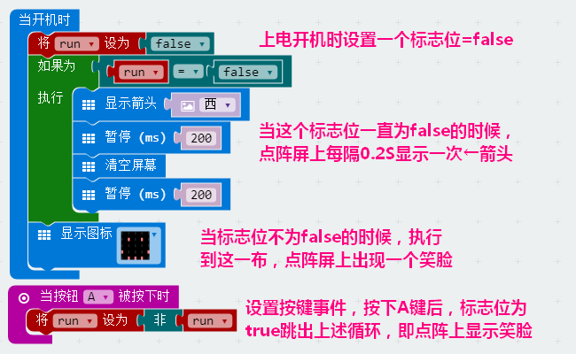
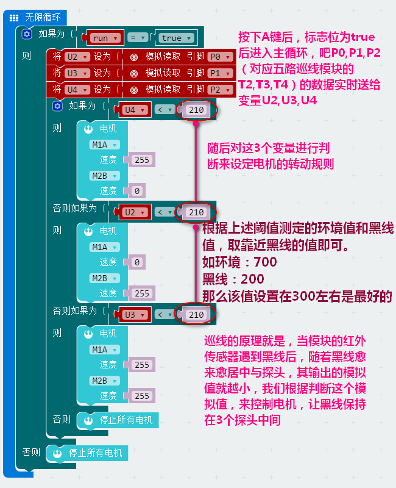
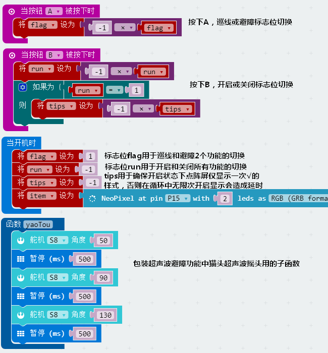
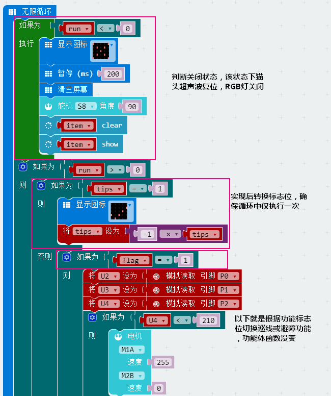
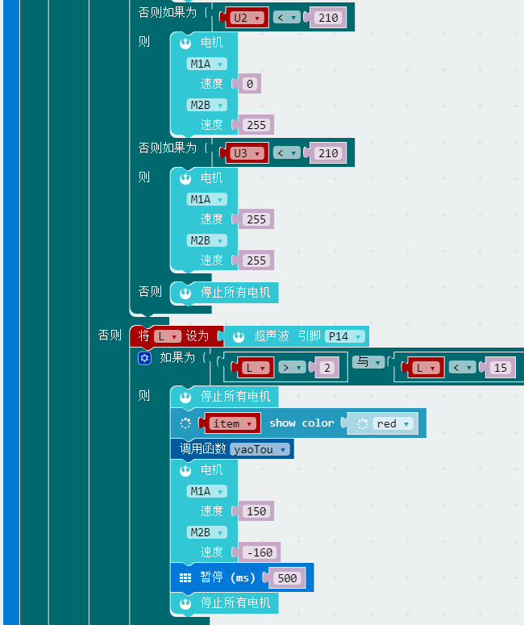

# Microbit&Robotbit巡线壁障小车说明  
  
## 适用人群 

培训机构/家长/爱好者

## 配送清单
  
- 钣金底座 x1
- 橡胶轮子 x2  
- Microbit x1
- Robotbit x1
- 18650电池 x1
- TT电机 x2
- 9g小舵机 x1
- 5路巡线模块 x1
- 猫头超声波 x1
- 转接板 x1
- 电路板支撑柱 x4
- 支撑柱螺丝 x4
- M3螺丝 若干
- M4螺丝/螺母 x2
- 万象轮 x2
- 杜邦线 若干
- 螺丝刀 x1

    
 
## 产品简介

这是一款结合避障和巡线功能于一身的小车机器人产品。对于一般人来说，他们从大学通过电子竞赛才能略微听说或接触这种应用，但那样的制作及编程模式复杂而冗余，很大程度上划出一道技术与非技术的门槛，无论是对于硬件的选择还是代码的编写都令一般有兴趣有想法的人望尘莫及。然而，Micorbit结合其拓展板Robotbit的这款巡线避障小车所使用的是图形化编程，无需大量复杂的库加载，以及小车套件的简易组装及使用程度，大大降低了上面所提到的技术门槛，让没有基础的人仅凭兴趣也可很快上手领略并玩出属于自己的智能机器人

## 产品特色

- 基于图形化编程
- 可拼装注重动手能力
- 轻松组装
- 玩法多不局限
- 锻炼编程逻辑思维
- 锻炼动手能力
- 可拓展性强

## 产品参数 
长x宽x高： 170mm x 145mm x 110mm （组装成品）

净重： 390g

毛重：根据包裹最终大小决定

## 技术参数

- 电压：5V
- 电流：1A（在板载电池的支持下）
- 8路可拓展IO口
- 4路电机、8路舵机驱动接口
- 18650-3.7V可充锂电池

## 组合过程    
  
**零件拼装**  
 
1.将9g从背面顶上来，并用舵机包里的细长螺丝和螺母固定住  

  
  
2.将固定支架卡在舵机转头上，并随即测试②，③步骤的旋转极限角度是否相同，来保证①的位置处于居中的90度
   
    

 
  
3.取下支撑架子，与转接板用螺丝固定好 
  
    
  
4.将组合好的转接板插在舵机转头上，并用舵机包里的小螺丝拧紧固定
 
   
  
5.TT马达将螺丝从外部拧上，螺母在内部固定 
  
    
  
6.装5路巡线模块小技巧
  
  
  
  
  
7.装上两颗万向轮  
  
    
  
8.Robotbit的固定准备
  
  
  
  
  
**接线**  
1.猫头超声波接线    

    
  
2.3路巡线及其他接线
  
    
  
**整品展示**   
  

## 使用环境

编程方式：Kittenblock(基于Scratch3.0)/Makecode可连接硬件：Microbit 

## 使用方法  

- 编程方式：Kittenblock(基于Scratch3.0)/Arduino/Makecode
- 兼容硬件（配合硬件，或者配套什么使用）：各种arduino传感器
- 小喵教程集合地址：learn.kittenbot.cn
- 小喵论坛地址：kittenbot.cn/bbs
- 网易云课堂：搜索小喵科技
-更多的实时讨论，请加入爱上小喵科技官方Q群：568084773
  
**3路巡线编程**    
  
  
  
  
**超声波避障编程**  
  
 
  
  
## 展示  
  
**3路巡线**   
  
   
  
**超声波避障**  
  
  
  
## 巡线避障进阶  
  
**一键开启关闭小车&一键切换巡线避障功能**  
   
  
  
  
  

## 注意事项

- 一切准备就绪后，插上电池，你需要做的第一件事情就是激活电源 
   
  
- 关于TT电机的接线，当红对+/黑对-时，程序中给定速度为正数时轮子是顺时针转，而小车向前必须是右轮顺时针，左轮逆时针，但如果想让程序如下还能保持向前走，也就是必须要让其中一个电机反接。即右轮正接，左轮反接。

  

- 如果你发现你的小车不正常，请一定重新检查你的接线是否与上述一样，以及程序的设置是否相同     

- 当使用到P0脚时，一定要将旁边的跳线帽拔掉并妥善保管，因为P0是跟蜂鸣器复用的  

如果上述提示都无法解决你的问题，请加入小喵科技QQ交流群：568084773咨询
  

  
_本产品只适用于14岁以上的儿童进行独立使用，8~14岁儿童请在家长或者老师的陪同下进行使用。
如使用前请按照小喵官方资料指导下进行使用，不要随便接插电路，切勿外接大电流舵机，大电流电机，以免烧毁电路板。
注意控制板不要置于金属表面，或者导电的物体上使用，以免短路
请避免在潮湿和有水的地方使用，以免短路
电路板或者机械上含有细小物件请不要吞食，请放在儿童接触不到的地方妥善保管_