# Robotbit绘图小车说明

## 产品名称

Robotbit绘图小车

## 适用人群

适用于培训机构作为编程思维入门案例，同时适合家庭教育启蒙及DIY爱好者。   

## 配送清单   
- 1米长usb数据线 X1   
- Robotbit扩展板 X1   
- microbit X1   
- 硅胶保护套 X1    
- 18650锂电池 X1   
- 钣金底座 X1   
- 白板笔 X1   
- 卡笔环 X1   
- 28byj步进电机 X2   
- 车轮 X2   
- 万向轮塑料件 X2   
- 钢珠 X2   
- M3X3螺丝 X4   
- M3X6塑料螺丝 X4   
- M3X10塑料单通螺栓 X4   
- 喵家螺丝刀 X1   

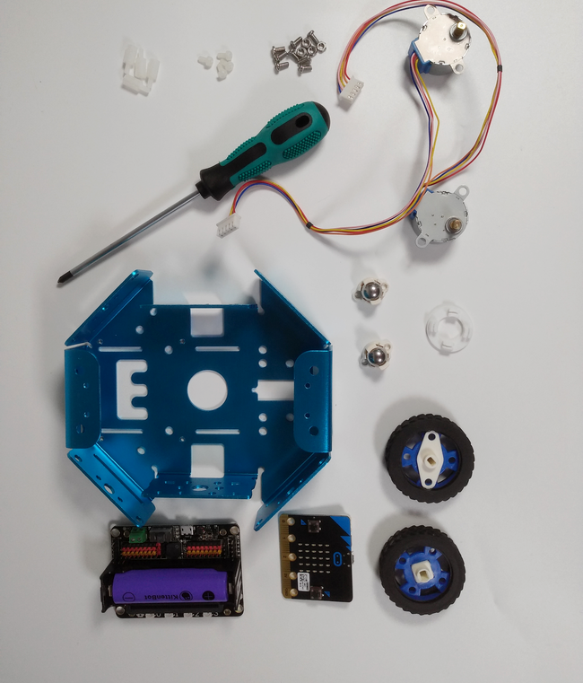

## 产品介绍   
   
它以钣金底座为基础，在两侧换上步进电机，以实现绘图小车平稳地运动，精准地绘图。前后加上夹有钢珠的万向轮塑料件，可使小车保持水平，避免小车画出来的线出现断线的情况。可以自己手动控制绘图小车行走画出自己想要的图形，也可以用kittenblock自行编辑小车行进路径画出自己想要的图形。   

   

## 产品特色   
- 基于图形化编程   
- 可用蓝牙遥控   
- 适用人群低龄化   
- 零件可替换   
- 操作简单   
   
## 产品参数   
- 长：15cm   
- 宽：14cm   
- 高:6cm   
- 净重：382g   
   
   
## 技术参数   
- 18650电池电压：3.7V   
- USB输入电压：5V   
- VM引脚最大：1A（在板载电池的支持下）   
- 绿色端子电压(外部电源输入)：5V（只支持5V输入，切勿接超5V的电压，最大电流支持3V） 

## 组合过程

1.步进电机的固定

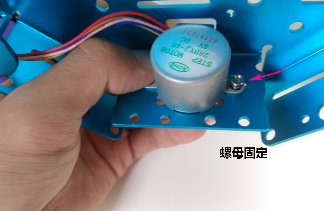

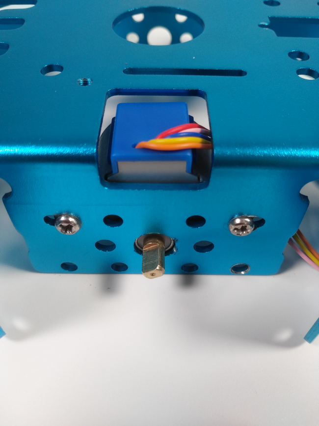

2.轮子安装

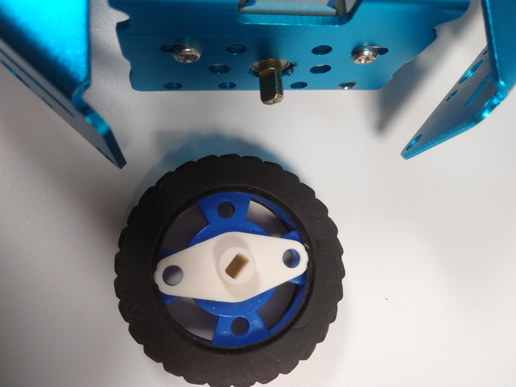

3.万向轮安装

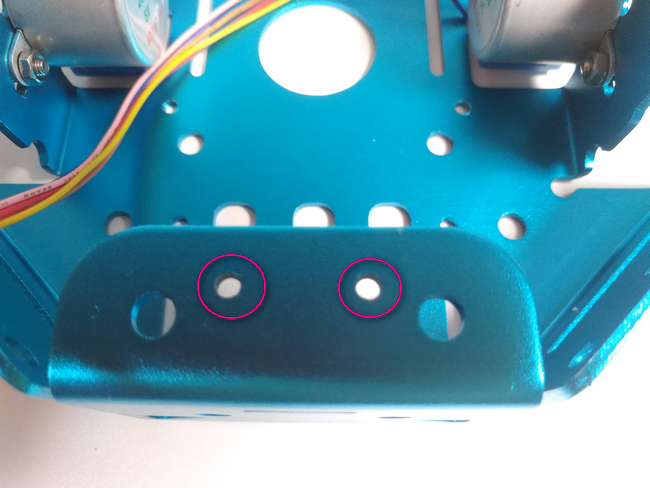

4.控制板固定

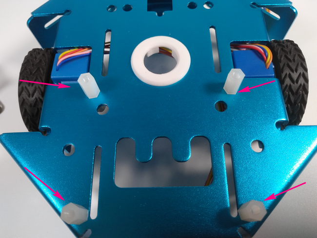

5.接着将卡笔装置压进钣金底座

__接线__

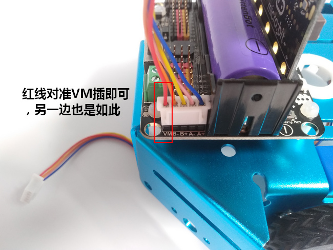

__安装好的整体__

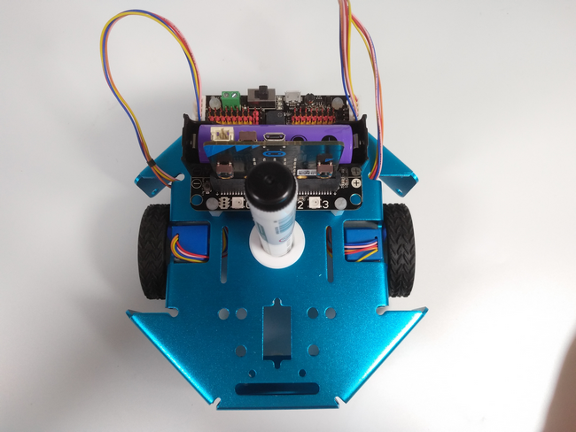

## 使用方式  
  - 可用蓝牙遥控、可用另一块microbit智能控制、可用kittenblock编程控制   
  - 编程方式：Kittenblock(基于Scratch3.0)/Arduino/Makecode   
  - 兼容硬件：猫头避障电子模块   
  - 小喵教程集合地址：learn.kittenbot.cn   
  - 小喵论坛地址：bbs.kittenbot.cn   
  - 网易云课堂：搜索小喵科技   
  - 更多的实时讨论，请加入爱上小喵科技官方Qqun: 568084773

__简单绘图小车编程__

首先导入Robotbit软件包

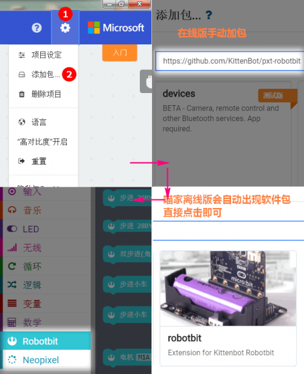

使用如图积木块对绘图小车进行编程，一般只用到最后2个

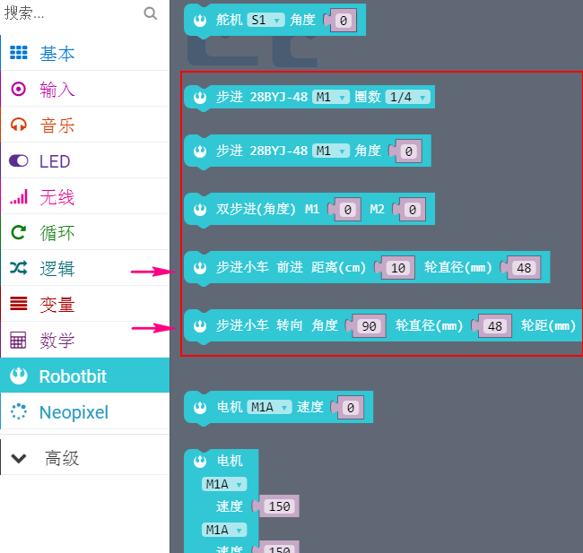

__蓝牙控制绘图小车__

1.microbit上按照如下说明按需求烧录程序

- 由于蓝牙和Robobit带RGB灯的拓展包冲突，所以使用添加如下包

_https://github.com/KittenBot/pxt-robotbitnopixel_

- 添加蓝牙包

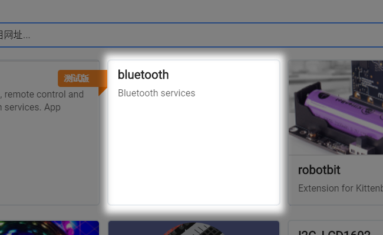

- 更改蓝牙设置（这一步很重要，关乎成败）

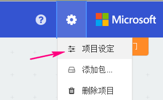
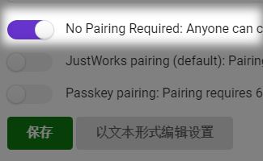

- 使用高级分栏中控制的事件积木块

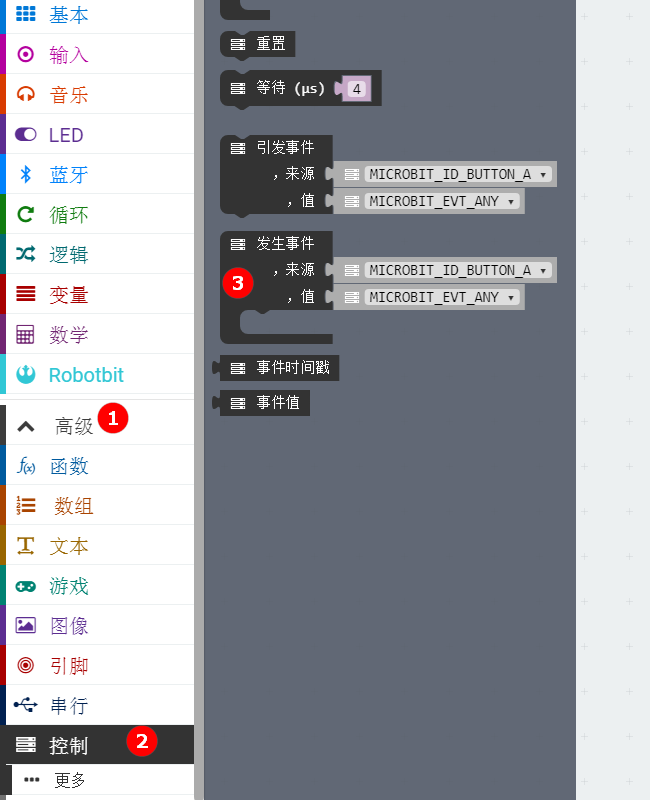

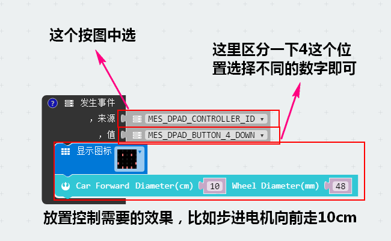

2.手机控制端在kittenblock中程序操作方法
 
- 硬件选择microbit及添加蓝牙拓展包

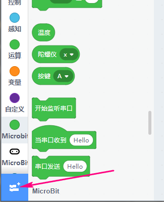
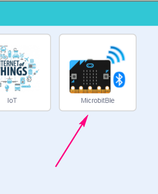

- 由于手机APP中预设的按键比较简单，上下左右，4个按钮

想要使用的话如下操作，图中当按下空格键的位置可以下拉选择其他如上下左右

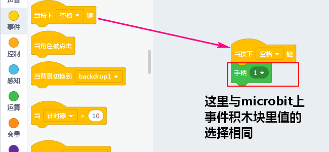

- 对于如果想要在舞台自己新建点击项目的按照如下操作

选择一个精灵，当然你可以自己设计一个，点击他们后会出现在舞台中，可以自行拖动位置

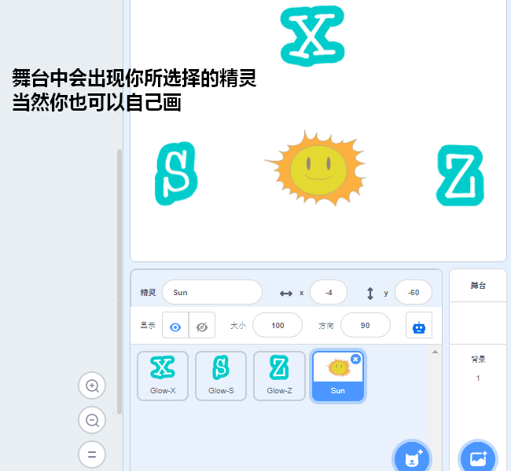

- 对每个精灵进行按键事件的匹配，分别选择这些精灵进行积木块编程

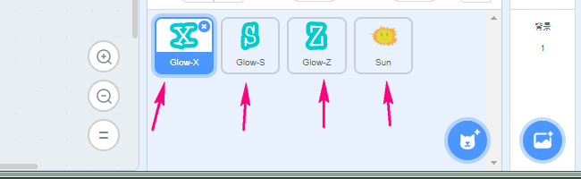

此处由于舞台中新建的称之为角色，所以我们选择当角色被点击事件

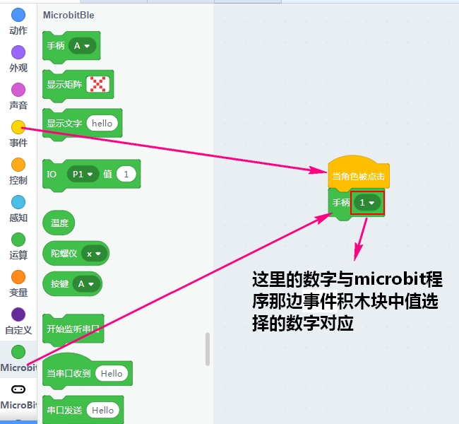

就这样给每个舞台角色都匹配好了事件后，可以扫码进手机作为控制端程序来控制microbit了

我们先打开手机app，确保蓝牙打开，首先连接microbit蓝牙

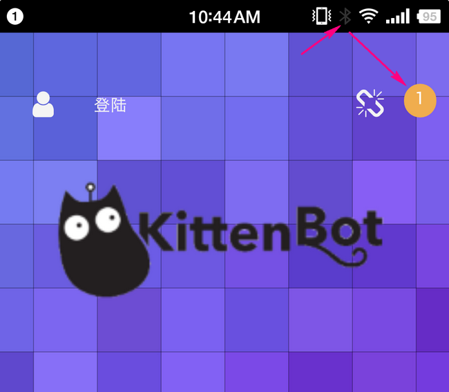

接下来确保手机和电脑在同一wifi网络下，我们将控制程序扫进app

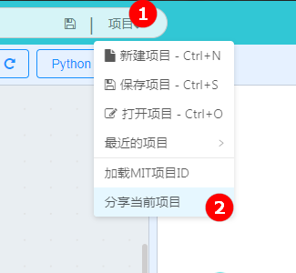

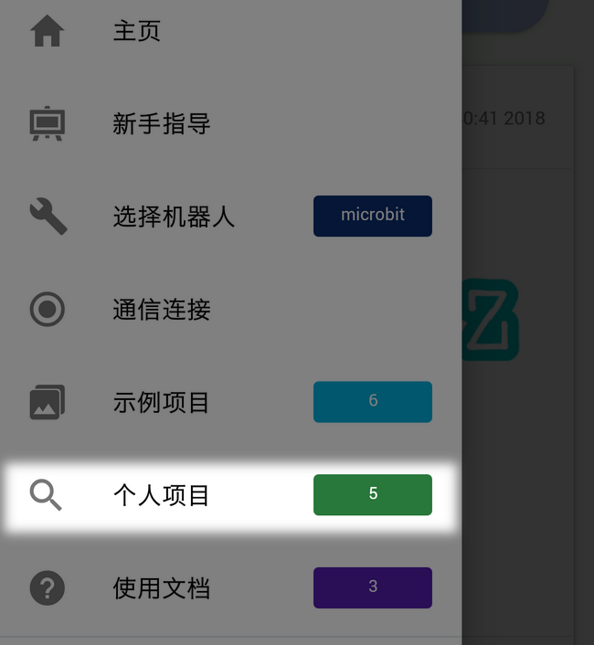

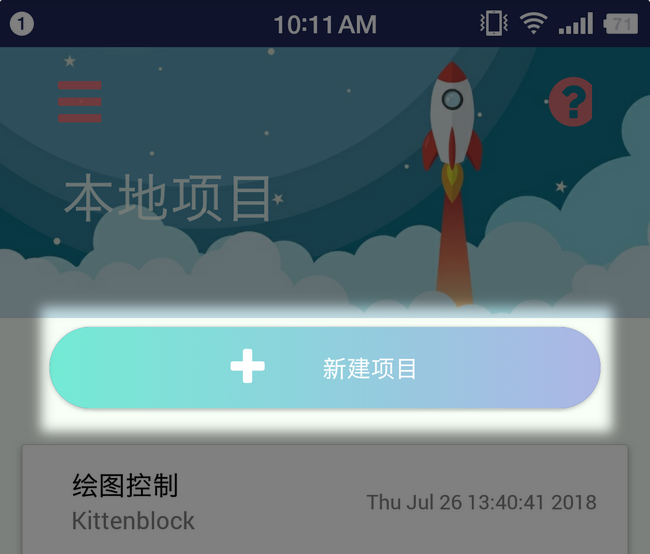

程序扫进来后我们点击SAVE并PLAY就可以加载界面了，如下，点击中间绿棋子就可以开始控制你的绘图小车了~

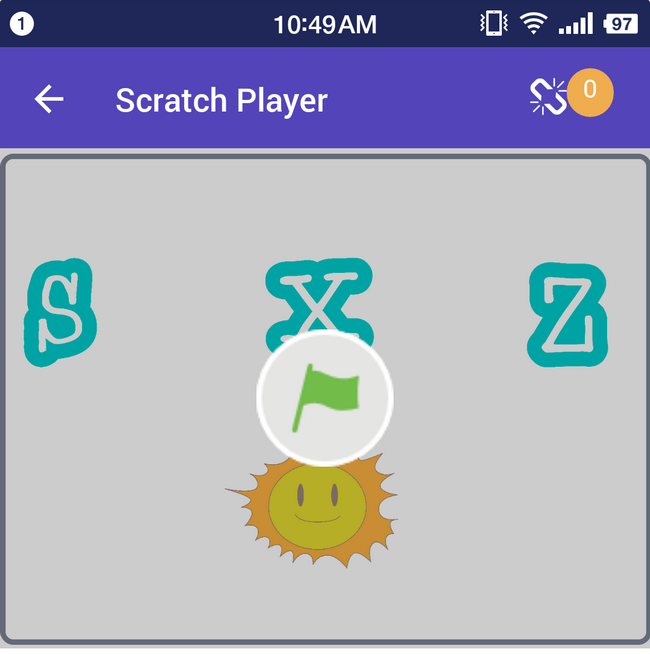

这里直接给出绘图小车及蓝牙绘图小车的示例程序以供参考：[程序入口](https://bbs.kittenbot.cn/forum.php?mod=viewthread&tid=366&extra=page%3D1)

 

## 展示

## 注意事项

- 接线别插反咯，可能会烧
- 如果app中为发现microbit蓝牙，那么请检查microbit端的hex烧录前蓝牙的项目设定选项是否与上述说明一致
- 手机扫码请确保与电脑在同一wifi网络
- kblock手机app请到小喵科技交流群下载 568084773
- kittenblock和makecode离线版请到小喵科技论坛下载[论坛](https://bbs.kittenbot.cn/forum.php?mod=forumdisplay&fid=37)

如果通过上述教程还有无法实现的部分请加入小喵科技交流群咨询：568084773

_本产品只适用于14岁以上的儿童进行独立使用，8~14岁儿童请在家长或者老师的陪同下进行使用。 
   如使用前请按照小喵官方资料指导下进行使用，不要随便接插电路，切勿外接大电流舵机，大电流电机，以免烧毁电路板。   
   注意不要在金属表面，或者导电的物体上使用，以免短路   
   请避免在潮湿和有水的地方使用，以免短路   
   电路板或者机械上含有细小物件请不要吞食，请放在儿童接触不到的地方妥善保管_   

