# 多脚兽说明  

## 材料

原装风能怪物一盒    

喵家风能怪物打印件一套   
 
MICROBIT X 1    

ROBOTBIT X1    

18650锂电池 X1  

TT马达电机（焊接好线） X2  

乐高插销 X4  

TT马达安装螺丝M3x25 X4  

自攻螺丝十字圆头带垫M2.3x8 X14  

喵家螺丝刀 X1  
 

## 组合过程

1.关键部分，此处原本相接固定，后期应剪掉凸出部分与图中保持一致  

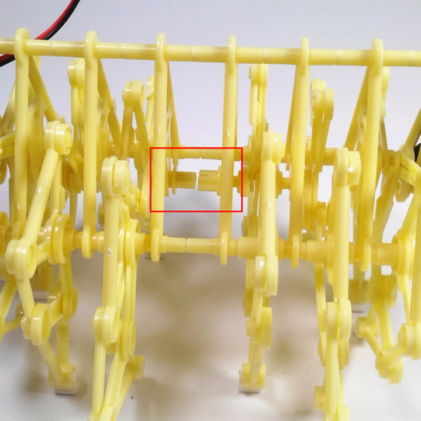   
  
2.按图组装喵家风能怪物打印件    

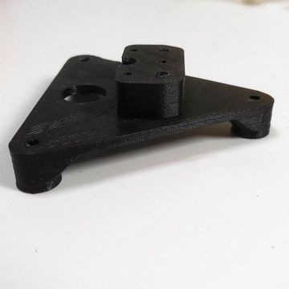
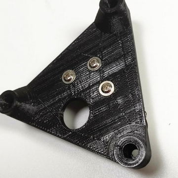 
   
3.将组装好的打印件与机械支架组合并固定    

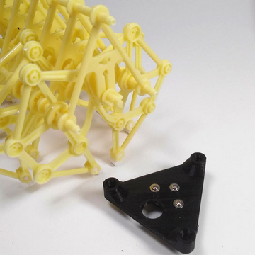
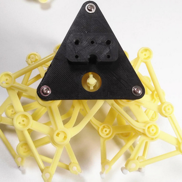   
 
4.给TT电机安装插销  

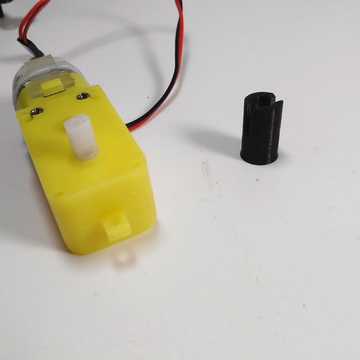
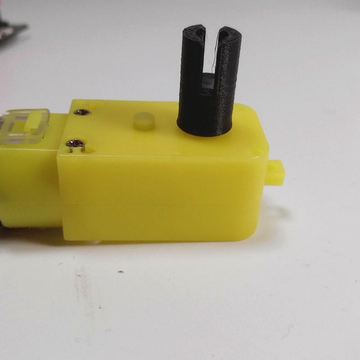   
 
5.TT电机固定到支架上  

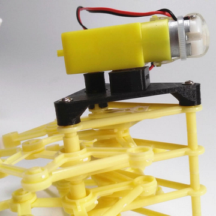
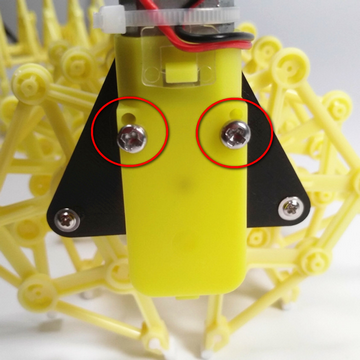    

6.LEGO插销固定到robotbit支撑台的平面一侧，支撑台卡主机械支架中心并固定  
 
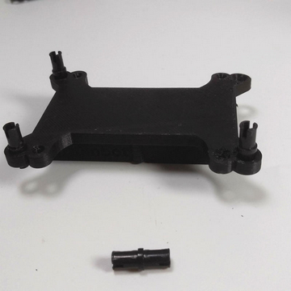
 
   
7.TT电机与Robotbit接线如图     

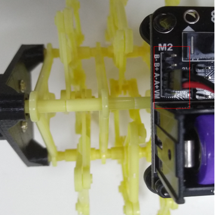
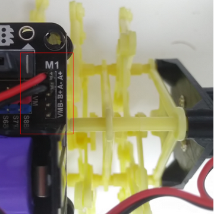  
  
8.Robotbit和支撑台的组装如图  
   
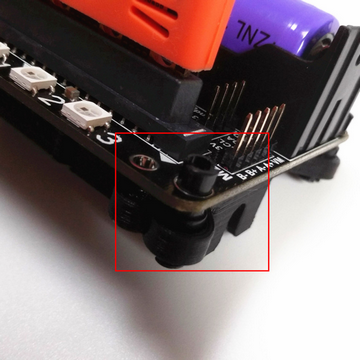  
    
9.完成——成品展示  
  
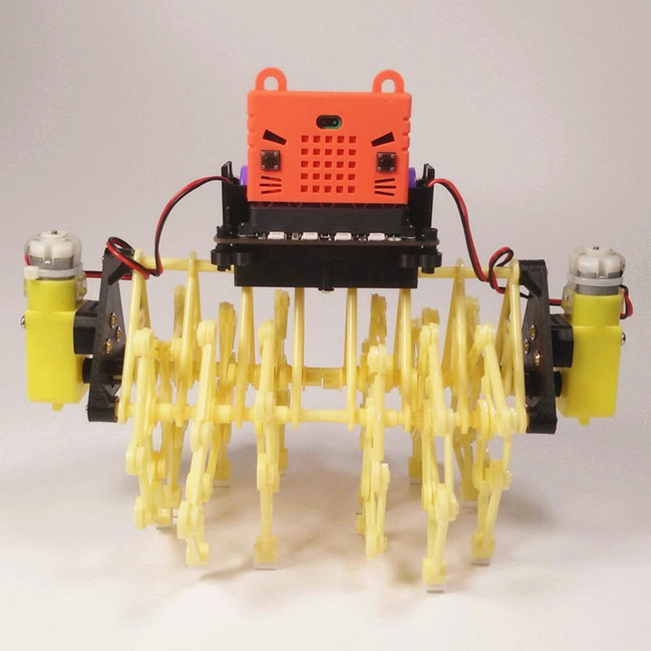    

## 编程  

以下使用的是小喵科技出品的离线版Makecode无需网络    
(Makecode+Robot:bit extension package)

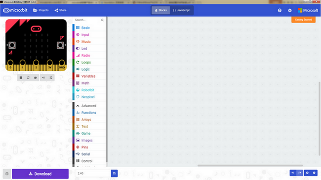

下载链接：[http://kittenbot.cn/bbs/forum.php?mod=viewthread&tid=156&extra=page%3D1](http://kittenbot.cn/bbs/forum.php?mod=viewthread&tid=156&extra=page%3D1)
    
要使用TT电机编程，需要先在Makecode上安装Robotbit插件，安装方法如下：
如图先在设置中找到添加包，找到robotbit单击即可    

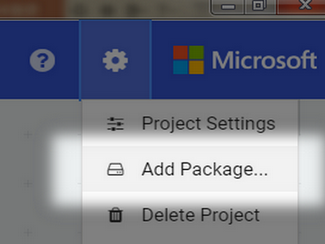 
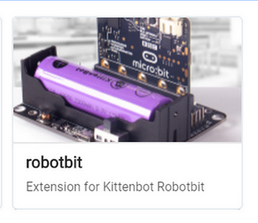  

加载完后我们可以看到2组新增的编程积木    

    

**简单的向前走**

按照上述接线图解法。从Robotbit中拉出电机积木块   
 
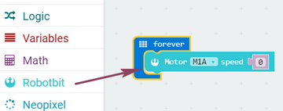    

点图中标识部分选择下拉框按如图选择   
 
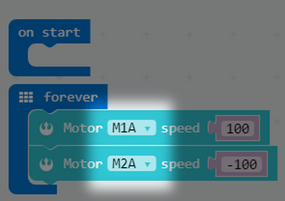  

**有趣的玩法（基于2.4G控制多脚兽运动，需要两块microbit)**  

从Radio中拉出如图所示积木块，并保持默认值1，并放置在开始执行下用以初始化    

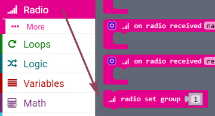
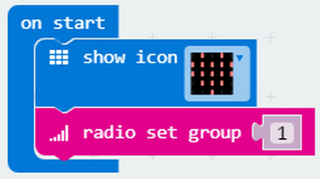     
   
分别从Input、Radio中拉出积木块并组合起来

实现效果：按下microbit上A按钮通过2.4G发送字符串A  
 

   
   
如图步骤取出积木块    

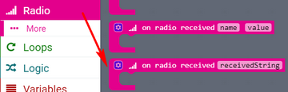
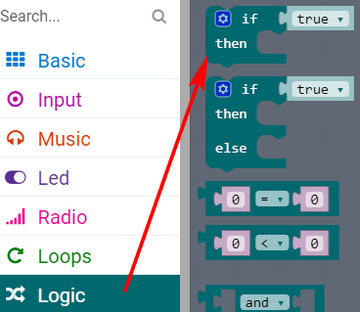
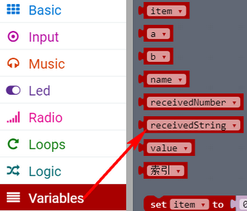
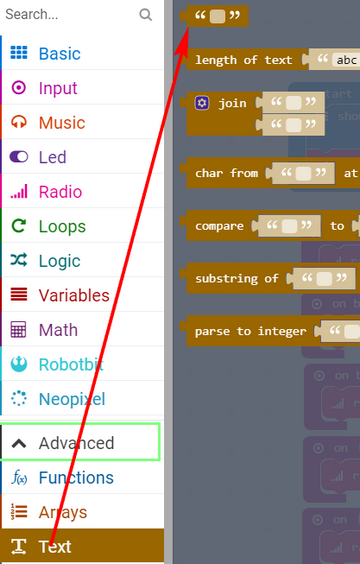    

准备好上述积木之后，配合之前已经熟悉过的电机积木块，组成如下图的程序块   

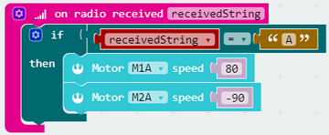    

综上，下图所示就是一个简单的2.4G控制多脚兽向前走的一个小例子    

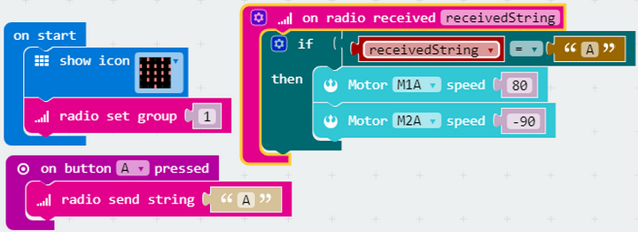    

使用上述技巧，可以拓展多个方案  
实现效果：按下A（前进）；按下B（后退）；A、B同时按下（停止）；控制端microbit左倾斜、右倾斜分别实现左转右转  
    
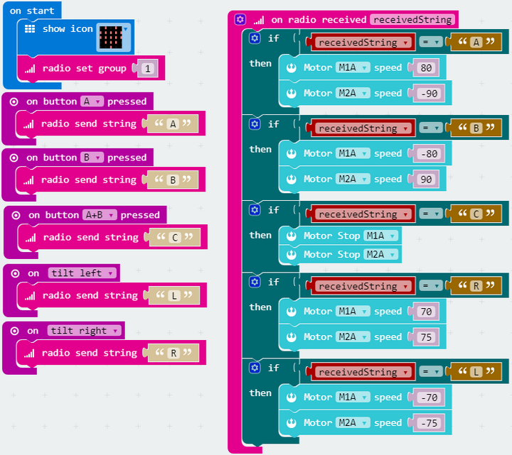    

上述程序中的倾斜事件积木块如下   

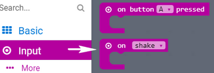
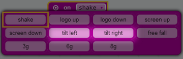    

## 展示 
  
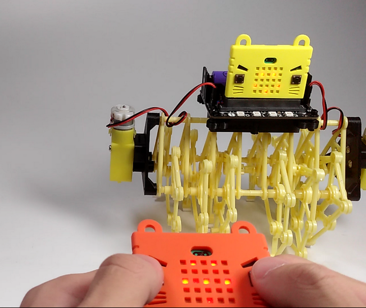    

**注：**  

- 多脚兽机械零件拼装中一定要确保两部分合并时三脚架底边中间突出部分不相连  
- TT电机接线必须按照范例，如需更改自行修改程序，请确保使用同一组接口如A+/A-  
- 电机要运动起来speed绝对值最好在50-255间，且越大越快  
- 2.4G的玩法需要两个microbit实现  
- 更多的有关资料及有趣玩法请参照：  

Robotbit：[http://kittenbot.cn/bbs/forum.php?mod=viewthread&tid=114&extra=page%3D1](http://kittenbot.cn/bbs/forum.php?mod=viewthread&tid=114&extra=page%3D1)  

Microbit： [http://kittenbot.cn/bbs/forum.php?mod=viewthread&tid=104&extra=page%3D1](http://kittenbot.cn/bbs/forum.php?mod=viewthread&tid=104&extra=page%3D1)