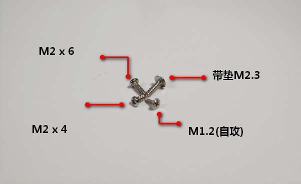
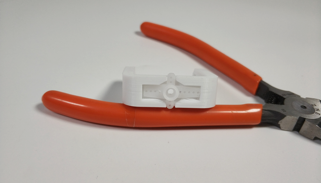
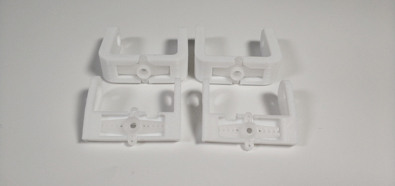
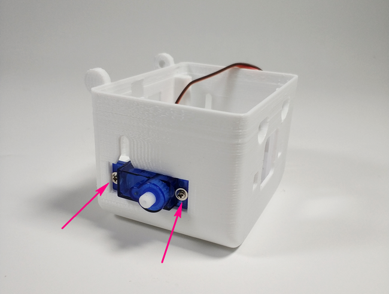
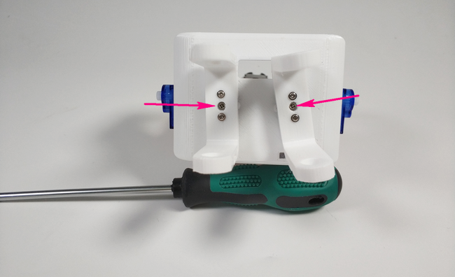
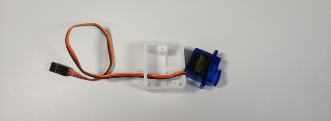
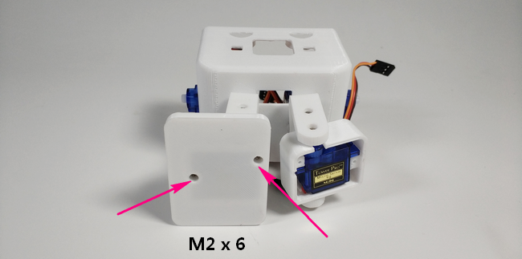
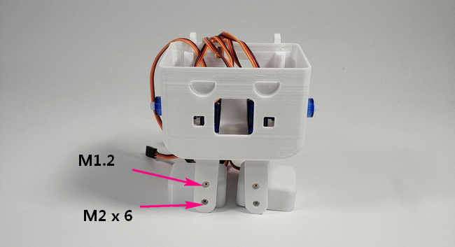
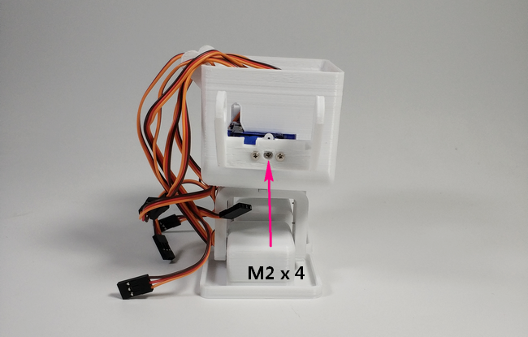

# OTTO机器人说明

## 材料

- OTTO打印件一套
- 螺丝若干
- 9g小舵机 x 8
- microbit x 2
- robotbit x 1
- 螺丝刀（大、小） x 2
 

## 组合过程

__首先写在前面的一个要点是，每个舵机的安装前应确保初始位置为90°__

1.先认识一下组装过程中需要的螺丝

2.先将舵机包里的零件取出，4个关节都按照如图剪切卡位

3.我们分别均给他们拧上M1.2自攻螺丝2颗固定

4.将4个舵机作为身体的4个主关节固定再壳子里，注意图中每个舵机均使用2颗带垫M2.3螺丝固定

5.每个舵机和支撑关节分别用1个M2 x 4的螺丝连接固定

6.脚掌的部位按照如图安装舵机

7.脚掌与腿部的连接卡位及螺丝选配如图所示

8.手臂部位的固定如图，背面固定舵机使用M1.2以及侧面积固定关节舵机也同样使用M1.2

9.手的固定跟脚的相似，最后直接卡进去就打工告成了~

10.一切准备就绪就按照就按照图中的标示接线吧

## 编程

使用makecode编程第一步按照需求导包

- 我们控制otto动起来所需要的积木块是这个

通过配合S1-S8的8个舵机按照不同角度和顺序运转最终实现OTTO的各种造型动作

这里给出一个现成的2.4G控制OTTO向前向后走的程序（针对不同的舵机安装误差角度，运动起来会稍有偏差，可以自行调整程序中数组中的数值）

[程序点这](http://kittenbot.cn/bbs/forum.php?mod=viewthread&tid=365)

__注：__

- 舵机初始角度确保90°（左右可旋角位移相等）
- 给出的程序是严格按照上述已给接线图

如果上述提示都无法解决你的问题，请加入小喵科技QQ交流群：568084773咨询

