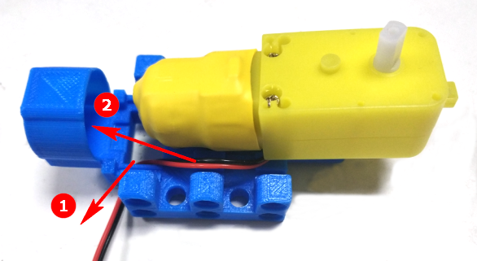
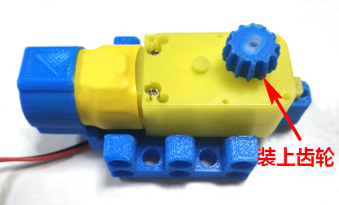
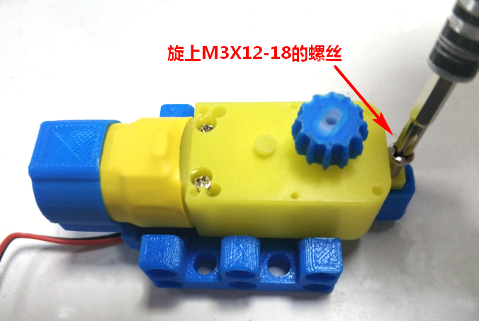
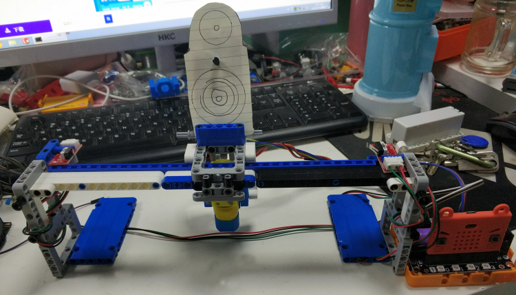
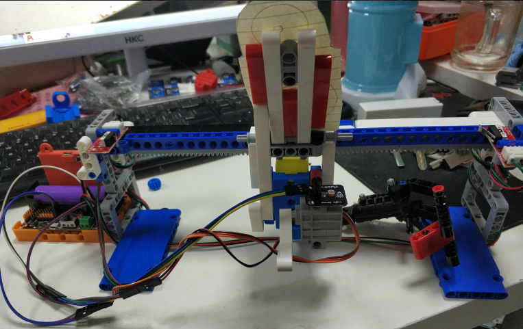
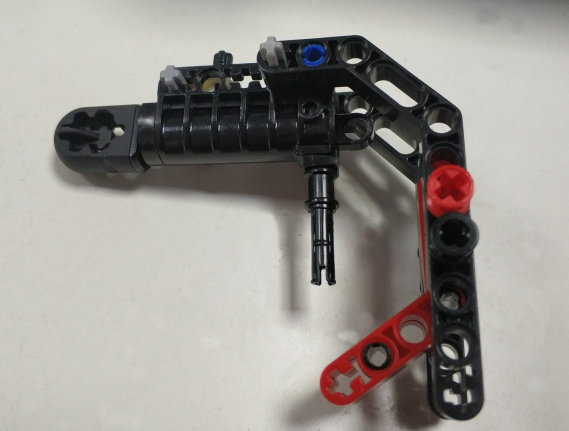
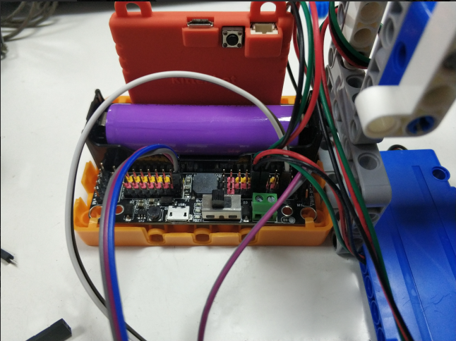
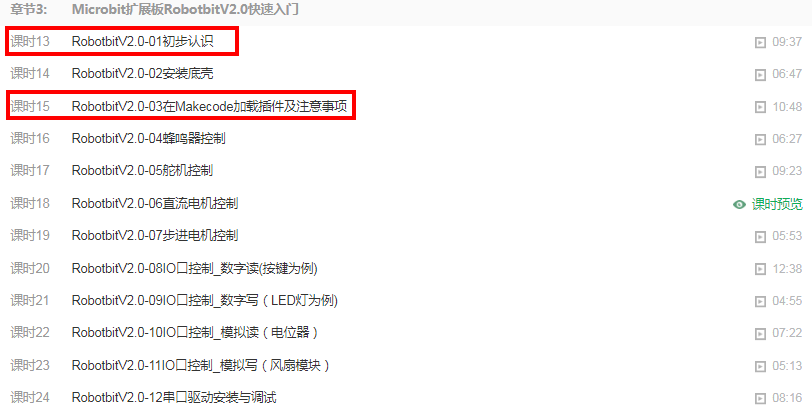
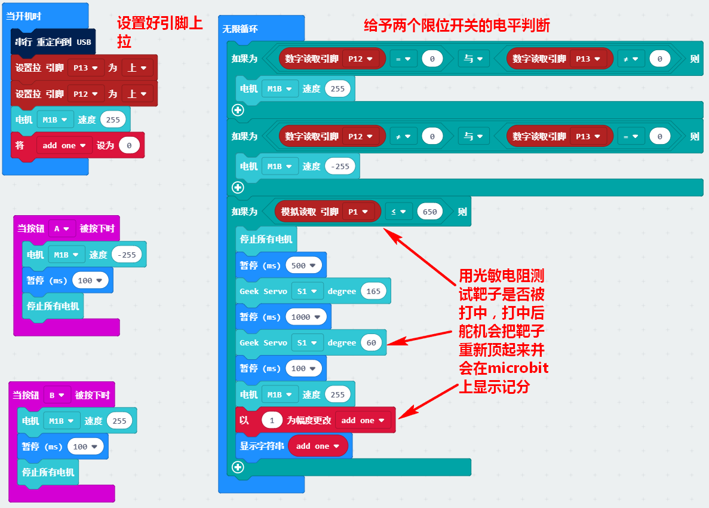

# Robotbit&TT马达 打靶机

## 设计意向   
一直用TT马达驱动钣金小车已经显得越发没吸引力，而越来越多的乐高积木以及结合乐高的robobit底座，让我立刻想到了与乐高结合的TT马达的外壳，这样TT马达在乐高搭建中也能派的上用场。   

---

## 所用零件   
转载TT马达与乐高结合的打印件外壳   

12齿打印件齿轮   

TT马达   

限位开关X2   

光敏电阻X1  

robobit+microbit   

乐高积木件若干   

杜邦延长线若干   

---

## 装配示意   

   

   

   

正面图：   
   

反面图：   
   

附带一把积木小手枪~   

   

---

## 实物接线图   

   

---

## 入门基础

可能很多友友第一次买到这样的套件，之前也没有接触过Microbit板子，也不知道什么是Robotbit。所以在后面的编程，对于大家来说可能跳跃太大了。

为了帮助新手尽快上手，小喵科技特意录了视频教程。有36个课时（每节平均大概5~10分钟，只讲干货）

所以避免后面的软件编程不知道如何上手。所以这里先提醒大家先看看视频。至少知道，你手上的电路板是干嘛的？有什么功能？如何下载程序？软件在哪里下载？

[网易云课堂视频教程，学习能力好的推荐2倍速观看](https://study.163.com/course/introduction.htm?courseId=1005485001#/courseDetail?tab=1)

推荐按顺序看，但是如果你只是想把这个套件驱动起来，可以先看一下我标注的章节。这样针对性比较强。

**Microbit板子的介绍和一些基础入门**

  

**Robotbit板子的介绍和一些基础入门**

 

## 程序   

   

**[程序](https://makecode.microbit.org/_XiU4v1gA9Jyt)**

---

## 附上趣味展示视频    

   
**[视屏](http://v.youku.com/v_show/id_XNDAwOTMwMzYyOA==.html)**  

