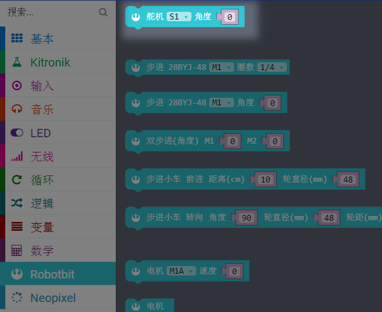
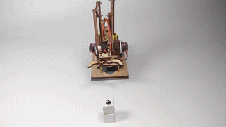
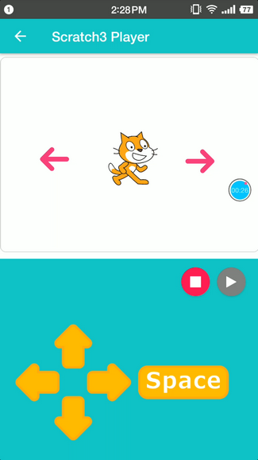

# 机械臂说明

## 装配说明书

跳到链接处下载[click](http://kittenbot.cn/bbs/forum.php?mod=viewthread&tid=361 "含组装过程和程序示例")

## Robotbit版

__编程__

_使用makecode进行编程_

1.为在线版或离线版添加robotbit拓展包

2.找到舵机积木块

3.简单用例搭建

__效果展示__

## Rosbot版
_Rosbot版是使用了手机通过wifi进行控制，在kittenblock中进行编程，kblock app中使用。具体操作方法请参照_
[kblock使用教程](http://kittenbot.cn/bbs/forum.php?mod=viewthread&tid=242&highlight=app "论坛")

__编程__

1.在kittenblock中直接写手机控制所要实现的程序效果

2.这是手机端的操作界面，我们使用二维码将kittenblock的程序扫下来即可以使用

__效果展示__

__注：__

- 若使用给出的示例程序，接线请严格按照装配说明。

- 如果您的kblock手机控制程序无法运行，请确保您的程序逻辑正确的前提下重新参照上述kblock使用教程，注意扫二维码前手机和电脑在同一个wifi网络，并且确定Rosbot已经插上并按照kblock的wifi指引配置好了wifi模块。

- 机械臂的各个初始位置请确保是90度，如果不确定可以先使用软件复位为90度再进行安装使用。

如果上述提示都无法解决你的问题，请加入小喵科技QQ交流群：568084773咨询
