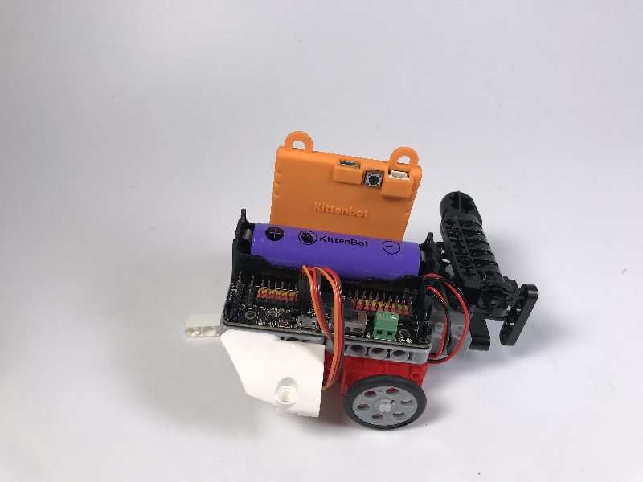
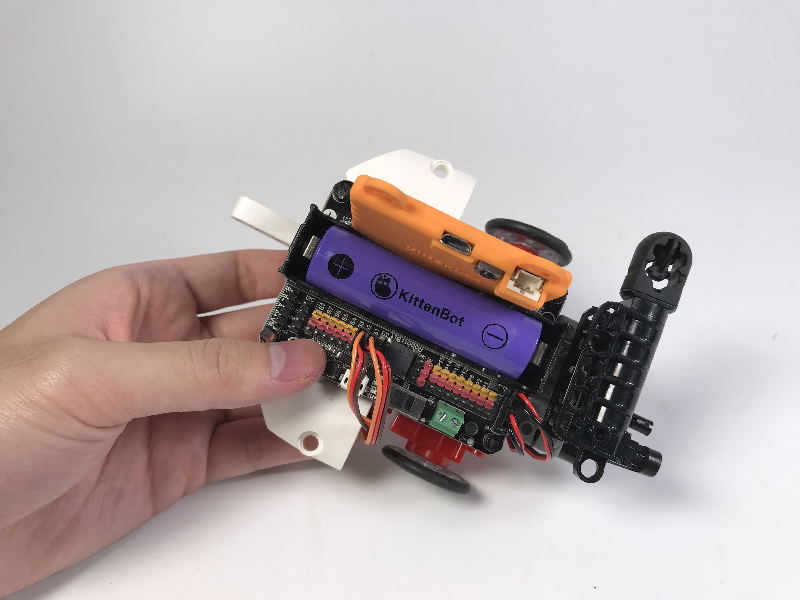
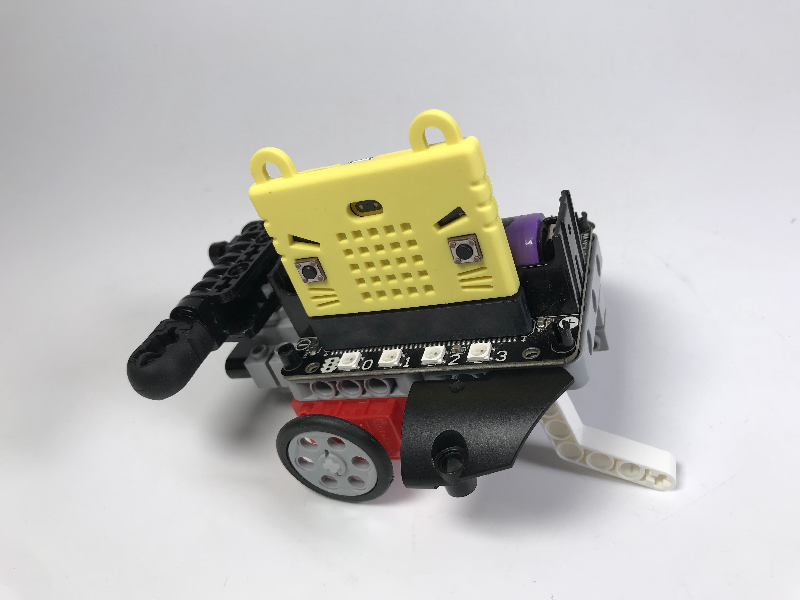
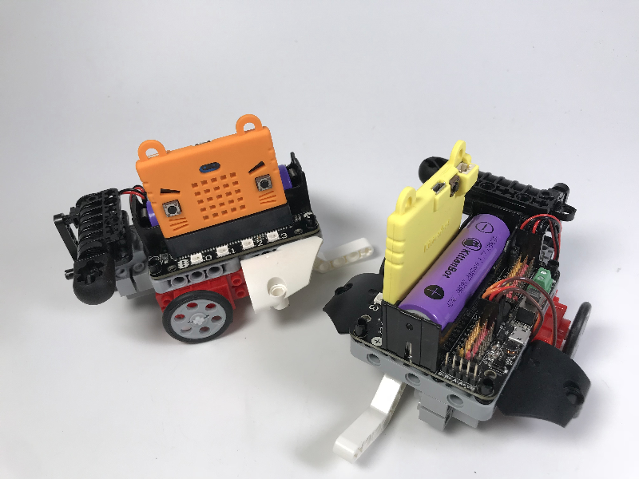
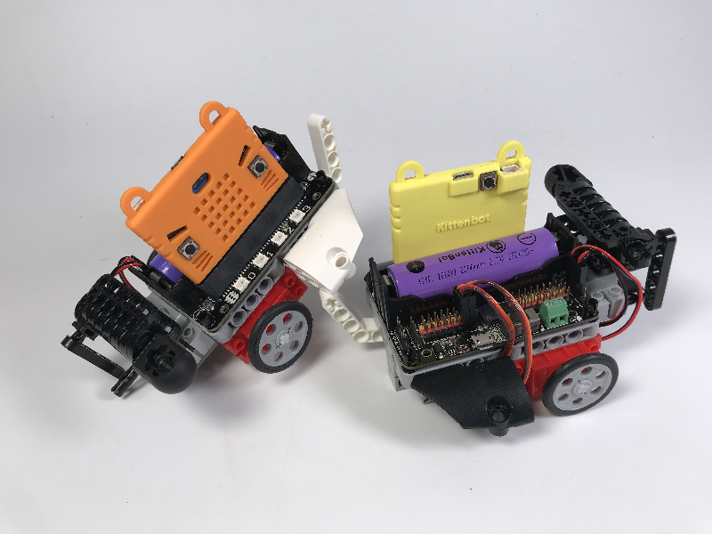

# 乐高格斗战车  

## 购买链接

__转到淘宝购买__----------→格斗战车
## 产品名称   

格斗战车

## 适用人群   

中学学生/培训机构/机器人爱好者/机器人比赛选手   

## 配送清单   

- 格斗战车乐高积木包 x 1   
- Robotbit中小学套餐 x 1   

## 产品介绍  

Robotbit的扩展套件，Micorbit的机器人套件。适合低龄小学生入门机器人编程学习。组装简单，无需螺丝刀等复杂工具，直接将塑胶件拼装起来即可。

整体组装时间不超过15分钟，是培训机构，机器人工坊必备套件！可以用手机蓝牙控制，前后左右移动，并且战车前方有个小揪揪，用于格斗，将对手战车撬翻。车后方还有一个弹射装置（威力比较小，很安全），可用于近距离的射击。

格斗战车可用Makecode图形化编程或者喵家专用图形化编程软件Kittenblock进行编程。

## 产品特色 

基于Microbit的图形化编程   
组装简单，整体组装过程不超15分钟
车型紧凑具有科幻感
可自由前后左右移动，带弹射机构与攻击铲装置
可用Microbit2.4G遥控   
可用Kittenblock图形化编程软件在线控制
可用微信小程序“Micorbit喵咪咪”蓝牙控制

## 产品参数

- 长 x 宽 x 高：20 x 19 x 8cm   

## 技术参数

- USB输入电压：5V   
- VM引脚最大电流：1A（在板载电池的支持下）   

## 机械拼装  

组装过程很简单，基本上看图就明白了。

   

   

   

   

   

   

安装主控板4个孔稍微有点难度，安装注意安全，不要被排针扎到手！

   

   

   

   

   

安装弹射装置，切勿对着眼睛安装，注意安全（也可以在战车全部安装完成后，再安装炮弹）

   

   

   

   

   

   

接线也不难，按照下图接，这样你就可以用上我们的程序了，不用自己修改了

   

   

整理下电线，把线通通塞到底下

   

完成了~组装是不是很简单很快哦？

   

   

   

一辆战车格斗怎么好玩呢？来再做一辆~

   

吃我一招~哎呀，被撬起来了

   

## 使用方法   

- 编程方式：Kittenblock(基于Scratch3.0)/Arduino/Makecode   
- 兼容硬件：猫头避障电子模块等
- 小喵教程集合地址：learn.kittenbot.cn   
- 小喵论坛地址：kittenbot.cn/bbs   
- 网易云课堂：搜索小喵科技   
- 更多的实时讨论，请加入爱上小喵科技官方Q群:568084773   

1.打开kittenblock软件，选好KittenBot硬件，插上usb线选好COM口，并点击例子   

   

2.找到序号13的万向轮小车，当然高手你可以自己编写其他功能，毕竟这是男人的浪漫   

   

3.出来图中代码块后点击右上角舞台两字切换到代码   

   

4.点击翻译，上传，收到下载完成后即完成下载   

   
   

## 注意事项   

安装弹射装置需要注意安全，切勿对着眼睛

弹射装置禁止对人或小动物进行射击！

在不使用格斗战车时，请把弹射装置的炮弹卸下来

