#麦克纳姆轮小车说明   

## 购买链接

__转到淘宝购买__----------→[麦克纳姆轮小车](https://item.taobao.com/item.htm?spm=a1z10.3-c-s.w4002-17001215033.63.54b4762eFp0qOE&id=553796162257)

##产品名称   

麦克纳姆轮小车

   

##适用人群   
培训机构/机器人爱好者/机器人比赛选手   

##配送清单   
- 钣金底盘 x 1   
- 麦克纳姆轮 x 4   
- Rosbot x 1  
- 18650锂电池 x 1   
- 1Pin杜邦线 x 6   
- 25电机 x 4   
- PH2.0端子线 x 4   
- PS2手柄套件 x 1   
- 电路板支撑柱包（含固定螺丝） x 1   
- 麦克纳姆轮联轴器（含固定螺丝） x 4   
- 魔术贴绑带 x 1   
- M3螺丝 x 8   
- 螺丝刀 x 1   
- 六角螺丝刀 x 2   

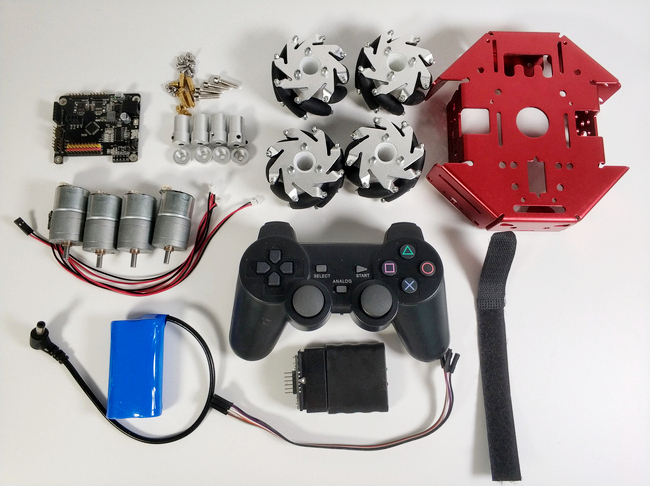   

##产品介绍   
KittenBot狂野麦轮扩展套件是基于KittenBot基础套件的扩展件   
它主要由麦克纳姆轮部分，编码电机动力部分构成，是一款结构紧凑，运动灵活的机器人套件。依靠四个麦轮的速度和方向，小车能狂野地自由移动，而无需改变机轮自身方向。基于麦克纳姆轮技术的全方位移动设备，可以实现前进、横移、斜行、旋转、后退及其组合等运动方式。   
不仅如此，小车使用的是Nexus系列的麦克纳姆轮（兼容乐高），该种轮子由铝合金和合成橡胶组成，负载能力强！每个从动小轮内嵌入两个滚动赛刚，精密加工并将从动小轮轴间隙控制在很小的范围内，特别适合于各种小型机器人的驱动应用。   
此外，使用Kittenblock编程让KittenBot小车实现狂野飞驰！主控还可升级搭载树莓派，完成更高难度的机器小车运动项目。扩展套件均可支持2.4G模块以及PS2游戏手柄，让你的小车变成游戏手柄遥控小车！   

##产品特色   
- 基于图形化编程   
- 适用人群广   
- 负载能力强   
- 操作简单，多样化   
- 可全方位移动   
- 可用手柄、蓝牙、WiFi控制   

##产品参数

- 长 x 宽 x 高：20 x 19 x 8cm   
- 净重：917.6g   
- 轮子直径：60mm   
- 轮子宽度：31mm   
- 滚轮数：8   
- 阀体材料：铝合金   
- 轧辊材料：合成橡胶   
- 滚子长度：30mm   
- 净重：86g x 4   
- 负载能力：10Kg   

##技术参数

- 18650电池组电压：7.4V   
- USB输入电压：5V   
- VM引脚最大电流：1A（在板载电池的支持下）   
- JGA25电机转速：空载211rpm，负载147rpm   

##组合过程   
1.将25电机与PH2.0端子线相连   

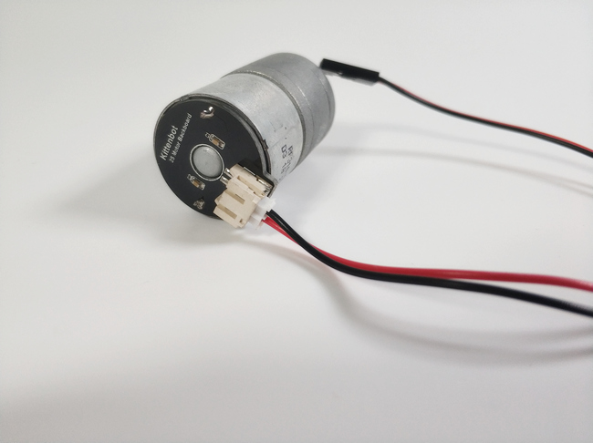   

2.将联轴器较长的部分插入麦克轮（注意联轴器的两个六角螺丝要位于螺母两侧，这样方便与电机固定），然后用六角螺丝和联轴器的另一部分固定组合好轮子   

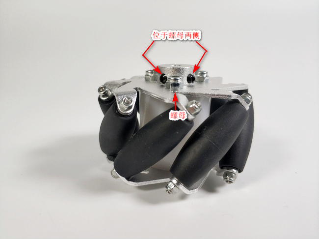   
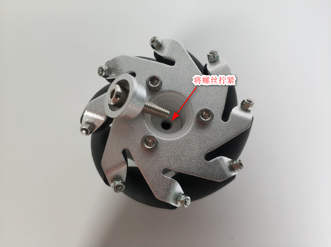   

其余三个轮子依照同样的方法组合，但是**特别要注意的是一定要非常非常严格按照图中的方向组合**   

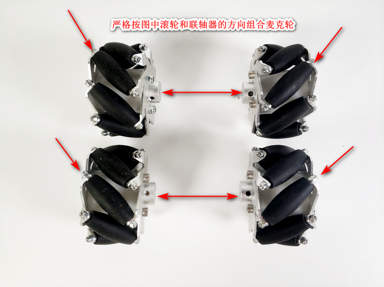   

3.安装支撑柱时，建议先用手从钣金盘底部顶住螺丝，再拧紧柱子,最后放上Rosbot然后拧紧螺丝即可   

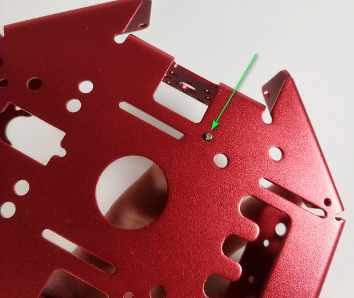   
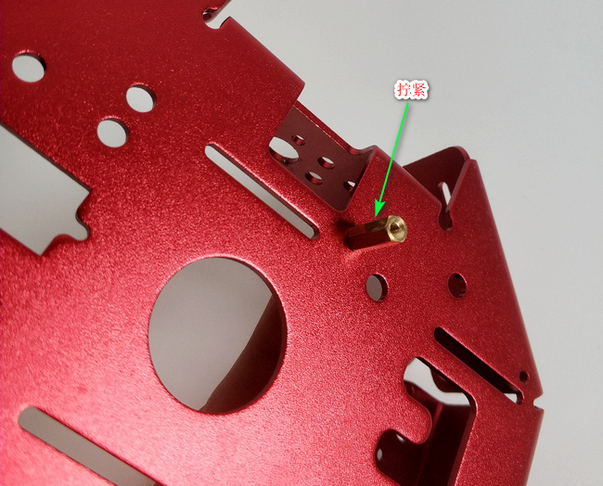   
   

4.将电机螺丝孔对准钣金控，然后用M3螺丝拧上   

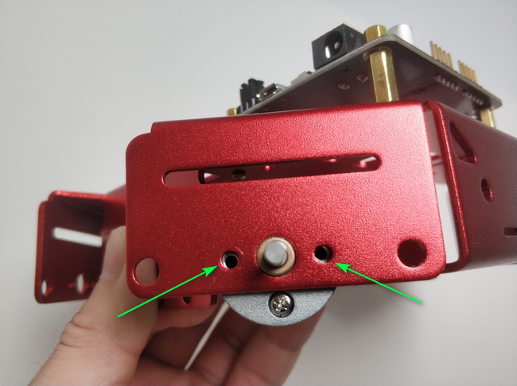   
   

5.装配麦克纳姆轮时把轮子插入电机后用六角螺丝刀把轮子的两个螺丝拧紧   
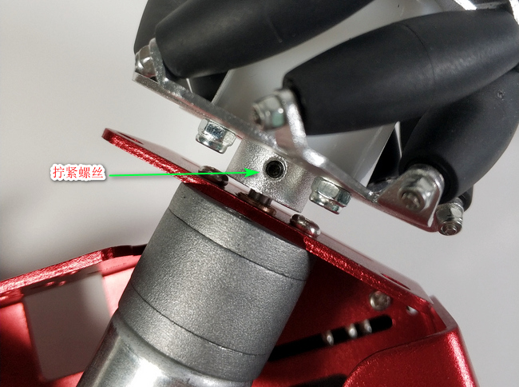   

**这里同样也要特别注意轮子的安装方向，请严格依图安装**   

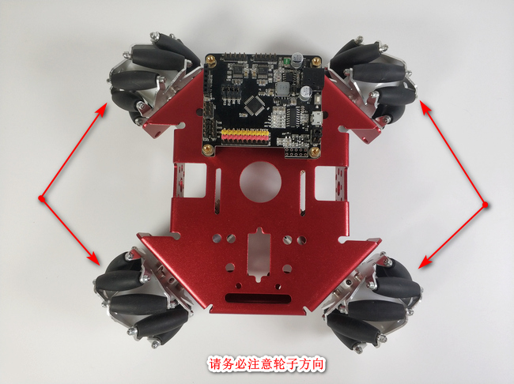   

6.拼接PS2手柄件以及手柄接线   

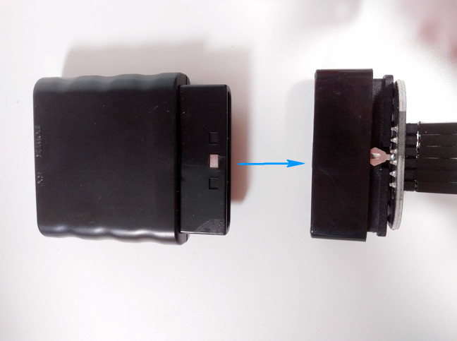   
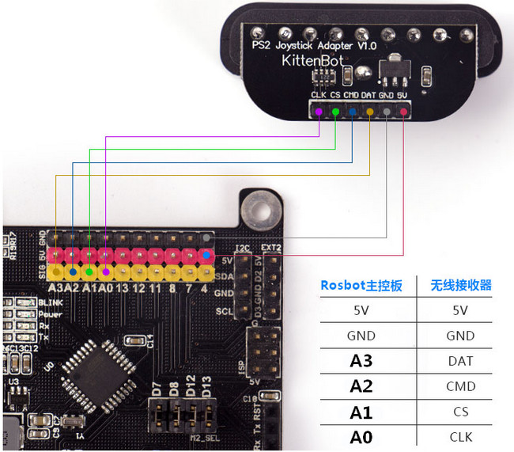   

7.用绑带固定无线接收器和电池   

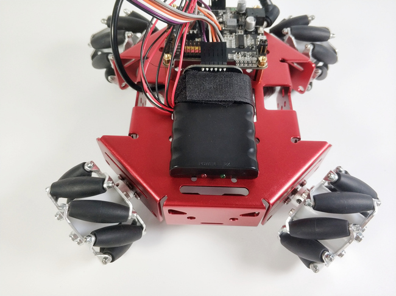   
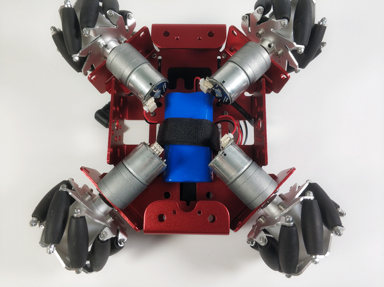   

8.电机连线   

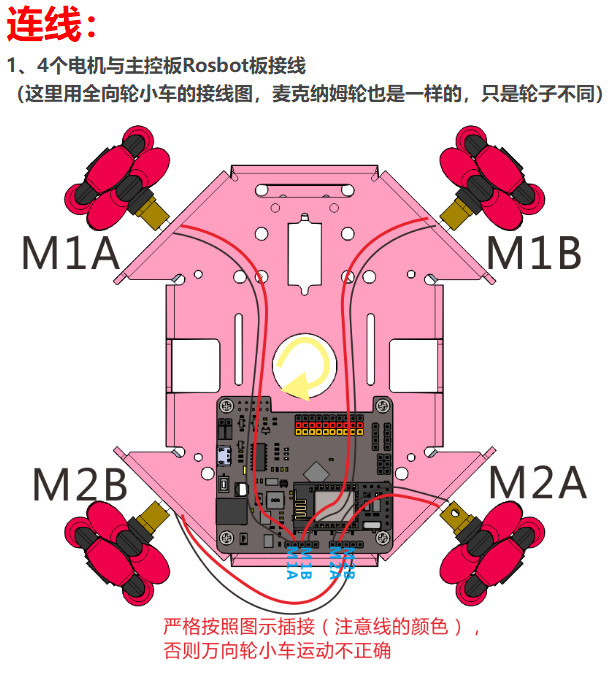   

9.PS2手柄使用   
插上电池后，即可观察到无线接收器一个灯闪烁，一个灯常亮（处于搜索设备状态）   

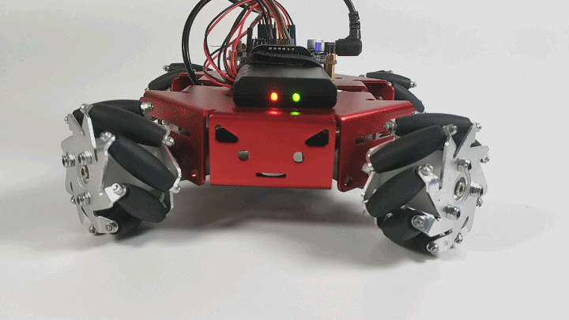   

开启PS2手柄   

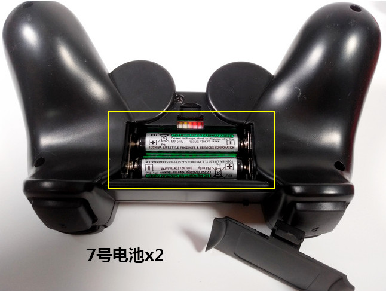   

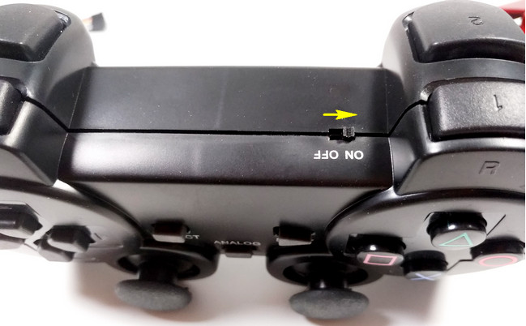  

此时可观察到PS2手柄两个灯同时闪烁，成功配对后无线接收器和PS2手柄的两个灯都会处于常亮状态   
配对成功后即可按下START键啦  

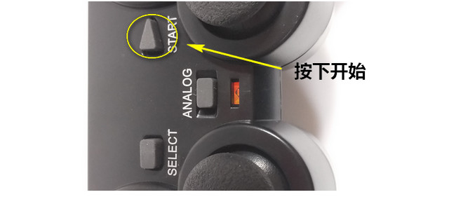   

##使用方法   
- 编程方式：Kittenblock(基于Scratch3.0)/Arduino/Makecode   
- 兼容硬件：猫头避障电子模块等
- 小喵教程集合地址：learn.kittenbot.cn   
- 小喵论坛地址：kittenbot.cn/bbs   
- 网易云课堂：搜索小喵科技   
- 更多的实时讨论，请加入爱上小喵科技官方Q群:568084773   

1.打开kittenblock软件，选好KittenBot硬件，插上usb线选好COM口，并点击例子   

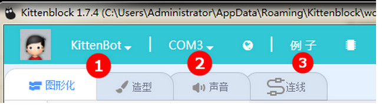   

2.找到序号13的万向轮小车，当然高手你可以自己编写其他功能，毕竟这是男人的浪漫   

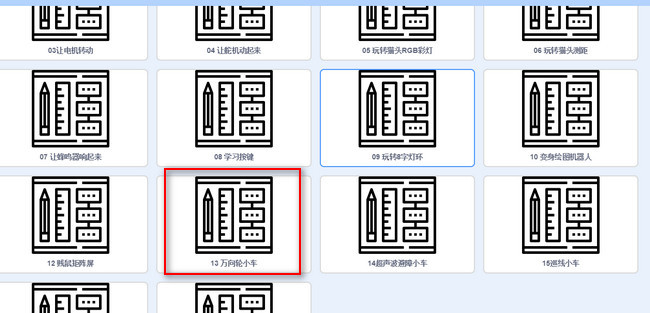   

3.出来图中代码块后点击右上角舞台两字切换到代码   

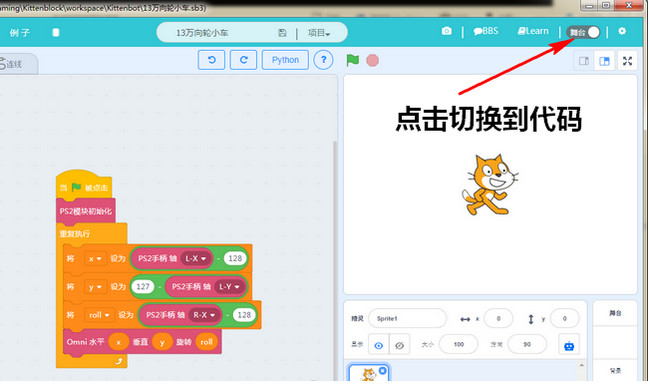   

4.点击翻译，上传，收到下载完成后即完成下载   

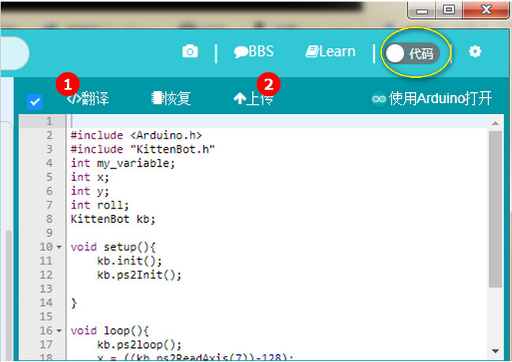   
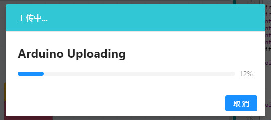   

##注意事项   
- 供电使用喵家7.4V锂电池即可，自己用电池盒接5V电池的话车子有点慢   
- 接线可别接错了，重点提醒   
- PS2手柄要打开还要按START键哦   

_请按照说明书正确接线，接错线会造成小车没反应或运动错误摔、砸可能会导致小车故障，请尽量避免本产品只适用于14岁以上的儿童进行独立使用，8~14岁儿童请在家长或者老师的陪同下进行使用。 如使用前请按照小喵官方资料指导下进行使用，不要随便接插电路，切勿外接大电流舵机，大电流电机，以免烧毁电路板。注意不要在金属表面，或者导电的物体上使用，以免短路请避免在潮湿和有水的地方使用，以免短路电路板或者机械上含有细小物件请不要吞食，请放在儿童接触不到的地方妥善保管 _   
