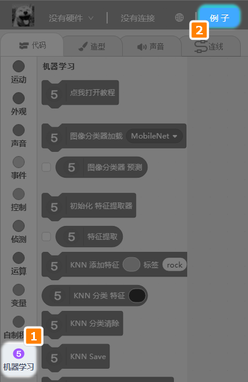
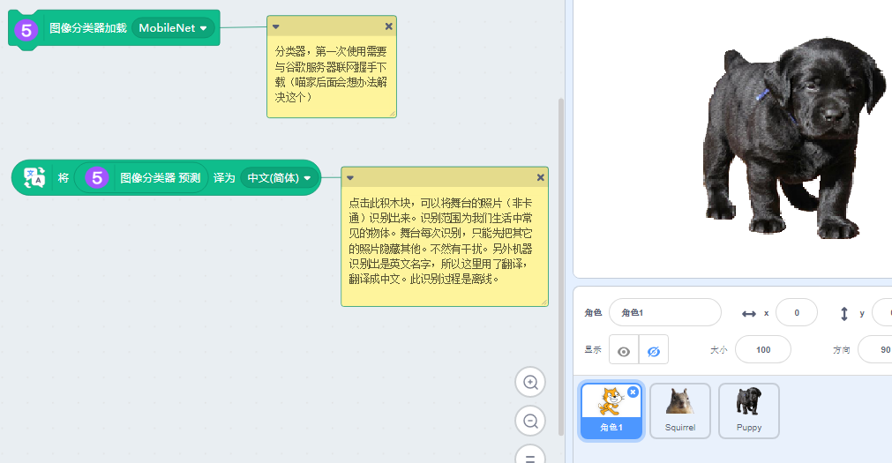
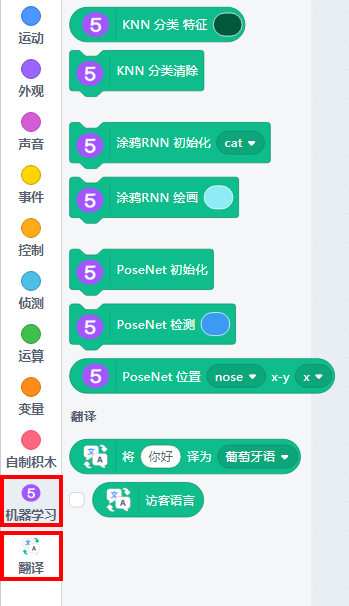
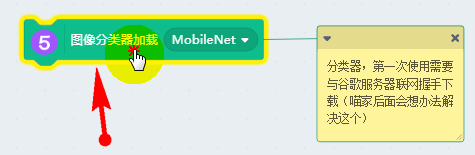
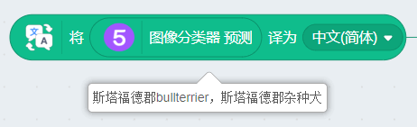
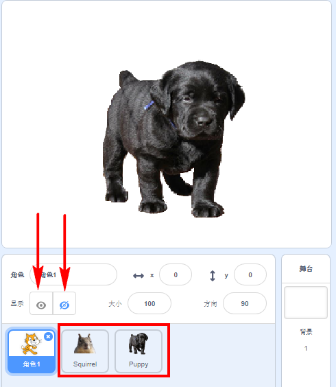
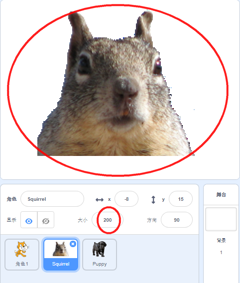

# 图像分类器——看图识物 

底层技术依靠TensorFlow实现，此图像分类器利用了MobileNet分类模型

## 用途

识别常见的物体/动物

## MobileNet简介

说到机器学习，不得不提卷积神经网络（CNN），它普遍用在计算机视觉领域中，可以简单理解，神经网络层数越多，模型越复杂，对分类越准确。

但在实际的生活场景中，这种复杂的模型很难被应用，第一它对运算配置要求高，第二实时响应速度不够快。MobileNet模型的产生就是为了解决这个问题，可以在保持响应速度比较快和模型比较小的前提下，依然能保证识别效果，常用用于移动端的应用场景。

## 实验要求

畅顺的网络

Kittenblock 1.8.4i 以上版本

## 加载插件

ml5插件成功加载

## 直接打开示例

为了帮助初学者更快入门，在我们例子系统,已经集成了示例程序，点击例子即可(如图的图标2)！

## 成功加载程序

示例程序可能还没更新，大家程序按照下图进行拖拽一下。选择**MobileNetLocal**

## 同时也把文字翻译加载进来

直接打开示例程序，是会自动把文字翻译插件自动加载进来的。

## 使用方法

点击“图像分类器加载”方块，加载MobileNetLocal，这个MobileNetLocal模型已经内置在Kittenblock里，不需要网络下载了（之前是需要联网下载的）。（当前软件版本为1.8.4i）

点击“图像分类器预测”积木块，进行预测当前舞台的照片，舞台的其他照片需要隐藏起来。

点击积木块，就立马返回一串英文结果

因此这里配合翻译积木块，把英文翻译成中文，这样我们就知道这只小狗是什么品种。

## 为何需要翻译插件？

其实直接点 图像分类器预测 就会返回结果了。但是返回的结果是英文，为了方便大家看，所以加入翻译插件直接翻译成中文

## 如何识别另外的

如果你要识别另外一张图片，你需要手动选中角色后，让它进行显示（对其他精灵进行隐藏）。然后再点击方块进行预测。（MobileNetLocal已经加载过了，所以不用再点击了）

如果你还想识别其他物体，可以直接点击增加精灵
识别物体的照片最好是无背景，或者白背景，照片尽量清晰，需要是现实生活的真实照片（卡通画，漫画不能正确识别）

另外需要注意，角色的大小对识别结果也有影响，所以尽量让识别的图片占据舞台的大部分面积，这样可以提升识别的准确率。

