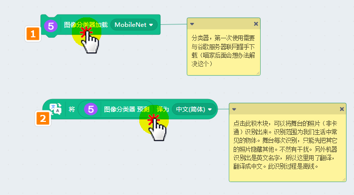

# 图像分类器

底层技术依靠TensorFlow实现，此图像分类器利用了Mobilenet分类模型

## 用途

识别常见的物体/动物

## 直接打开示例

## 成功加载程序

## MachineLearning5与文字翻译成功加载

## 使用方法

点击第一个方块，加载MobileNet，这个模型需要从网上下载

等第一个方块边框灭掉后（下载完毕），点击第二个方块，进行预测当前舞台的照片

预测结果以文字字符串进行返回，这里识别这是小狗是拉布拉多犬

如果你要识别另外一张图片，你需要手动选中角色后，对齐进行显示（对其他精灵进行隐藏）。然后再点击第二个方块进行预测。（第一个方块已经下载过模型了，所以不用再点击了）

如果你还想识别其他物体，可以直接点击增加精灵
识别物体的照片最好是无背景，或者白背景，照片尽量清晰，需要是现实生活的真实照片（卡通画，漫画不能正确识别）

另外需要注意，角色的大小对识别结果也有影响，所以尽量让识别的图片占据舞台的大部分面积，这样可以提升识别的准确率。

