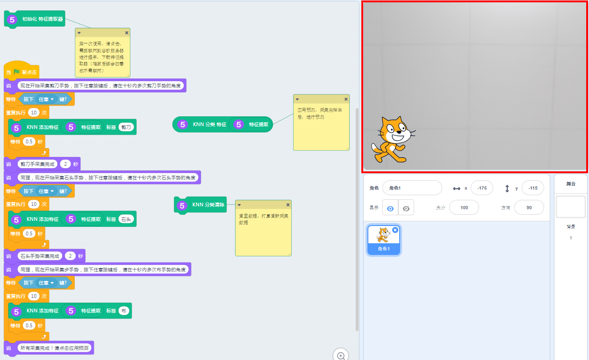
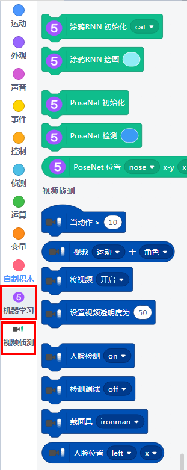
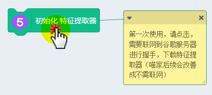
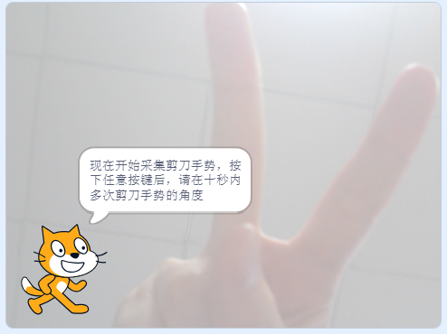
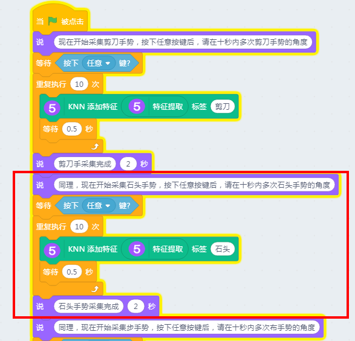
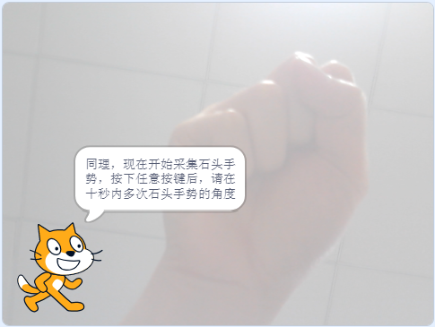
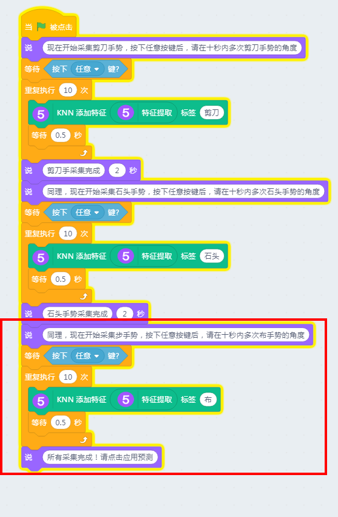
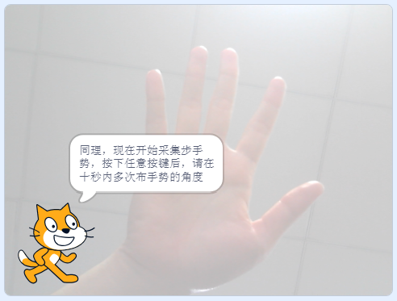
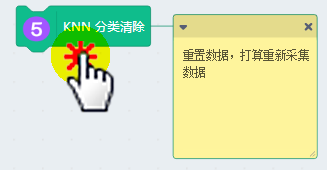
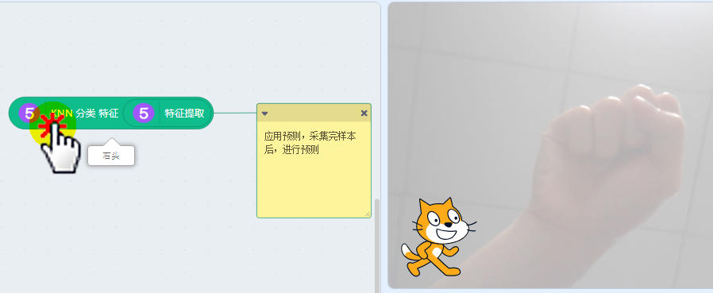

# 特征提取器（以剪刀石头布为例）

底层技术依靠TensorFlow实现，此特征提取器采用了KNN模型（实际上用MobileNet也是可以的）

## 用途

将一定数量的摄像头实时照片或者图片的特征提取出来进行归类

## 直接打开示例

## 成功加载程序

## MachineLearning5与文字翻译成功加载

## 使用方法

点击第一个方块，加载MobileNet，这个模型需要从网上下载

等第一个方块边框灭掉后（下载完毕），点击第二堆方块，进行剪刀石头布采集

### 剪刀手势采集

### 石头手势采集

### 布手势采集

### 如何重置

有时候在录制手势过程中，不小心弄错，可以进行重置重来，否则错误的样本会导致错误的结果。

### 预测

点击最后的方块，就可以对应把出现在镜头里的手势识别出来。

