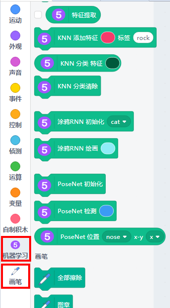
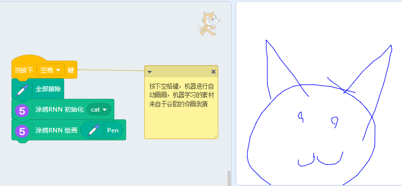
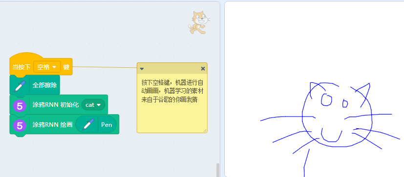
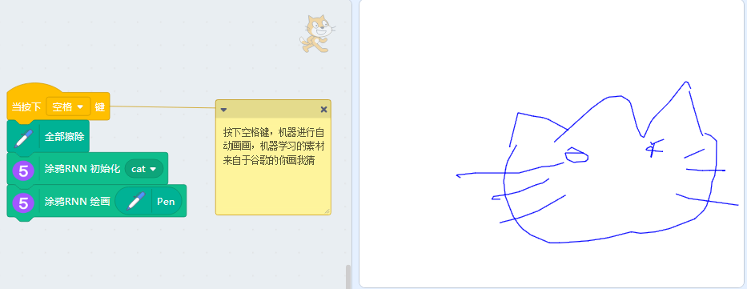
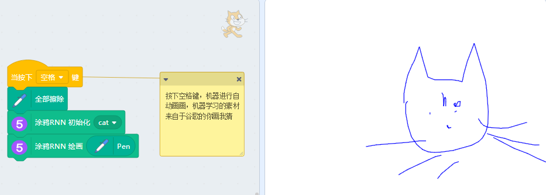

# 05涂鸦KNN应用

涂鸦KNN是一个你给定一个单词，它就画出这个单词对应的画来。涂鸦KNN的输入样本是之前谷歌做的很多的小游戏“猜画小歌”

## 用途

来感受机械学习人类的图片后，它自己创作的图片是怎样的

## 直接打开示例

## 成功加载程序

## MachineLearning5与文字翻译成功加载

## 使用方法

直接按下空格键，机器就会自动作画，以下四幅图片就是机器心中的“猫”

