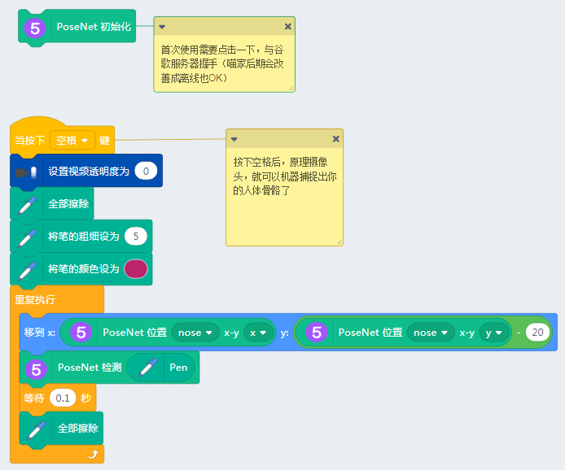
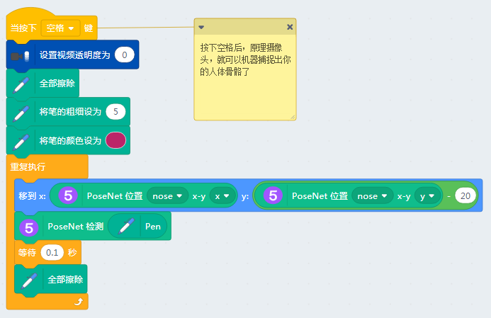
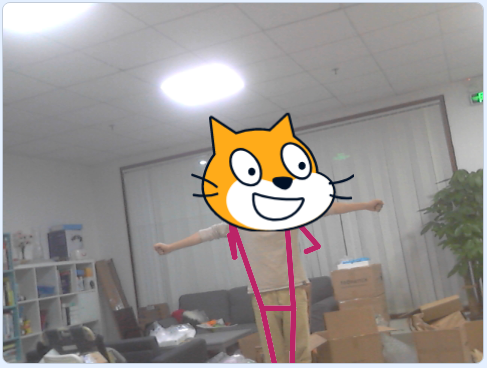

# 骨架追踪

底层技术依靠TensorFlow实现，骨架追踪用了采用了PoseNet模型

## 用途

追踪摄像头入境中的人的骨架

## 直接打开示例

## 成功加载程序

## MachineLearning5、文字翻译、视频侦测成功加载

## 使用方法

点击第一个方块，加载PoseNet，这个模型需要从网上下载

等第一个方块边框灭掉后（下载完毕），点击第二堆方块，进行骨架跟踪，并且把猫头戴在头上（工程师⁄(⁄ ⁄•⁄ω⁄•⁄ ⁄)⁄害羞没有办法）

## 效果

效果不是很好，不知道是环境光的问题，还是程序的问题，后续程序猿再进行优化下

