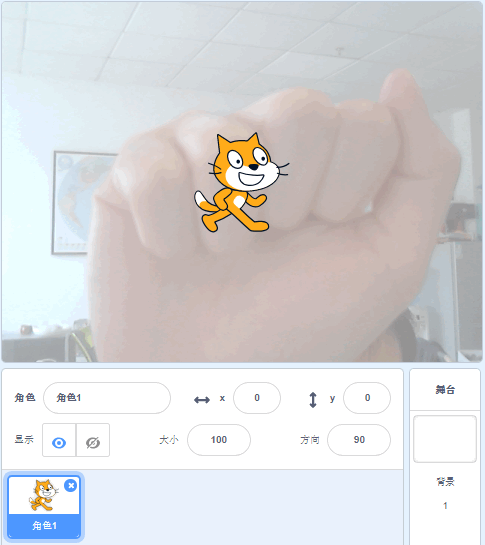
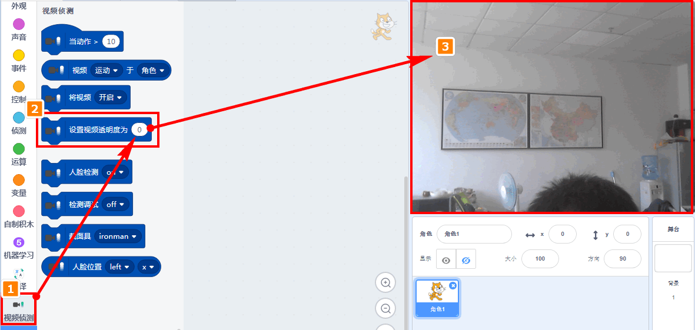
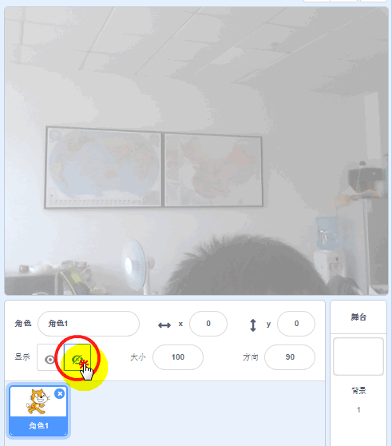
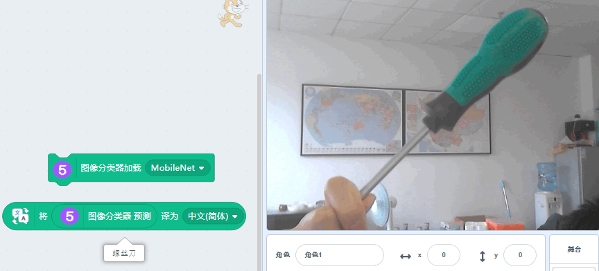
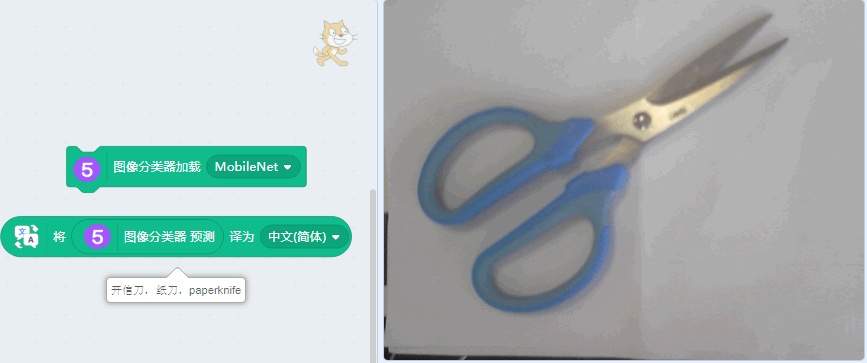
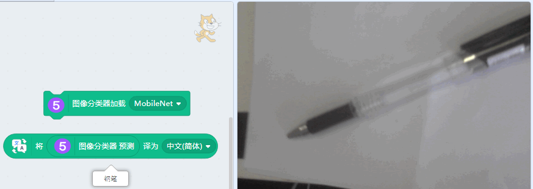
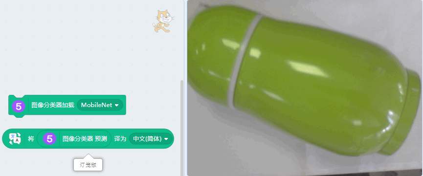

# 图像分类器——识别摄像头窗口物体

底层技术依靠TensorFlow实现，此图像分类器利用了Mobilenet分类模型

上节通过例子已经学会了指定图片的识别问题，本节我们学习摄像头窗口的物体识别

## 用途

识别摄像头窗口的——常见的物体/动物

## Mobilenet简介

说到机器学习，不得不提卷积神经网络（CNN），它普遍用在计算机视觉领域中，可以简单理解，神经网络层数越多，模型越复杂，对分类越准确。

但在实际的生活场景中，这种复杂的模型很难被应用，第一它对运算配置要求高，第二实时响应速度不够快。MobileNet模型的产生就是为了解决这个问题，可以在保持响应速度比较快和模型比较小的前提下，依然能保证识别效果，常用用于移动端的应用场景。

## 实验要求

USB摄像头

畅顺的网络

Kittenblock 1.8.4i以上版本

## 加载插件

ml5插件成功加载

## 同时也把文字翻译与视频侦测加载进来

全部成功加载

## 使用方法

### 确定摄像头窗口已打开

USB摄像头在开启Kittenblock前必须插好(如果这步没做好，请插好usb摄像头后，重启软件)，打开插件后，右侧舞台的窗口即为摄像头的窗口，如图

### 调整摄像头窗口参数

更改透明度，使得画面更加清楚

### 隐藏舞台角色

我们只需要纯净的摄像头窗口，其余的角色全部隐藏起来。

### 加载图像分类器

### 编程

### 将识别的物体放入摄像头窗口中

点击识别，当然你使用照片也是可以的

下面的图片因为是旧图片，所以没有更新。

## 误差分析

当然识别会有误差，如图

影响识别效果有一下几个原因

### 摄像头像素

摄像头如果像素太差，画面识别回来的图片都是模糊的，机器识别它识别也是要靠猜

### 摄像头窗口背景

摄像头背景如果太多物体太杂，对机器识别是一个干扰项

### 物体特征

Mobilenet的样品库只是包含生活一些常用的物体，例如上图中的保温瓶子，它库可能没有这样的样本，所以它识别成灯笼椒，哈哈，好像识别成灯笼椒也说得过去哈~

## 如何关闭舞台窗口的摄像头

舞台窗口摄像头无法通过软件关闭（Scratch的bug），只能将软件重启，清空插件。

