# 特征提取器入门

底层技术依靠TensorFlow实现，此特征提取器采用了KNN模型（实际上用MobileNet也是可以的）

## 用途

简单理解将不同物体识别出来。将一定数量的摄像头实时照片或者图片的特征提取出来进行归类

## 特征提取器原理

每张图片都可以提取一个特征码，机器学习针对样本集合的特征总结提取出来。

## 实验要求

USB摄像头

畅顺的网络

Kittenblock 1.8.4i以上版本

## 加载插件

ml5插件成功加载

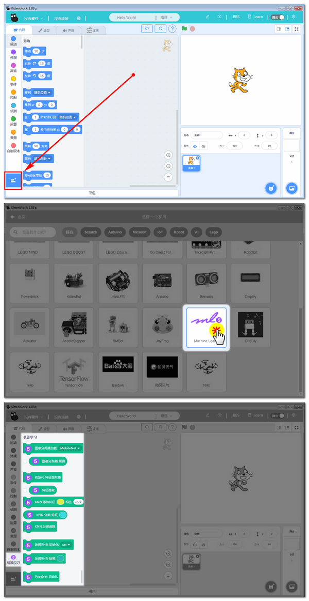

## 同时也把文字翻译与视频侦测加载进来

全部成功加载

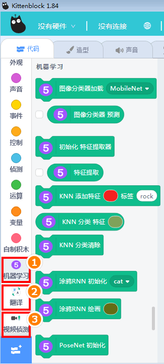

## 使用准备

### 加载特征提取器

点击，特征提取器已经做成是本地加载形式

### 测试——特征提取

任何一张图片，它的特征提取码都不一样。

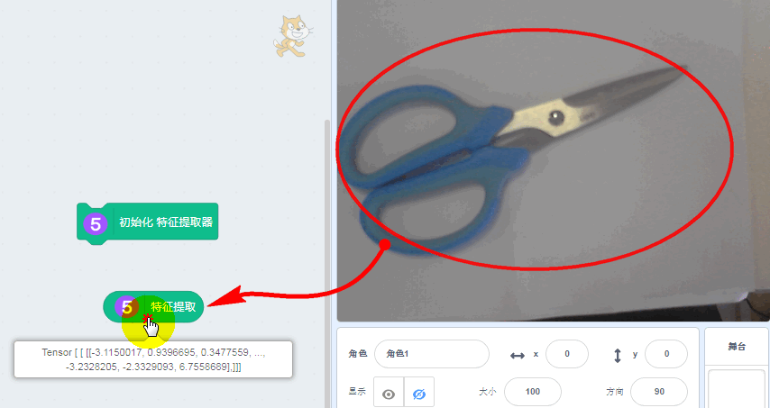

## 编程

编写了一个简单程序，用于识别剪刀与魔方（你可以识别不同物体，记得把对应标签更改下即可）

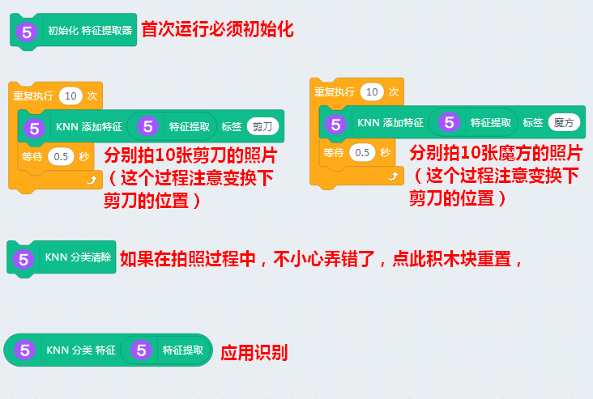

## 分别对要识别的物体进行拍照

剪刀：

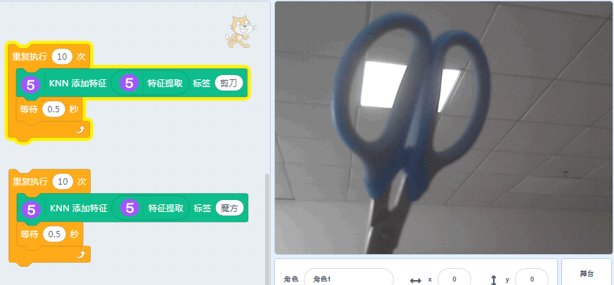

魔方：

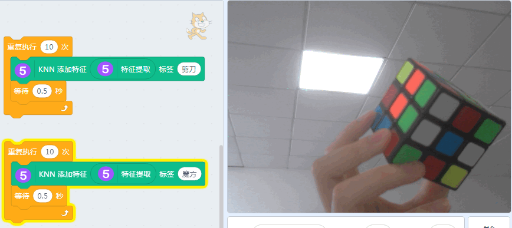

这里做了拍照过程的gif演示：

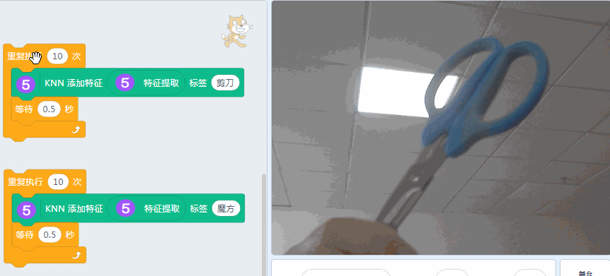

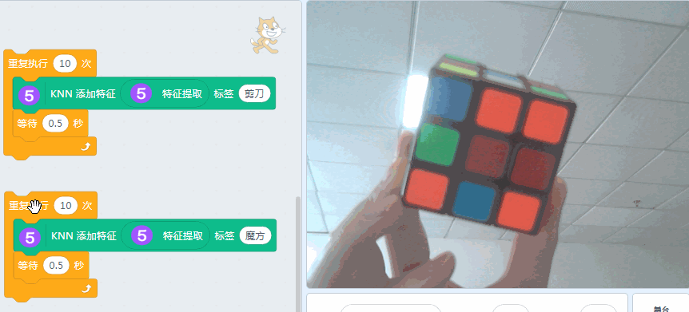

如果在拍照过程中，有误操作，例如有其他东西入镜，或者忘记在摄像头窗口放入物体识别，都会导致后面应用识别有误，可以点击清除。

清除后需要重新操作所有物体的拍照。

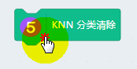

## 点击应用识别

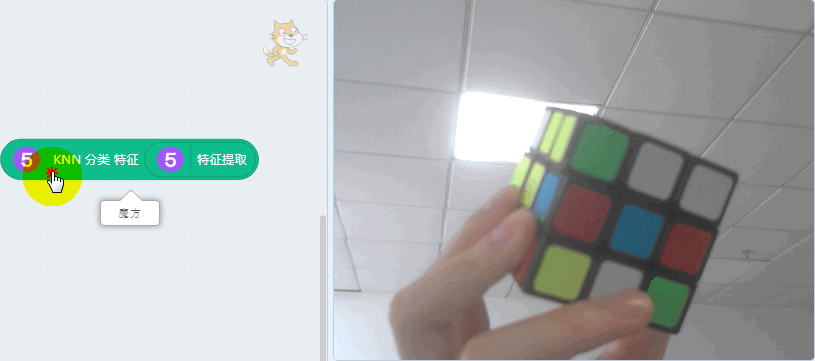

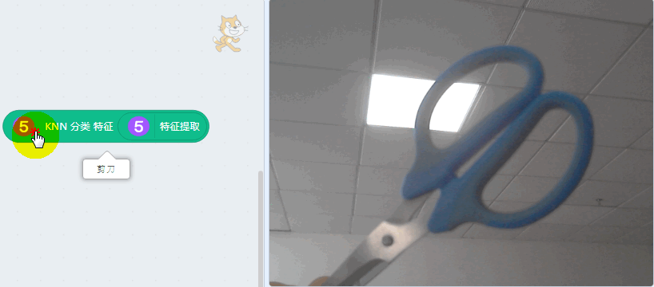

## 让小猫自动说

更改下程序，增加多一个空白的特征识别，另外让舞台小猫显现出来，让其将识别结果说出来

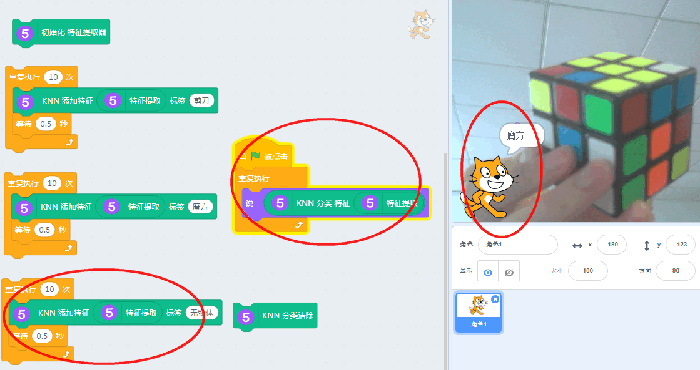

gif演示：

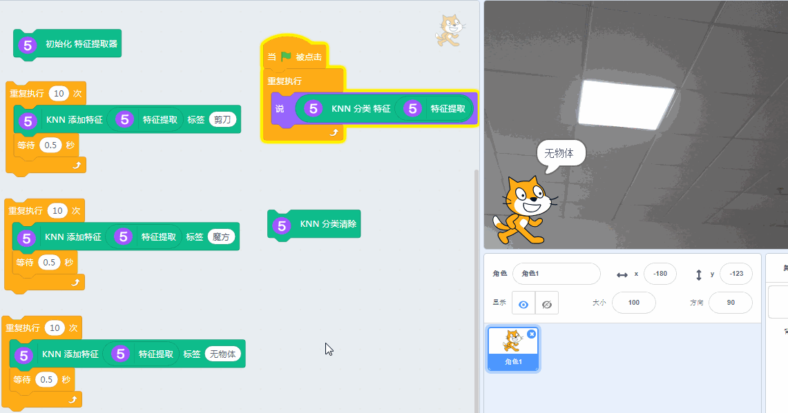

## 拓展与提高

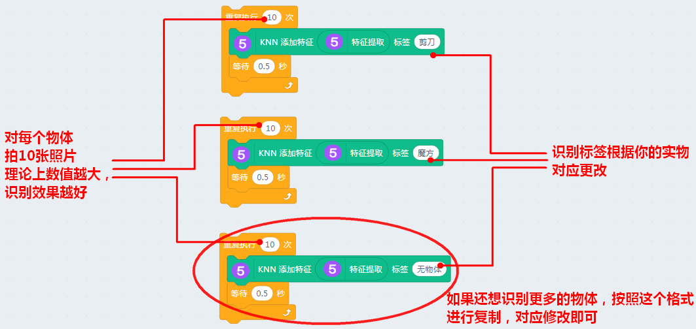

