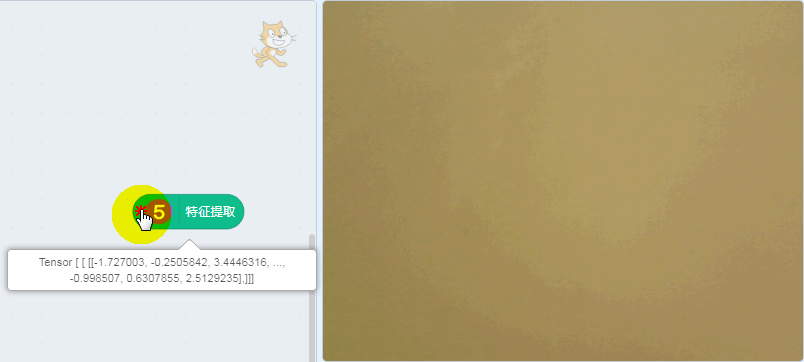
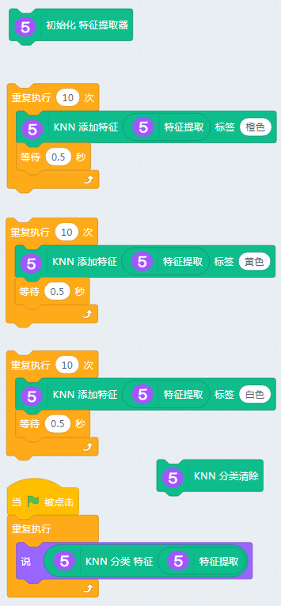
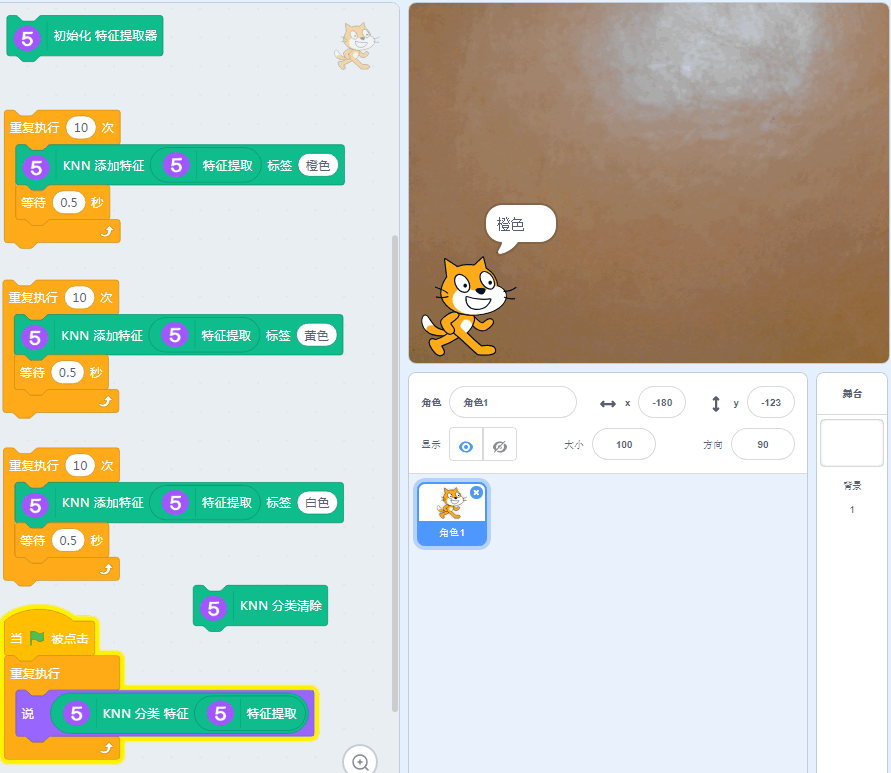
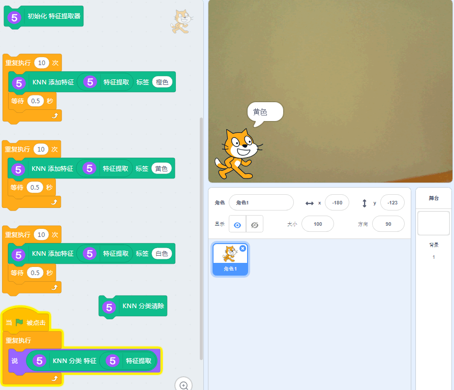
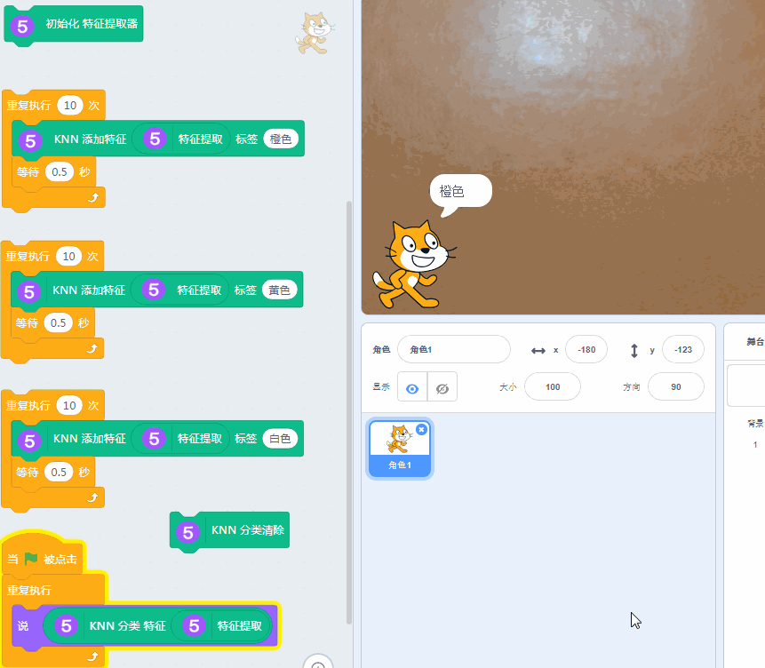

# 特征提取器_识别不同颜色

底层技术依靠TensorFlow实现，此特征提取器采用了KNN模型（实际上用MobileNet也是可以的）

## 用途

识别颜色和识别不同物体。对于人来说，可能是两种不同的东西。

但是对于机器学习的特征提取器来说，还是一样，依旧将图片的特征提取出来进行归类

## 特征提取器原理

每张图片都可以提取一个特征码，机器学习针对样本集合的特征总结提取出来。

## 实验要求

USB摄像头

畅顺的网络

Kittenblock 1.8.4i以上版本

不同颜色的卡纸或者物体

## 加载插件

ml5插件成功加载

## 同时也把文字翻译与视频侦测加载进来

全部成功加载

## 使用准备

### 下载特征提取器

点击，特征提取器已经做成是本地加载形式

### 测试——特征提取

任何一张图片，它的特征提取码都不一样。

## 编程

讲准备好的色卡，根据程序依次放入，进行特征提取

## 应用测试

gif演示

