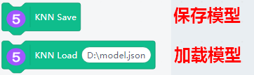
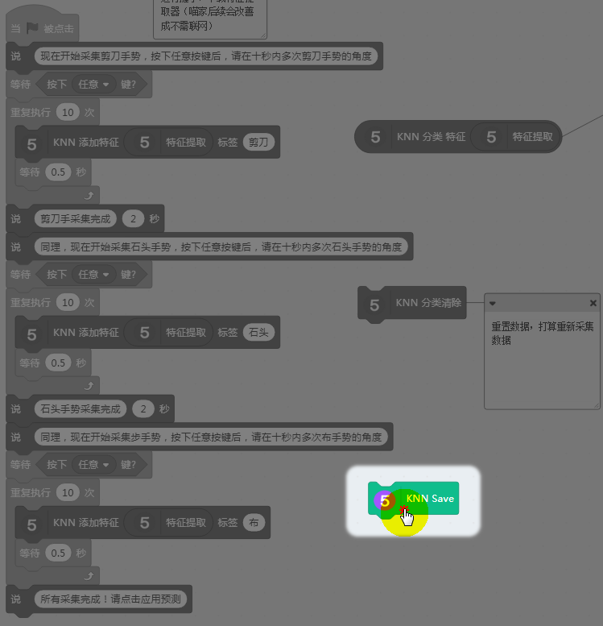
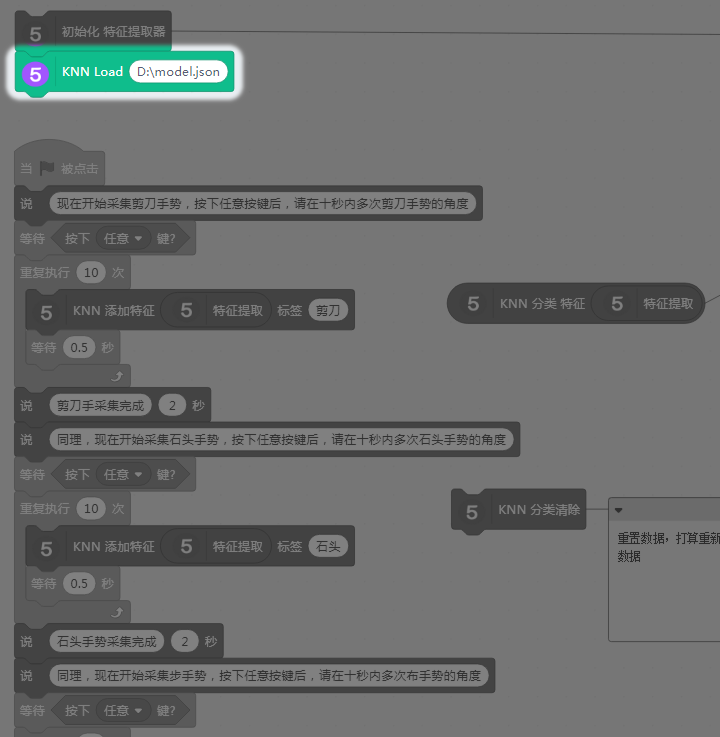

# 特征提取器_保存训练好的模型

## 关于机器学习的保存

机器学习5底层本质上是用了谷歌的学习框架TensorFlow,如果你在之前用过我们Kittenblock的TensorFlow插件，你就知道，TensorFlow的程序保存，并不是点击软件上的保存，如果只是点了软件上的保存，只保存了这个程序，并没有保存TensorFlow的训练数据和的出来的模型结果。

因此需要特别的积木块对模型的权重和拓扑结构进行保存。

## 特征提取器保存与加载积木

## 保存使用方法

记得使用 **KNN保存模型** ，否则下次打开程序，仍然需要录入数据！

### 点击KNN保存

点击后，就会弹出一个弹框，让你保存在什么位置，自己对应选择下

## 加载使用方法

当你重新打开这个特征提取器相关的程序，实际它现在是没有任何数据的，所以如果你现在不进行训练，你直接点击预测结果，是没有结果返回的。

如果你已经使用KNN保存过这个模型，这时候你可以进行加载。

### 点击初始化+加载模型

KNN Load加载的记得点选下，选择你的实际路径

## 关于机器学习模型保存的优势

- 不用每次打开sb3，又要重新训练，省时省力

- 机器学习的模型如果能保存，这样每次加入新样本后，又继续进行保存，长时间的积累会使机器模型越来越强壮，各种可能性的样本增加的，使模型的适应性更好。

