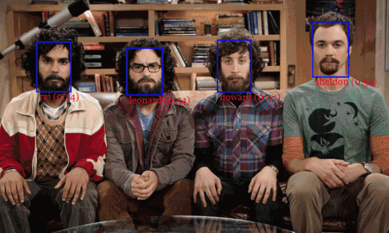
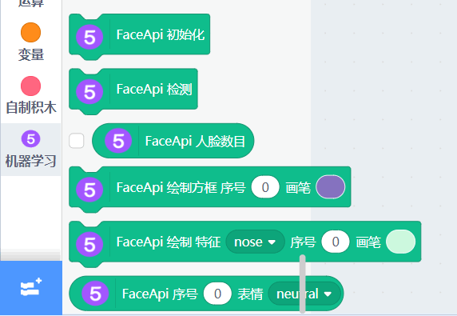
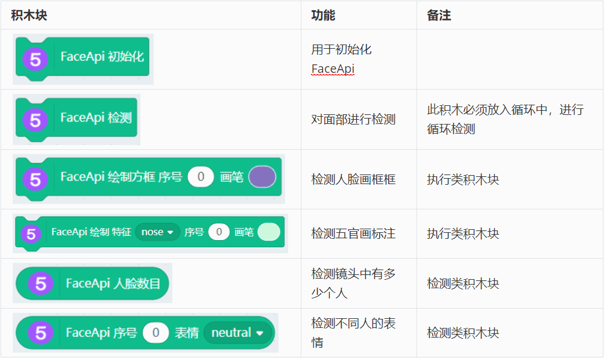
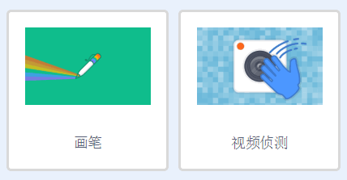
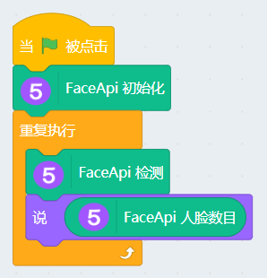
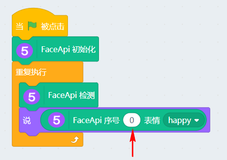
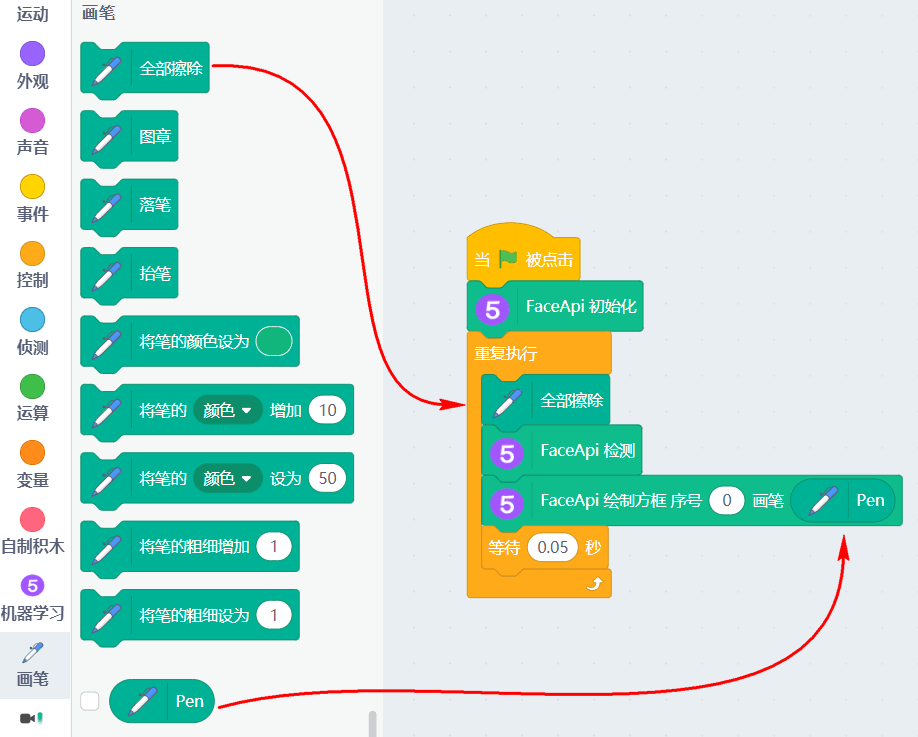
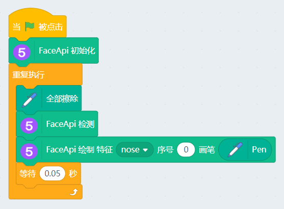

# 本地版的人脸检测FaceApi-检测人数/表情/五官

## 简介

人脸检测在FaceAI的插件中已经讲解过了，FaceAI的人脸检测是基于网络云端的，一般对网络要求也不高，只是有一定的时间间隔限制。

之前用用户问，是否可以检测镜头中有多少个人，还有他们各自的表情。这个功能需要更加细化的人工智能，因此小喵加入了FaceApi。它是一个建立在tensorflow.js内核上的 java 模块，它实现了三种卷积神经网络（CNN）架构，用于完成人脸检测、识别和特征点检测任务。

## 加载插件

FaceApi是放在Machinelearning5（机器学习5）的插件下

插件成功加载，FaceApi相关积木块如下：

## 积木块简介

| 积木块              | 功能                 | 备注                               |
| ------------------- | -------------------- | ---------------------------------- |
|  | 用于初始化FaceApi    |                                    |
|  | 对面部进行检测       | 此积木必须放入循环中，进行循环检测 |
|  | 检测人脸画框框       | 执行类积木块                       |
|  | 检测五官画标注       | 执行类积木块                       |
|  | 检测镜头中有多少个人 | 检测类积木块                       |
|  | 检测不同人的表情     | 检测类积木块                       |

## 示例程序

在使用FaceApi前，我们还需要加入两个插件，视频侦测与画笔插件

### 检测人脸数目

**初次 FaceApi初始化 与检测会有点卡，稍等几秒就好，因为首次运行需要导入模型到显卡中进行初始化运算。**

实物现象，检测到1个人

### 检测不同人的表情

序号从0开始。如果镜头中有两个人脸，到底哪个是序号0哪个是序号1呢？

脸越靠近摄像头的，序号越小。表情反馈的数值为0~1，越接近1，表明这个表情的几率越大。

### 脸部追踪画框框

说到人脸检测，我们经常看到一些图片展示，在检测到的人脸进行画框，感觉很高大上。我们也实现下。

这里用到画笔插件，程序如下：

### 画五官

同理，FaceApi也能把我们的特征给画出来

