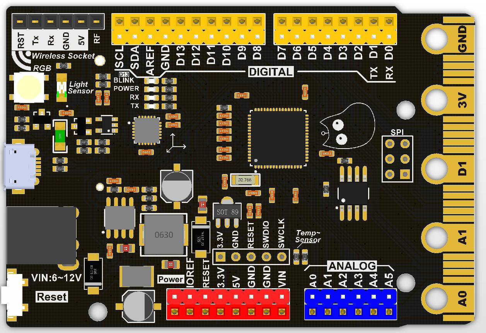
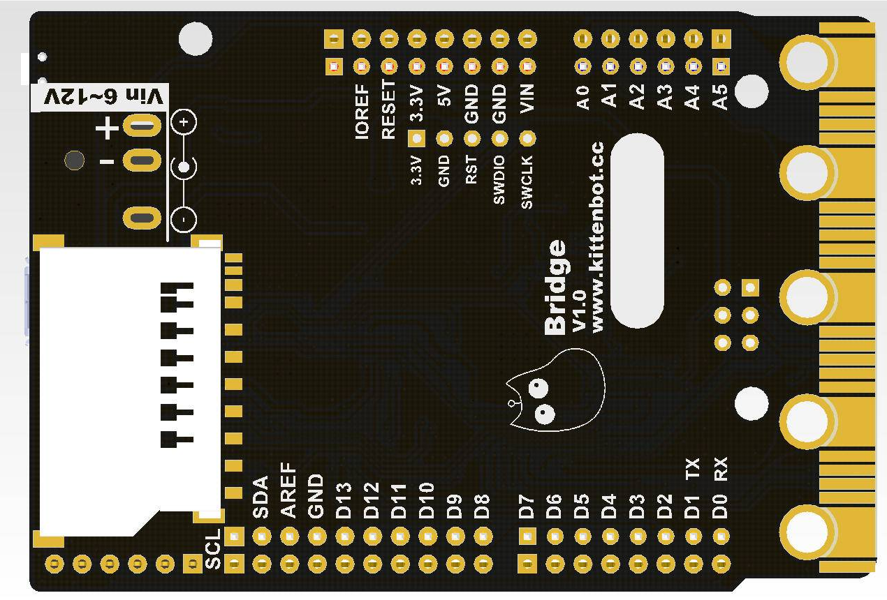
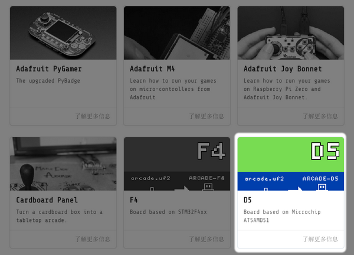
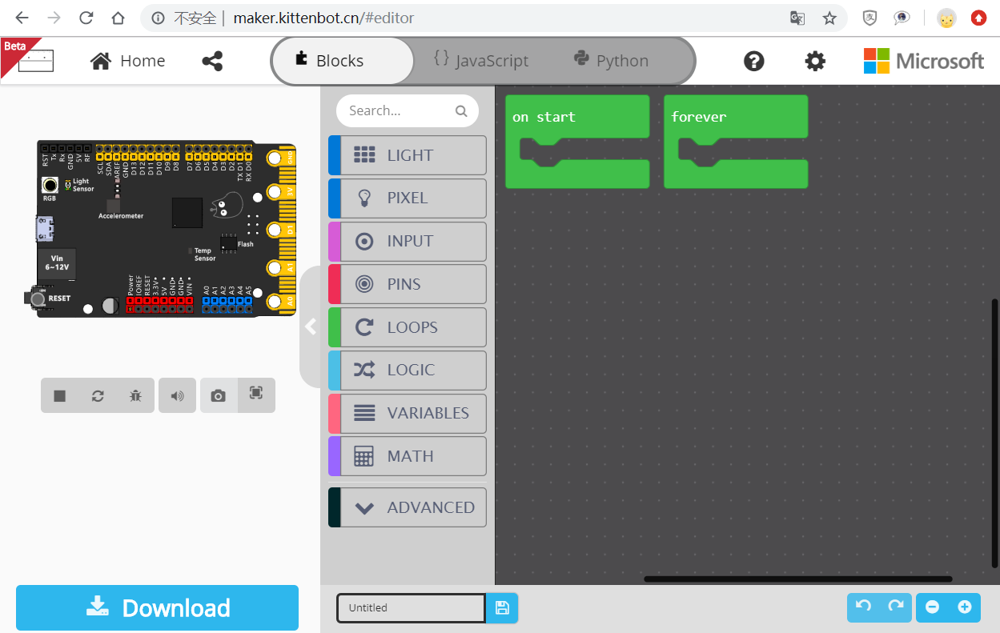
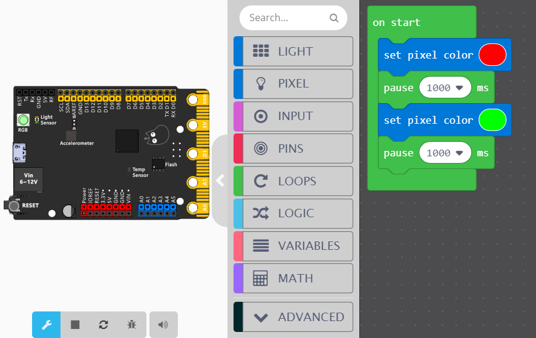
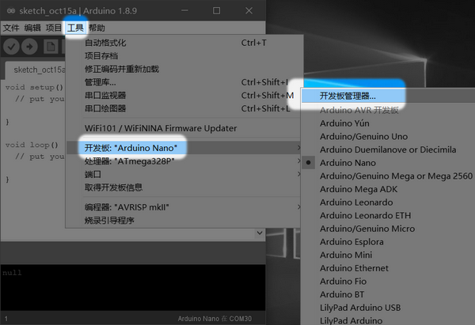
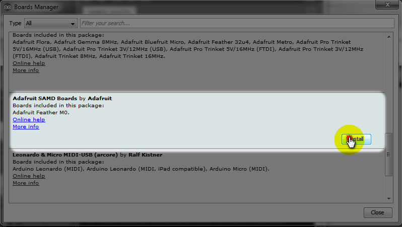
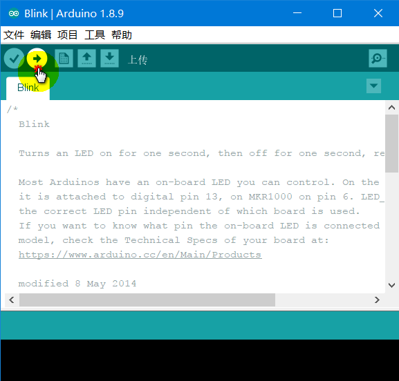

# Bridge

## 简介

Bridge是喵家推出一个款D51高性能主控板，它具有UNO的外形与引脚排布，板子尾部还带有类似Microbit的金手指，可插在Microbit相关的扩展板（Robotbit、IObit）进行使用。

软件上，它可以在Aruduino IED、Makecode Arcade平台、Makecode Maker平台上使用，支持图形化编程与MicroPython编程，因此取名为Bridge(桥)，连接各个平台的桥梁。

## 技术参数

主控芯片：ATSAMD51J19  ARM Cortex-M4

主频：120MHz

硬件DSP和浮点支持

**512 KB** flash, **192 KB** RAM

32位单片机，3.3V逻辑电平

2路真DAC（A0、A1，真正的模拟输出）

8路ADC（实际引出6路）

16路PWM输出（除SCL引脚）

所有引脚支持中断

板子尺寸：77.8x53.3mmx13mm

重量：26.5g

自带传感器：

- 光敏传感器
- 温度传感器
- 加速度传感器 
- 可编程RGB灯（芯片脚PB22）
- 可编程LED（13脚）

2MByte SPI FLASH

2.54mm排针排母接口编程口

Microbit金手指可编程接口

机械安装孔位：符合UNO安装孔的形状尺寸与位置尺寸，直径3的通孔

## 使用注意

SDA、SCL引脚，此引脚上没有上拉电阻，因此当与I2C一起使用时，需要2.2K-10K上拉电阻。

SDA对应是A6，SCL对应是A7

可编程RGB接在 pin 40（Arduino）

插上USB状态下，RGB灯用来表示板子在电脑是否枚举成功，绿色为成功，红色为故障。

## 供电方式

USB供电：5V，最大驱动电流1A

DC电源供电：6-12V，最大驱动电流3A

## 接口说明

Microbit金手指接口

数字IO口：D0-D13、A0-A5

模拟IO口：A0-A5  

20路PWM

1个SPI接口

1个SWD接口

1个SD卡槽

1个kittenbot wifi接口

## 特色

性能远超UNO

引脚接口和板子形状尺寸兼容UNO，支持UNO的扩展板

支持多个平台编程，Makecode Arcade平台、Makecode Maker平台、Arduino IDE上使用

加上Arcade Shield可扩展为 Arcade平台的游戏机

以U盘形式进行下载，下载方便

支持MicroPython编程

## Arcade编程平台快速指引

### 插上主控板

第一次插上Bridge软件会提示安装驱动，大部分的WIN10和WIN7都会安装成功，只有极少部分精简系统的电脑系统驱动没有安装成功，安装不成功请到喵群找技术解决。

成功连接，板子左上角（如图）RGB会显示为绿色。并且电脑会枚举一个Bridge的U盘出来

这个U盘不是真的U盘，只是一种下载方式，当程序（.UF2）拖到U盘上，板子就相当于下载程序了，然后这个.UF2就消失了。重新枚举的U盘跟下载之前的一样（很多新手以为这个现象是程序没下载成功，其实并不是），这种.UF2的下载方式是由微软的Makecode团队所创造的。

### 打开编程网址

https://arcade.makecode.com/

Makecode Arcade平台，使用方式与喵比特一致，点击下载时，选择D5主控板，如图

maker makecode平台

http://maker.kittenbot.cn/

新建项目，选择Kittenbot-Bridge板子

编程界面如下

这里编写了一个控制板子自带的RGB灯的程序，点击下载即可。

## Arduino 使用

### 下载Arduino

首先你需要[下载Arduino](https://www.arduino.cc/en/Main/Software)，保证版本至少是1.80以上的，否则按照以下教程操作可能不成功。

### 加入板子

因为这个板子不属于官方的标准板子，所以没有内置，我们需要自己设置下载。

把这条连接贴上去

https://adafruit.github.io/arduino-board-index/package_adafruit_index.json

### 打开开发板管理器

选择安装adafruit的包，adafruit的包基本上含有市面上比较新的主控板，Bridge内核D51与adafruit的一款M4板子内核一致，所以我们直接用现成的就好。等待安装完成

### 选择开发板

1. 选上主板——SAMD51
2. 连接上串口

### 打开示例程序

这里打开了经典的示例程序13脚闪灯的程序，点击下载，下载完成我们就可以看到13脚的LED交替亮灭了。

