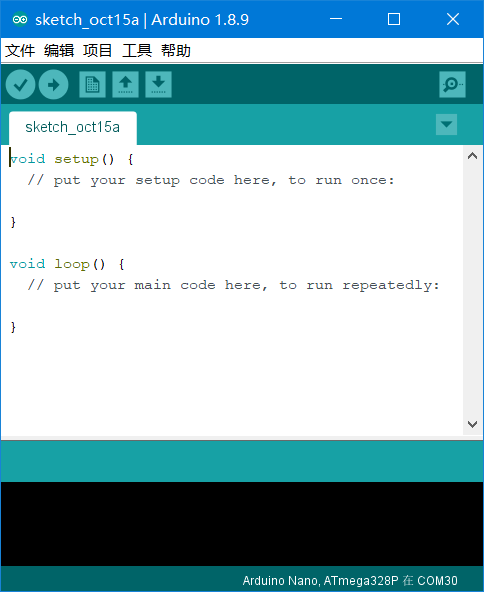
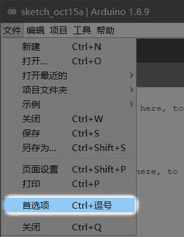
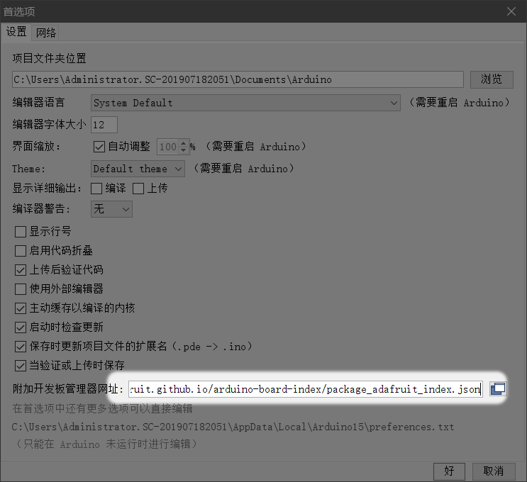
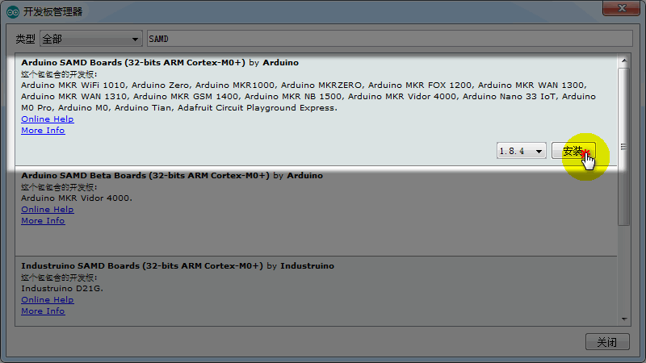
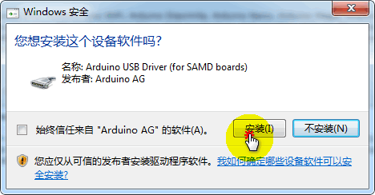
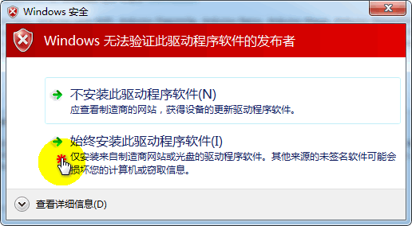
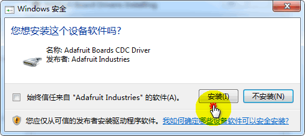
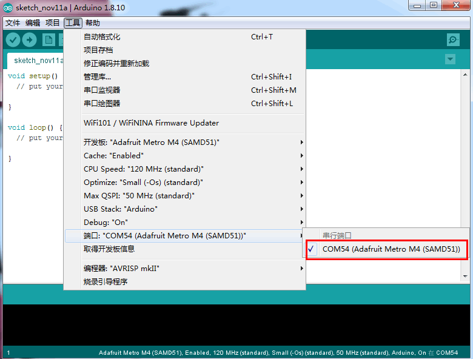

# Arduino编程快速开始

提起Arduino当然会想到Arduino IDE，我们也从这个讲起

## 下载Arduino IDE

首先你需要[下载Arduino](https://www.arduino.cc/en/Main/Software)，保证版本至少是1.80以上的，否则按照以下教程操作可能不成功。




## 加入板子

因为这个板子不属于官方的标准板子，所以没有内置，我们需要自己设置下载。





把这条连接贴上去

https://adafruit.github.io/arduino-board-index/package_adafruit_index.json


## 打开开发板管理器


- 首先安装SAMD suport 

    

```hint:: 如果过程中弹出的一些驱动安装提示，和安全提示通通选择安装即可
``` 

 
 


- 接着我们安装Adafruit SAMD来添加我们bridge板子文件的定义

  

```important:: 如果你是win7或8，你需要下载相关的驱动，win10一般会自动安装所以win10用户应该可以不管下面的驱动安装
```

- 安装这个驱动安装包，[下载驱动安装软件](https://kittenbot.oss-cn-shanghai.aliyuncs.com/bridge/adafruit_drivers_2.3.4.0.exe)  

双击打开即可  

 
 


## 选择开发板

选上主板——SAMD51，并连接上Port口

 
 


## 运行第一个程序——点灯

打开经典的示例程序blink(13脚闪灯)，点击下载，下载完成我们就可以看到13脚的LED交替亮灭了。

