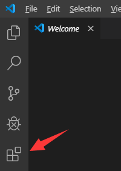
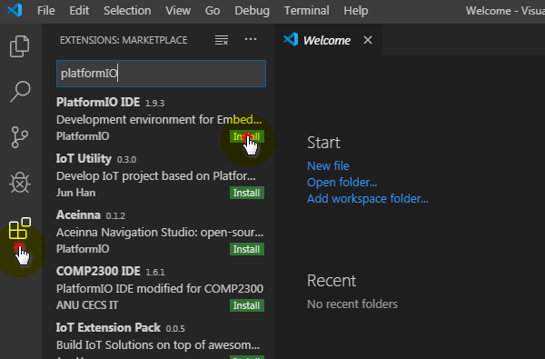
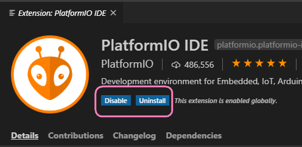
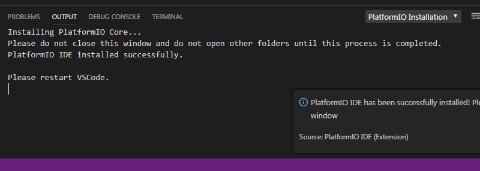
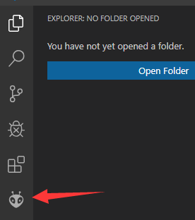

# platformIO准备

```important:: platformIO是一个依附于vscode编辑器的开发平台
```

本教程是针对bridge在Arduino环境下的开发，但本章以后我们就不使用传统Arduino IDE进行讲解而使用platformIO。使用它的最大原因在于vscode专业的编程体验加上platformIO强大的平台和库管理功能，使得整体写代码效率高于Arduino IDE

本教程最好先完成上一篇讲到的基本配置再进行，否则可能遇到一些驱动问题

## Step1——安装vscode

vscode由微软开发和维护，可以理解为一个更加精简和开放的visual studio。我们可以直接在 [https://code.visualstudio.com/](https://code.visualstudio.com/) 下载并安装。

## Step2——vscode下安装platformIO插件

- vscode大部分功能都以插件的方式实现，首次安装后可以在左侧打开插件面板：



- 搜索 `platformIO`，并选择install，安装成功就会变成下面这样 





```attention:: 插件安装一般会挺久的，超过1小时都有可能，请大家耐心等待完成～
```

- 成功会有如下提示，如果失败，请尝试重新安装 



```hint:: 过程很长，期间可以浏览下其他插件，有需要有用的插件，比如你喜欢python，你可以在这里输入python，并选择下载喜欢的插件，一般下载数最多的准没错
```

- 当platformIO插件安装完成后，重启一下vscode，就可以在左侧看到一个外星人logo，这就是platformIO的插件入口了




本节内容到此结束，这一讲我们安装好了VScode和platformIO的环境。


