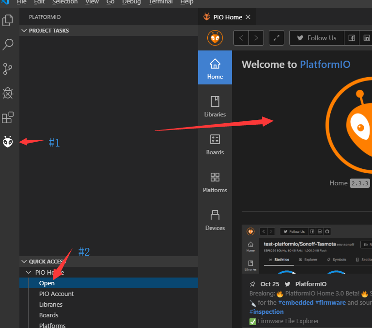
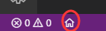
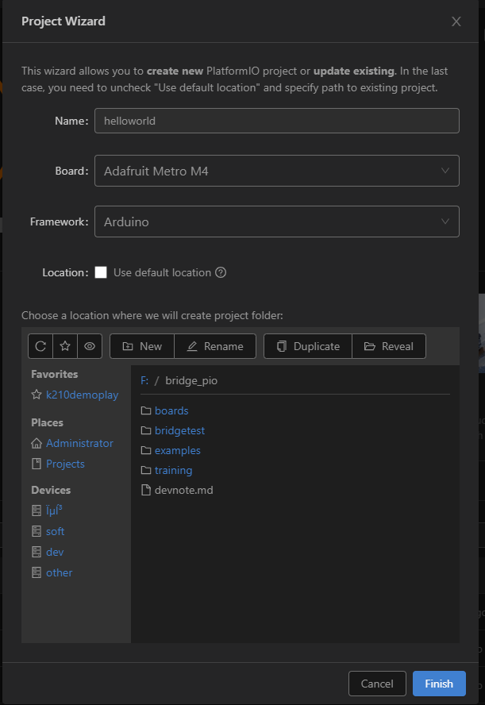
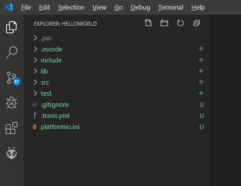
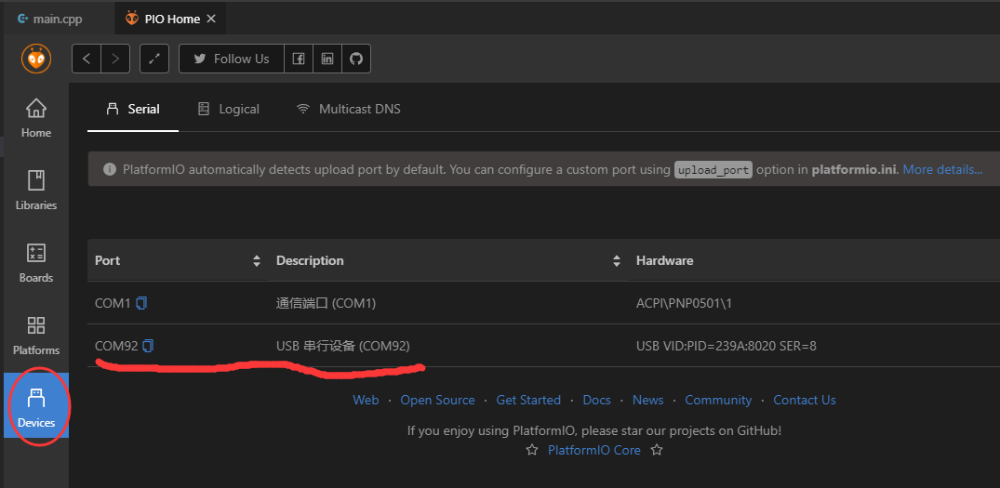
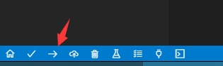
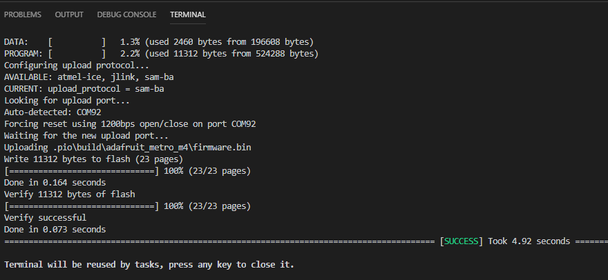
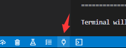
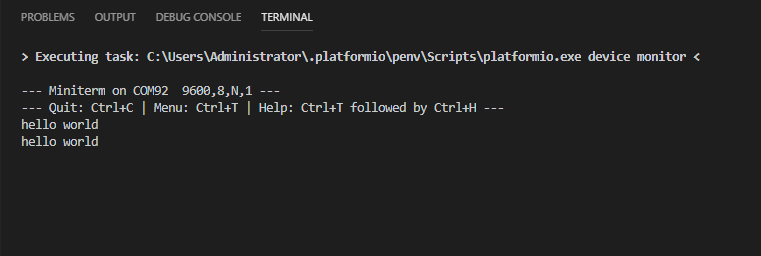

# platformIO快速开始

通过上篇搭建好开发环境后，就开始我们第一个程序，以点灯作为最基本的例子

## 第一步：进入Home主页

首先打开platformio（后面简称为PIO）主页，有两种方法

**方法1，点击侧边栏外星人图标 > 在PIO Home点击Open**



**方法2： 在最下侧点击 Home 图标**




## 第二步：新建项目 （自动生成项目模板）

- 在home主页中我们点击 `+ New Project`

- 在弹出的页面中我们给项目起名字(helloWorld之类的)

- 因为Bridge基于Adafruit M4开发，在小喵Bridge项目页面上线前都可以使用M4作为主板型号。

```hint:: 建议大家自己选择项目地址，如果默认，则项目地址藏在PIO用户页面下，比较难找还不好管理
```



- 点`Finish`按钮，首次建立项目需要下载项目相关的库，编译环境等等。基于网络环境可能需要5～30分钟不等。

**自动生成的项目结构如下**



## 第三步：连接Bridge主板

我们需要用microusb线将主板连接到我们的电脑上，如果一切正常的话可以在PIO主页的设备目录看到我们的Bridge主板



当我们确认我们的主板跟电脑连接正常后就可以开始写程序了～

## 第四步：编写Blink代码

我们在`src`目录找到自动生成的`main.cpp`，这就是我们主程序的入口。

接下来将下面代码复制到主程序文件中

```c++
#include <Arduino.h>

void setup()
{
  // initialize LED digital pin as an output.
  pinMode(LED_BUILTIN, OUTPUT);
  Serial.begin(115200);
}

void loop()
{
  // turn the LED on (HIGH is the voltage level)
  digitalWrite(LED_BUILTIN, HIGH);
  // wait for a second
  delay(1000);
  // turn the LED off by making the voltage LOW
  digitalWrite(LED_BUILTIN, LOW);
   // wait for a second
  delay(1000);
  Serial.println("hello world");
}
```

当代码编写完成后我们需要编译并上传到Bridge主板上，在下侧菜单栏找到上传按钮并点击：



PIO会自动对代码进行编译并自行找到串口并下载编译后的程序，一起正常的话应该在最后显示 `SUCCESS`



## 第五步：使用串口终端

PIO还内置的串口终端工具，虽然基于命令行模式的跟我们其他常见的工具比起来不那么好用，但是可以快速得到我们想要的输出结果。

在底部菜单栏中插头标志就是我们的串口终端：



我们可以看到终端在不停打印我们的 `hello world`输出



最后我们可以通过`Ctrl+C`关闭终端

以上就是我们本节教程的内容，后续所有项目的创建、编辑还有下载流程都基本一致。


