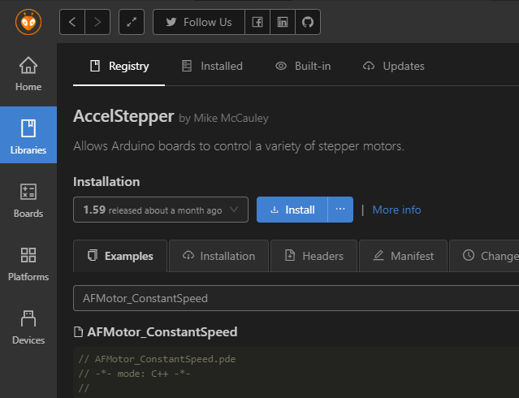
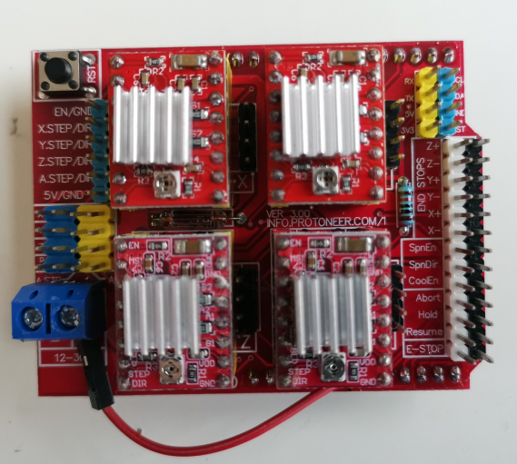
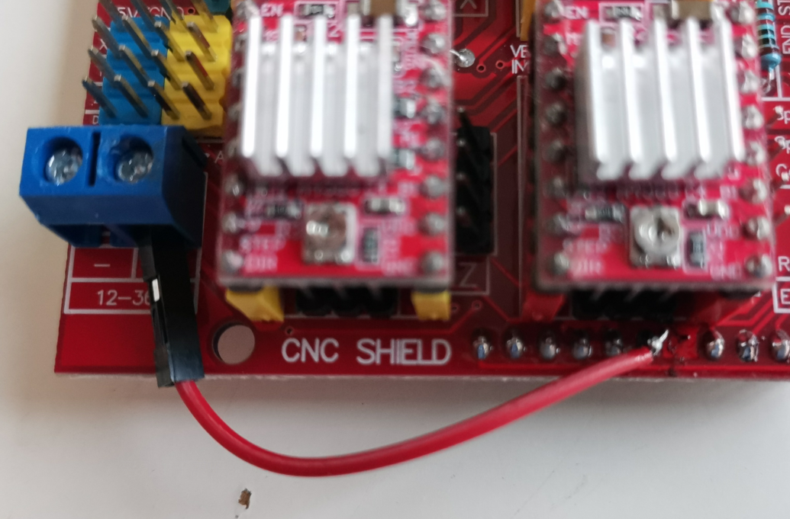
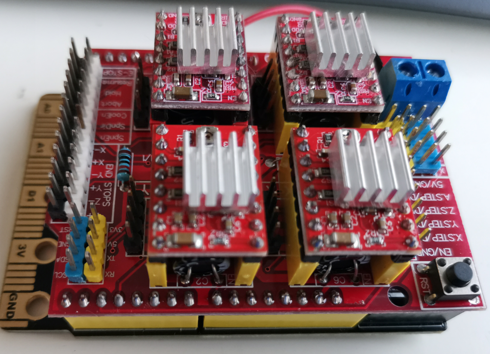

# CNC 扩展板与步进电机驱动

Bridge开发的初衷就是一个多编程平台的机器人主板，这一节我们就结合Arduino的CNC扩展板演示下Bridge的步进电机控制的潜力。完整的CNC主板控制程序还需要大量的工作，当然这也在我们开发计划中，大家可以期待下 ～

## Step 1 安装步进电机库

我们这里选用Arduino经典的`Accelstepper`库作为步进电机驱动程序



## Step 2 硬件准备

我们需要用到额外的CNC扩展板连接步进电机：



**以下有几点需要注意的地方：**

- 这个板子由于价格极低导致品质良莠不齐，大家拿到手后一定要检查下电源和地有没有焊短路，或者其他奇怪的地方是否有卡着锡珠。


- 由于需要额外的供电电源，这里我们为了简化供电直接将电源输入引到VIN脚，这样可以通过DC头给Bridge主板和CNC扩展板同时供电。

如下图：



- 将VIN和CNC shield电源输入短接后，尽量不要将高于16V的电源接到DC头上，过高的输入电压有可能会导致Bridge降压芯片工作不正常


- 还要注意的是步进电机驱动模块千万不要插反了，注意看背后丝印 EN对着插槽的EN脚，如果插反了可能会烧驱动器芯片。

最后我们把CNC shield插到Bridge上，注意对齐引脚位置。




## Step 3 程序引脚规划

在写程序前我们先要确定CNC扩展板的控制方式，我们可以在背后丝印找到对应IO的功能。我们知道常规类A4988驱动都是一个引脚控制方向，另外一个引脚发送步进脉冲。

本节我们用到的引脚如下：

```sh
D8: 电机使能

D7: Z DIR
D6: Y DIR
D5: X DIR

D4: Z STEP
D3: Y STEP
D2: X STEP
```

## Step 4 编写步进电机控制程序

- 首先我们需要引入Accel的头文件，注意这里我们需要同时使用多个步进电机因此需要两个头文件，分别表示基础步进电机驱动和多步进电机的组合控制。

```c++
#include "AccelStepper.h"
#include "MultiStepper.h"
```

- 之后定义步进电机实例，和组合控制器。

```c++
AccelStepper stpX(AccelStepper::DRIVER, 2, 5); // step, dir
AccelStepper stpY(AccelStepper::DRIVER, 3, 6);
MultiStepper steppers;
```

- 在Setup函数中我们首先初始化点击使能IO，注意是低电平使能：

```c++
pinMode(8, OUTPUT);
digitalWrite(8, 0); // enable
```

- 之后初始化步进电机相关参数，并且将XY的电机和多步进电机控制器捆绑：

```c++
  stpX.setMaxSpeed(600.0);
  stpX.setAcceleration(200.0);
  stpY.setMaxSpeed(600.0);
  stpY.setAcceleration(200.0);
  steppers.addStepper(stpX);
  steppers.addStepper(stpY);
```

- 我们可以通过给 `steppers.moveTo(stepPos)`传递目标位置，接着通过 `steppers.runSpeedToPosition();`等待两个步进电机运动到指定位置来实现同步运动。

## 完整代码如下

```c++
#include <Arduino.h>
#include "AccelStepper.h"
#include "MultiStepper.h"

AccelStepper stpX(AccelStepper::DRIVER, 2, 5); // step, dir
AccelStepper stpY(AccelStepper::DRIVER, 3, 6);
MultiStepper steppers;

long stepPos[2];

void setup()
{
  pinMode(8, OUTPUT);
  digitalWrite(8, 0); // enable

  Serial.begin(115200);

  stpX.setMaxSpeed(600.0);
  stpX.setAcceleration(200.0);
  stpY.setMaxSpeed(600.0);
  stpY.setAcceleration(200.0);
  steppers.addStepper(stpX);
  steppers.addStepper(stpY);
  
}

void loop()
{
  Serial.println("move to 1000");
  stepPos[0] = 1000;
  stepPos[1] = 1000;
  steppers.moveTo(stepPos);
  steppers.runSpeedToPosition();
  delay(2000);
  Serial.println("move to -1000");
  stepPos[0] = -1000;
  stepPos[1] = -1000;
  steppers.moveTo(stepPos);
  steppers.runSpeedToPosition();
  delay(2000);
}
```

## 下载与观察结果

最后将程序下载到板子上，并且连接电机到指定的驱动口。注意常见的42步进电机需要8v以上才能正常工作，请检查你的DC电源是否有足够的驱动能力。

`这一节我们介绍了基本的步进电机驱动，那么课后作业就请大家做一个XY绘图仪程序吧`