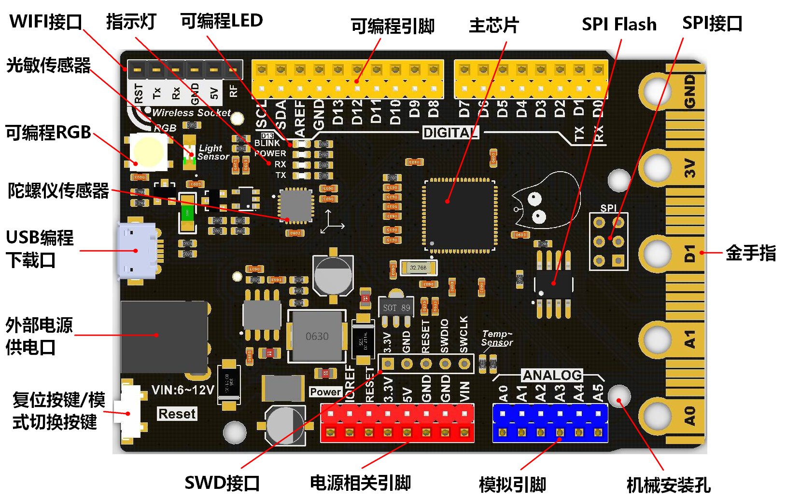
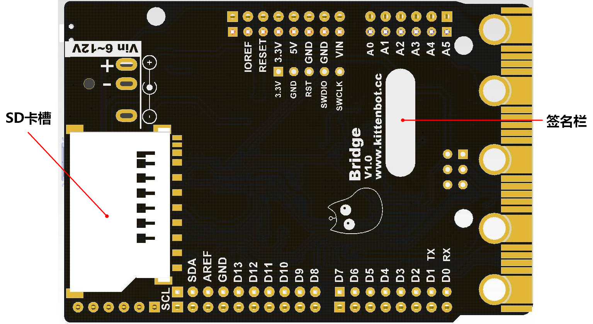

# Bridge简介

Bridge是喵家推出一个款D51高性能主控板，它具有UNO的外形与引脚排布，板子尾部还带有类似Microbit的金手指，可插在Microbit相关的扩展板（Robotbit、IObit）进行使用。

软件上，它可以在Aruduino IED、Makecode Arcade平台、Makecode Maker平台上使用，支持图形化编程与MicroPython编程，因此取名为Bridge(桥)，连接各个平台的桥梁。

## 技术参数

主控芯片：ATSAMD51J19  ARM Cortex-M4

主频：120MHz

硬件DSP和浮点支持

**512 KB** flash, **192 KB** RAM

32位单片机，3.3V逻辑电平

2路真DAC（A0、A1，真正的模拟输出）

8路ADC（实际引出6路）

16路PWM输出（除SCL引脚）

所有引脚支持中断

板子尺寸：77.8x53.3mmx13mm

重量：26.5g

自带传感器：

- 光敏传感器
- 温度传感器
- 加速度传感器 
- 可编程RGB灯（芯片脚PB22）
- 可编程LED（13脚）

2MByte SPI FLASH

2.54mm排针排母接口编程口

Microbit金手指可编程接口

机械安装孔位：符合UNO安装孔的形状尺寸与位置尺寸，直径3的通孔

## 使用注意

SDA、SCL引脚，此引脚上没有上拉电阻，因此当与I2C一起使用时，需要2.2K-10K上拉电阻。

SDA对应是A6，SCL对应是A7

可编程RGB接在 pin 40（Arduino）

插上USB状态下，RGB灯用来表示板子在电脑是否枚举成功，绿色为成功，红色为故障。

## 供电方式

USB供电：5V，最大驱动电流1A

DC电源供电：6-12V，最大驱动电流3A

## 接口说明

Microbit金手指接口

数字IO口：D0-D13、A0-A5

模拟IO口：A0-A5  

20路PWM

1个SPI接口

1个SWD接口

1个SD卡槽

1个kittenbot wifi接口

## 特色

性能远超UNO

引脚接口和板子形状尺寸兼容UNO，支持UNO的扩展板

支持多个平台编程，Makecode Arcade平台、Makecode Maker平台、Arduino IDE上使用

加上Arcade Shield可扩展为 Arcade平台的游戏机

以U盘形式进行下载，下载方便

支持MicroPython编程

