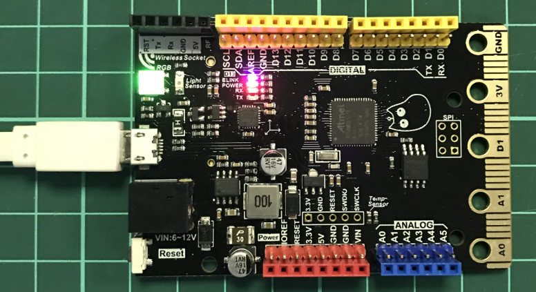
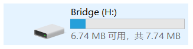
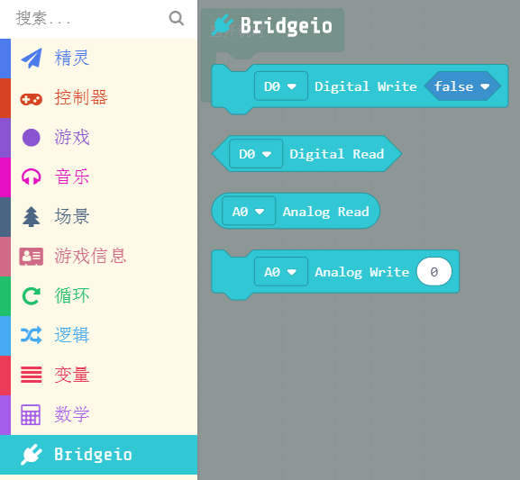
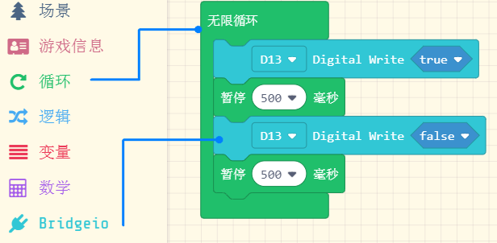
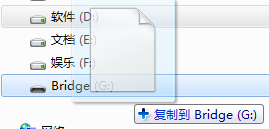
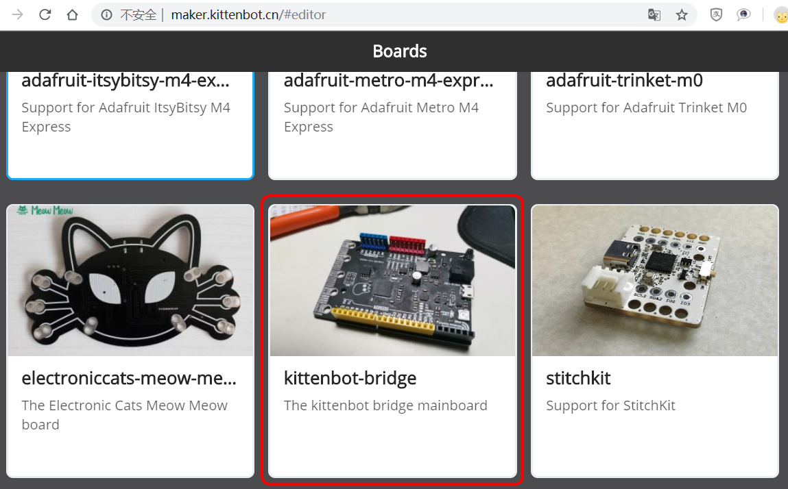

# Makecode编程

```hint:: makecode平台系列bridge支持2个，分别是Arcade和maker，这两个平台很像但，maker平台的完整性不高，而arcade平台主打游戏编程，需要喵家的arcadeShield才更能体现功能，但两个平台对引脚的控制都是差不多的自行选择
```

## 插上主控板

第一次插上Bridge软件会提示安装驱动，大部分的WIN10和WIN7都会安装成功，只有极少部分精简系统的电脑系统驱动没有安装成功，安装不成功请到喵群找技术解决。

成功连接，板子左上角（如图）RGB会显示为绿色。并且电脑会枚举一个Bridge的U盘出来



```hint:: 这个U盘不是真的U盘，只是一种下载方式，当程序（.UF2）拖到U盘上，板子就相当于下载程序了，然后这个.UF2就消失了。重新枚举的U盘跟下载之前的一样（很多新手以为这个现象是程序没下载成功，其实并不是），这种.UF2的下载方式是由微软的Makecode团队所创造的
```

 


## Arcade编程开始

编程地址 [https://arcade.makecode.com](https://arcade.makecode.com)

- 加载bridge扩展包： https://github.com/KittenBot/pxt-bridgeio 

   

- 编写简单程序让bridge板载D13脚的蓝色led间断闪烁 

   

- 点击左下角下载按钮，选择D5(由于bridge使用的是D51芯片)

 

- 将得到的.uf2文件拷贝进bridge盘符下即可看到现象

  

```attention:: bridge盘符没出现的话试着按一下Reset按键，如果板子的RGB常亮绿灯一般可以了
```

## maker编程开始

推荐地址为喵家服务器：[http://maker.kittenbot.cn](http://maker.kittenbot.cn)


- 新建项目，选择Kittenbot-Bridge板子



编程界面如下


- 编写了一个控制板子自带的RGB灯的程序，点击下载即可。


- 将得到的.uf2文件拷贝进bridge盘符下即可看到现象

 


