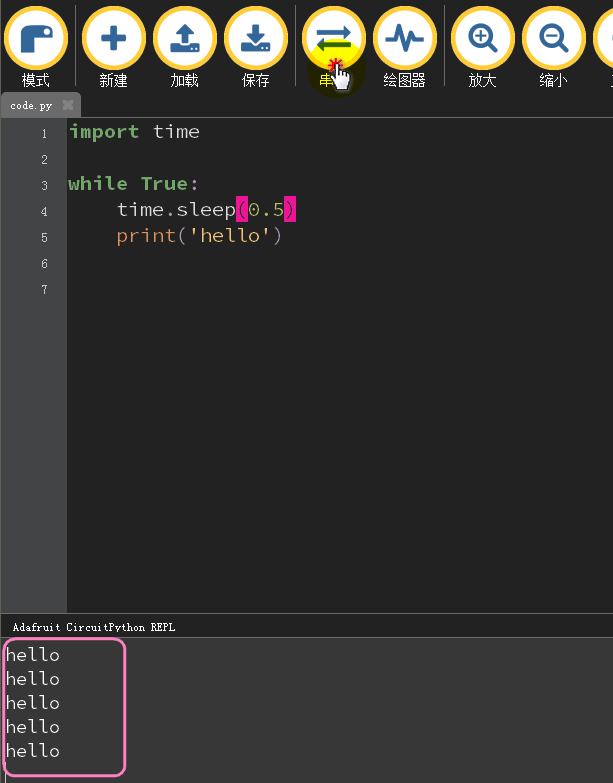

# 串口控制台 

python中常用的一个语句叫做`print`   

```python
print("hello World!")
```  

这行代码是让你的代码能够输出文本，便能够得到`hello World!`字样 

说起这些文本的输出，它需要一个地方去打印出来让我们看到，这个地方便是`串口控制台`  

串口控制台通过USB传输收到板子的文本输出并展示。

```hint:: print是最常用的代码段，用于调试或捕获异常信息，让代码的运行更清晰 
```  

## 连接串口控制台 

- 串口控制台已经集成好在Mu中了，首先我们先写个程序给板子运行 

```python
import time
 
while True:
    time.sleep(0.5)
    print('hello')
```

- 打开串口，就可以看到一条条打印的hello了 

  

## 与串口控制台互动 


