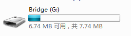
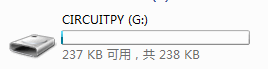
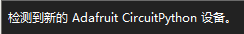
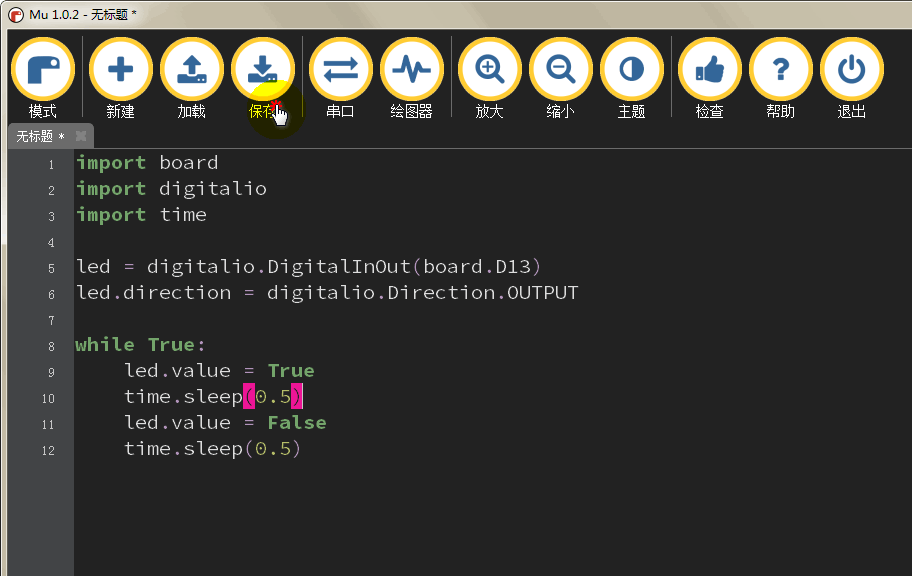
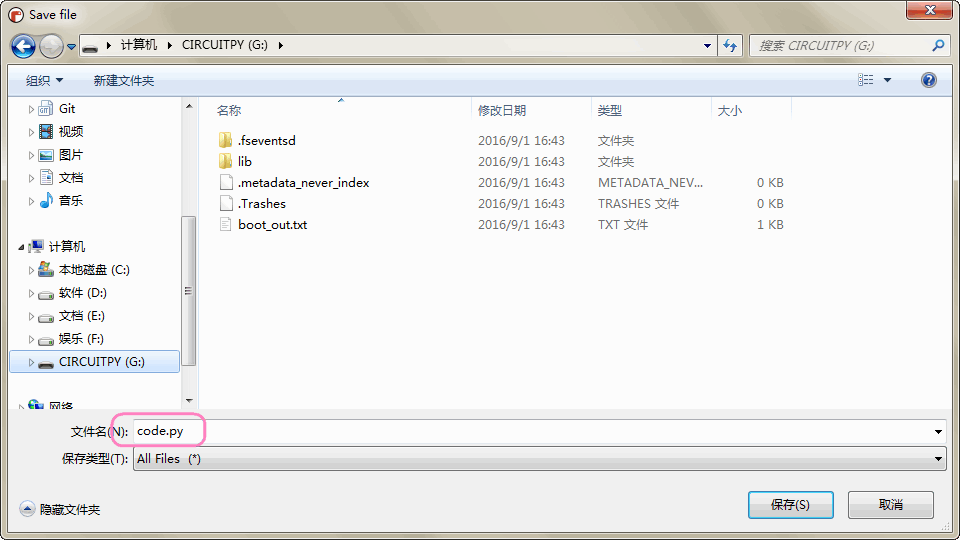

# micropython编程快速开始 

micropython的编程我们选择Mu edito软件，由于软件含有REPL，一键刷入，以及具有bridge的编程环境。

**没有Mu的朋友首先下载**

- Windows用户我们帮你下载好了安装包 [点击下载](https://kittenbot.oss-cn-shanghai.aliyuncs.com/mu/mu-editor_1.0.2_win64.exe)
- Mac用户在Mu官网下载 [https://codewith.mu/en/download](https://codewith.mu/en/download) 

## 刷入固件 

- 要进入micropython模式，首先下载固件 [点击下载](https://kittenbot.oss-cn-shanghai.aliyuncs.com/bridge/micropython/firmware.uf2)   

- 使用USB线连接bridge，看到bridge盘符出现  


- 将上面下载的固件.uf2文件拖入bridge盘符内，不出意外可能电脑自动安装驱动后，会出现如下盘符 



 ## 开始编程 

 编程环境都齐备了，接下来就开始编写第一个程序吧  

 - 打开Mu软件，不出意外左下角会出现这行字 
  

- 开始编程，复制下面代码到Mu 

```python
import board
import digitalio
import time
 
led = digitalio.DigitalInOut(board.D13)
led.direction = digitalio.Direction.OUTPUT
 
while True:
    led.value = True
    time.sleep(0.5)
    led.value = False
    time.sleep(0.5)
```
- 点击保存按钮，保存程序文件到CIRCUITPY盘符，命名为code.py  

 
  

- 最后等待一会儿，便可以看到板子上的蓝色led灯间断闪烁了，程序正在运行 


## 程序分析 

分析一下刚才我们下载的闪灯程序

### import和库 

```python
import board
import digitalio
import time
``` 

`import`告诉板子，需要在代码中使用的库，在上面的例子中，我们import了3个库分别是`board、digitalio和time`。这3个库都是bridge固件内置的，所以不需要额外的库文件。`digitalio`用以控制板子的输入、输出，而`time`库中的sleeping方法则使板子实现延时效果。 

### 配置LED 

```python
led = digitalio.DigitalInOut(board.D13)
led.direction = digitalio.Direction.OUTPUT
``` 

这两条语句用来配置led。板子内部固件已经知道D13脚就是板载的LED，我们只需要初始化这个D13引脚，并设置为OUTPUT模式。其中led被设置就等于是这一串的引脚信息，所以我们直接用`led`来代表这个引脚。 

### 循环 

```python
while True:
    led.value = True
    time.sleep(0.5)
    led.value = False
    time.sleep(0.5)
``` 

`while True：`实际就是指的永远都执行。这就相当于Arduino中的loop(无限循环)。代码将一直运行while(当)的条件是True，并且位于循环内的代码需要缩进。 

首先`led.value = True`，这一行告诉LED："打开"。下一行`time.sleep(0.5)`，告诉板子暂停运行程序0.5s，直到下一条代码告诉LED你需要做什么这段时间LED都不会改变。  

```important:: 完成到这里你应该已经了解micropython程序跑起来是这样的一个流程了，接下来后面的篇章将带大家进一步了解更有趣的编程体验
``` 


