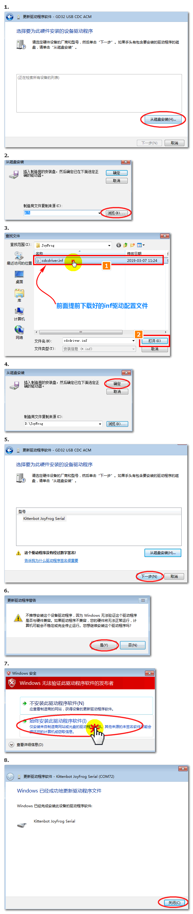
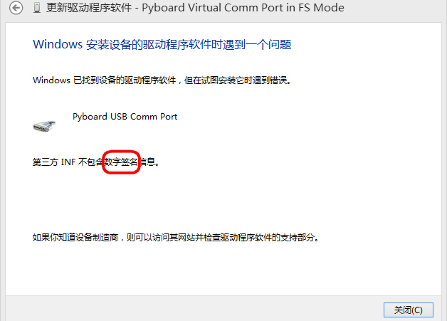
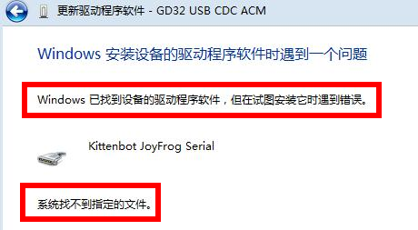
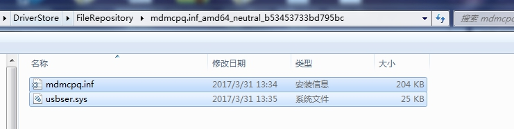

# 青蛙手柄驱动安装

针对与Kittenblock中的串口通讯，所以需要提前安装一个串口驱动，如果不安装驱动只能当做一个键盘外设与Kittenblock进行交互（红外功能与3PIN接口无法进行通讯）

## 插上USB

插好，蜂鸣器会发出一个短曲。证明USB成功枚举(不同电脑枚举的速度不太一样，有些电脑枚举特别快，枚举时间不同属于正常现象)

稳定后，中间的蓝灯常亮，右侧的红色电源灯常亮。硬件为正常

## 安装驱动

实际安装很简单，只是为了手把手让大家跟着做，所以截图比较详细，不要害怕！你可以的！

请对照图片一步步进行操作，不要跳过任何的一步。

### 下载inf驱动配置文件

[下载地址](https://bbs.kittenbot.cn/forum.php?mod=attachment&aid=MjgzOXxhYTgzZjE0MHwxNTU2MDg4MTI4fDN8NTU0)

### 驱动安装选择

右键我的电脑图标——管理——设备管理器

### 驱动路径选择

恭喜，安装完成！如果你发现安装不成功，请在再多看仔细看看操作，一般是自己操作有误导致的。

## 如果按照步骤安装依然安装不成功

### 现象1

部分电脑照着帖子一步一步操作，装到最后一步的inf，却被提醒以下的情况。

### 解决方法：

关闭数字签名，详情查看百度帖子：https://jingyan.baidu.com/article/3d69c5518ca3fdf0cf02d7c9.html

---

### 现象2

部分电脑照着帖子一步一步操作，装到最后一步的inf，却被提醒以下的情况。

### 原因

部分电脑是ghost版本，被精简了很多系统文件，所以驱动安装不上。

### 解决方法1：

针对精简情况**不是很严重的系统**，这种方式可以进行修复。

用腾讯电脑管家或者驱动精灵类似的软件，检查下电脑有哪些补丁可以更新，都去更新后，就能安装上了
（谢谢小笨老师反馈）

### 解决方法2：

对于精简很严重的系统，软件修复无效，那么我们需要手动补一些系统文件。

1、首先打开 C:\windows\inf\setupapi.dev.log

（有时候你需要管理员权限才能打开，右键以管理员身份启动）

这个文件包含了有关即插即用设备和驱动程序安装的信息，当然它也记录你驱动安装失败的原因。打开该文件，滚动到**文件末尾附近**，你可以看到如下信息：

2、在 C:\Windows\System32\DriverStore\FileRepository\ 路 径 下 ， 新 建 一 个mdmcpq.inf_amd64_neutral_b53453733bd795bc（**这个根据你上图的错误信息的提示修改**）文件夹

（有时候你需要管理员权限才能新建，右键FileRepository文件夹获得管理员权限）

****

3、将丢失文件拷贝到刚新建的文件下后，重新安装驱动，不出意外可以安装成功 。

缺失驱动文件在百度网盘下载：

链接：https://pan.baidu.com/s/1ZhlAgpaf9p-rpQClzCYOfA 
提取码：a7ez 