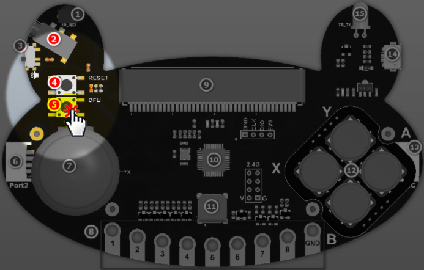

# Microbit如何给青蛙手柄更新底层固件

一般用户收到的青蛙手柄，它出厂时已经时候烧录好最新的底层固件。但是小喵是一家爱折腾的公司，不断会在产品上面增加功能，为了让它更加强大，适应性更好，所以我们产品难免会有固件升级。

## 如果装着硅胶套的，首先将硅胶套脱下来

按键帽和摇杆帽提前拔下来放好，再脱硅胶套，按键帽和摇杆帽先保管好，等烧录完固件，重新装好硅胶套后再按上。

## 把升级的hex文件拷贝到Microbit U盘上

首先把单独的Microbit插上USB线连接电脑

再把升级的hex复制到Microbit的U盘上（升级的hex文件由小喵科技提供）

[升级hex的下载地址（请到论坛下载，learn不能传附件）：](https://bbs.kittenbot.cn/forum.php?mod=viewthread&tid=568&extra=page%3D1)

拷贝成功后，Microbit现象（点阵屏显示一个问号）：

## 按住青蛙手柄PCB板上的的两个按键

因为实物比较难拍照，所以直接用渲染图表示。

按住按键4和按键5（按住不放！）

## 插上Microbit

依然按住按键4和按键5（按住不放！）

插到青蛙手柄的黑色PCB上可以听到滴、滴、滴的蜂鸣器声音
 

## 保持按住 按键5不放，放开按键4

**保持按住 按键5不放，放开按键4！**

**保持按住 按键5不放，放开按键4！**

**保持按住 按键5不放，放开按键4！**

这时候程序正式通过Microbit给青蛙手柄PCB进行刷入，这时候滴滴滴声变得急促起来，

Microbit点阵屏也从问号变成一个点阵进度显示。

**这个时候按键5也可以放手了！**

**这个时候按键5也可以放手了！**

**这个时候按键5也可以放手了！**
 

## 等待Microbit刷入完成

等到Micorbit点阵全部满屏后，变成一个心，这时候就表示程序完成刷入成功，这个时候，按键5可以松手了

## 刷入成功后，重新装好硅胶套 和按键，按照正常使用

