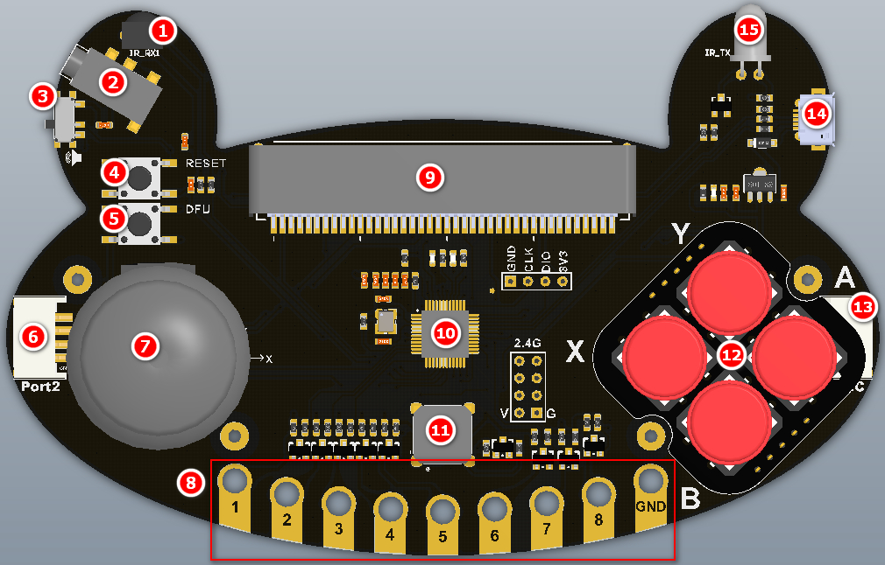

# 青蛙手柄（呱比特）简介

## 简介

青蛙手柄是小喵科技推出一款简单易用兼容Makecode编程的Scratch测控手柄。

它简单易用，可以接上Microbit作为Microbit的游戏手柄扩展板使用。也可以在Kittenblock中作为编程主板独立使用。

另外一个非常特别的特点，青蛙手柄插在电脑上即可自动识别成一个HID输入设备。此过程无需手动安装驱动。在不打开任何的图形化编程软件，它可以直接作为键盘的部分按键输入。如：手柄上的摇杆可以控制光标上下左右移动，摇杆按键为空格按键输入，手柄上的按键XYAB对应键盘XYAB，金属手数字触片分别对应键盘的数字键1~8

### 青蛙手柄在Kittenblock中编程

其中一个有趣的特色就是作为Scratch测控板来进行使用。青蛙手柄通过摇杆可以控制舞台角色的移动，青蛙手柄的按键可进行编程，可以结合程序进行编程。青蛙手柄上还有一个特色的功能——金手指，可以与Scratch的音乐模块，金手指通过鳄鱼夹可以与水果进行相连。这样我们就很简单做出水果乐器了。Scratch的音乐模块有18种敲击乐器，有21种乐器，足以让学生们充分发挥他们大脑洞与艺术细胞。

另外青蛙手柄，有2个PH2.0 3PIN接口，可以接市面上常规3PIN传感器，让用户也能把手上的3PIN模块用起来。有2个PH2.0 4PIN接口，可以插件小喵科技家的能量魔块，打通能量魔块的特色魔块，可以让DIY更加丰富。

板上带有红外发射管和红外接收管，板子已内置自动红外解码NEC，可以解码市面上常规遥控器。并且把解码的数据返回到Kittenblock中，您可以将其记录下来后，再通过编程发送不同的红外编码，这样就可以把家庭中的红外设备控制起来了

### 青蛙手柄在Makecode中的编程

在Makecode中编程，青蛙手柄作为Microbit的一个游戏手柄外设，通过游戏手柄与格斗小车相结合，让对战更加有趣。同时青蛙手柄上的红外发射与接收弥补了Microbit上没有红外发射和接收的功能。

Microbit的水果钢琴，直接用一个Microbit即可，无需像以往那样需要两个Microbit，而且需要复杂的连线，即可完成。

## 技术详细参数

尺寸：128mmx80mmx35mm，整体外形呈一个青蛙形状，后续可以配套青蛙硅胶套进行安装

主控：GD32F350C8T6，flash64kb，SRAM8kb，主频108MHZ

### 板上编程资源

- 两轴摇杆（摇杆有按钮）
- 四个按键
- 红外发射与红外接收管
- 可自动解标准NEC红外码
- 8个金手指触片，可配套鳄鱼夹进行使用
- 蜂鸣器
- 拨码开关：用于切换板上蜂鸣器或者者音频口（P0）

### 接口

- Microbit40PIN卧式接口
- GVAB 4PIN PH2.0接口x2
- GVS 3PIN PH2.0接口x2
- 3.5音频接口(用于外接音箱)
- 标准NRF24L01 8PIN2.4G无线接口

接口电压：3.3V

两个按键：用于给主控芯片进入烧写底层固件模式

LED灯：
电源指示灯

工作状态灯

插入电脑后可作为HID输入设备，同时也支持CDC串口设别

电源接口:MicroUSB
输入电压：5V

支持软件：Kittenblock、Makecode

## 电路板细节指示图

1.红外接收 
 
2.音频接口  

3.音频、蜂鸣器切换开关  

4.复位按键  

5.DFU模式按键  

6.4p模块接口  

7.摇杆（按键为空格键输入） 
 
8.金手指触片（1~8、GND）  

9.Microbit40PIN卧式接口  

10.主控芯片  

11.蜂鸣器  

12.按键（对应键盘上的X、Y、A、B）  

13.4p I2C接口  

14.Micor-USB数据线接口  

15.红外发射  

16、17.3P模块接口

## 特色

### 编程板

3PIN接口，可以支持市面

4PIN接口能量模块接口（后续会支持能量魔块）

可以接多种常见传感器与Kittenblock的舞台进行交互

### 手柄功能

在Kittenblock直接可以充当手柄键盘对舞台角色进行控制

在Makecode中可以作为Microbit的手柄控制板，2.4G遥控小车或者2.4G遥控机器人

### 水果钢琴功能

在Kittenblock作为测控板，结合Music插件，多达十几种乐器

在Makecode中可以作为Microbit的手柄控制板，2.4G遥控小车或者2.4G遥控机器人

### 红外遥控器

可以轻易的控制家里的红外设备（如电视，投影仪等等）

