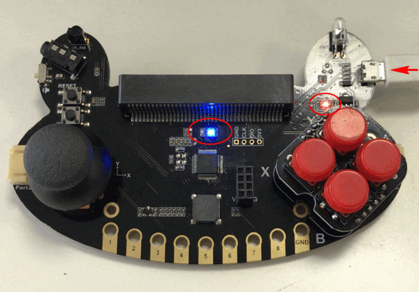

# Kittenblock中快速上手

假设你的串口已经完成安装了，这时候我们进入到Kittenblock中的快速学习，Kittenblock是由小喵科技开发的基于Scratch3.0的图形化编程软件。

## Kittenblock下载与安装

[Kittenblock安装参照这个帖子](http://learn.kittenbot.cn/zh_CN/latest/kittenblock/00Kittenblock%E5%AE%89%E8%A3%85.html)

## 插上青蛙手柄

## Kittenblock中软件操作

请注意使用青蛙手柄，注意软件要升级到1.8.3e以上才有青蛙手柄这个硬件

### 选择硬件

### 选择串口

如果前面一节，你没有安装青蛙手柄的串口驱动，这个是不会显示出来的

### 连接成功

## 青蛙手柄编程快速开始

第一次使用，可以直接打开我们提供的全功能测试程序。

[程序下载](https://bbs.kittenbot.cn/forum.php?mod=attachment&aid=MjkxNHxmZGZjMmNmMnwxNTU4NTA3MDMyfDN8NTU1)

后面会把这个全功能测试程序集合在软件的例子系统里面，暂时还没放进去。

默认你已经选好硬件与选择好串口了

打开后程序如下：

你现在可以操作手柄，对应电脑会朗读你操作的摇杆方向或者按键的键名回来（需要电脑联网，因为语音朗读是通过网络API进行朗读），电脑喇叭也需要开启，不然没有声音

按下电脑键盘的“n”与“m”对应测试红外发射与接收，如果红外正确被接受蜂鸣器会响出对应的音乐（必须提前安装好串口，并且连接上串口）
