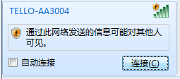
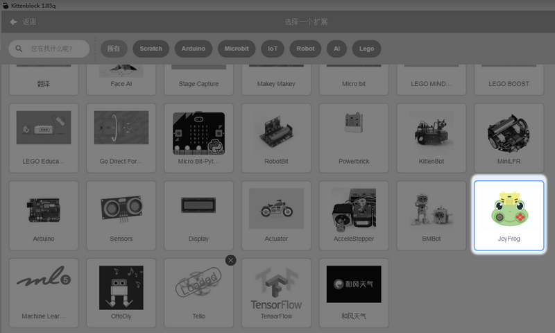
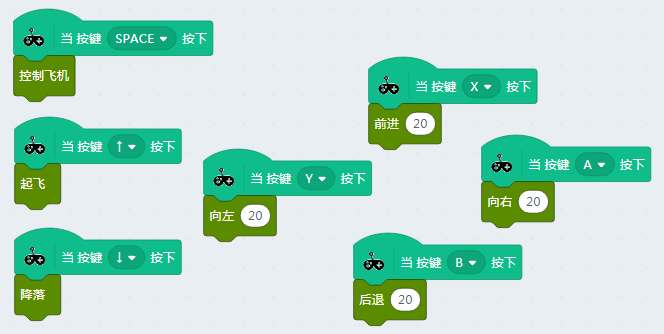

# 呱比特项目实战——呱比特控制大疆Tello

## 项目介绍

通过呱比特遥控大疆Tello

## 软件

- Kittenblock

## 器材准备

- 电脑与数据线
- 呱比特
- 大疆Tello（可以不用买edu版本，我买的就是最便宜的版本）

无人机使用要注意安全，切勿伤到人。

## 项目原理     

呱比特可以和Kittenblock进行交互，大疆Tello也可以和Kittenblock进行交互。所以虽然呱比特和Tello不能直接连接，但是通过Kittenblock作为沟通的桥梁，就可以控制Tello飞行。本质呱比特作为一个键盘来控制Tello。

## 项目操作

首先我们需要学会Tello控制，然后再把手柄遥控加进去。

### 学会tello控制

这是我的电脑找到tello的wifi

[Tello在Kittenblock中使用可以，看这个帖子](http://learn.kittenbot.cn/zh_CN/latest/kittensuite/Tello.html)

学会了Tello在Kittenblock中使用，再往下操作。不然程序累加很难找出问题来。

### 增加呱比特的插件

在选好Tello的硬件基础上，点击左下角扩展                                      

### 呱比特成功加载

### 进行组合编程

控制飞机这个是少不了的。SPACE就是空格键，按下呱比特的摇杆就是空格键。

摇杆往上推，飞机起飞，摇杆往下推降落。右边红色按键分别控制前后左右。

### 试玩

首先按下摇杆键，飞机已经就绪。

摇杆往前推，飞机起飞。起飞后，我们可以按手柄右侧按钮控制飞机前后左右运动，摇杆往下，飞机降落。

tello续航能力大概就是5分钟，所以如果不想扫兴，一般需要准备多几块电池，控制飞机是，切记注意安全

