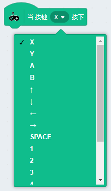

# 手柄按键与金手指检测积木块

## 成功加载青蛙手柄分栏，并连接上

如下图，出现绿色的勾勾图标，就证明串口已经正确连接上了

## 手柄按键与金手指检测积木块

### 使用示例1——xy按键按下播放蜂鸣器音乐

确保青蛙手柄的串口已经连接上，否则板上的蜂鸣器不会响。

**操作与结果：**按下X或者Y按键，蜂鸣器就会响起音乐来。

### 使用示例2——摇杆左右控制小猫移动

手柄摇杆左右可以控制舞台小猫左右移动

问：摇杆能否读到模拟值？

答：不能，因为如果摇杆涉及读到不同模拟值，对应Scratch角色运动控制比较麻烦。本手柄主要针对初学者入门，所以摇杆没有做读模拟值

**操作与结果：**左右摇动下摇杆，观察小猫会在舞台随着摇杆左右移动

### 使用示例3——摇杆按下

摇杆除了可以上下左右摇动，还有一个确认按钮(就是直接按下摇杆)。所以这里特意做了一个示例用来说明摇杆按键。

**操作与结果：**当你按下摇杆杆件，舞台小喵会说出“摇杆按键按下”，两秒后文字消失，再按下时候，重新说出“摇杆按键按下”

### 使用示例4——金手指触摸

青蛙手柄其中一个很好玩的功能就是——金手指触摸。金手指触摸还可以通过鳄鱼夹连接到各种水果上或者金属的物体上。

**程序**：

编写触摸金手指1和2，对应舞台小猫触发说“1被触发！”或者“2被触发！”

**操作**

一只手摸着GND（黑色鳄鱼夹线的金属区域）

另外一只手摸着金手指1或者金手指2（红色或者黄色的金属区域）。

舞台小喵就会说“1被触发！”或者“2被触发！”

当然你也可以连接8个鳄鱼夹，，鳄鱼夹夹上水果（推荐使用香蕉），刚好做出一个水果琴。如图，**GND那里也要接一个香蕉，否则不会触发**

