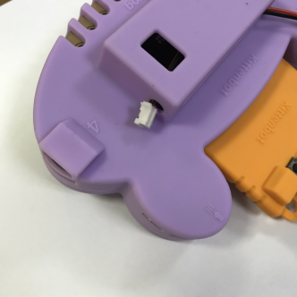
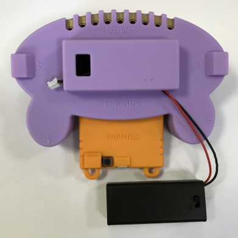
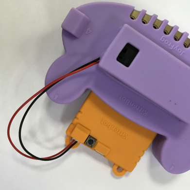

# 青蛙手柄安装电池盒

当然你可以选择给Microbit usb供电，或者用2节7号电池盒给Microbit供电，或者充电宝给青蛙手柄供电。这样就脱离usb线无拘无束了。

## 将电池盒端子塞过硅胶套的孔那边去

## 再慢慢将电池盒全塞到里面去

## 最后把电池盒开关往下打开即可

打开电池盒的一瞬间 ，青蛙手柄蜂鸣器，会发出一个短曲

## 电池盒一般配套Microbit蓝牙与电脑通讯使用

通过电池盒，我们就无需usb线供电了

