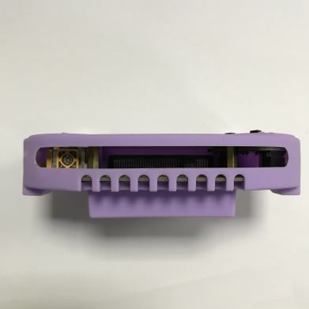

# 如何安装青蛙手柄硅胶套

一般用户买到的青蛙手柄已经安装好硅胶套。我们有些天使用户之前买到是没有带硅胶套的（感谢我们的天使用户），这里就专门写个帖子，教大家如何安装我们的手柄硅胶套。也为了满足那些喜欢拆产品的友友，拆开后如何安装回去（滑稽脸）

## 准备青蛙手柄硅胶套

## 摘下摇杆帽和按键帽

## 现将眼睛插入硅胶套中

## 硅胶套弹性很好，只有不用尖锐东西去刺穿就OK

延展性很好，可以用力扯都没有问题

## 把摇杆帽和按键帽重新装回去

调整下硅胶套的一些细节位置，让硅胶套装得正一点

