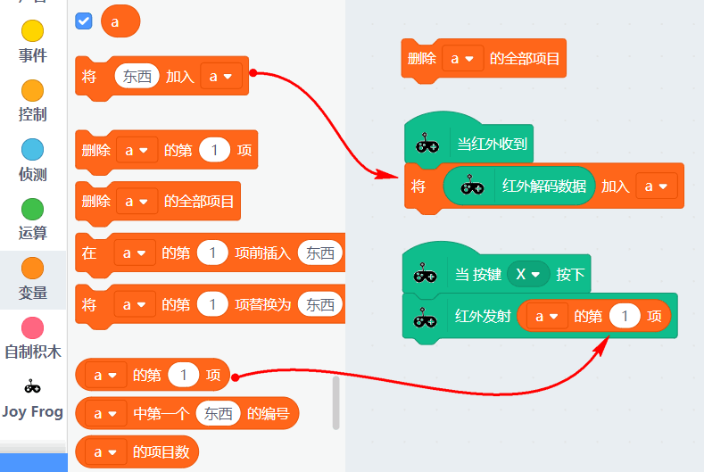
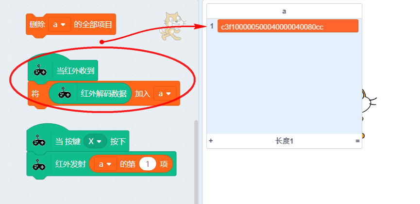
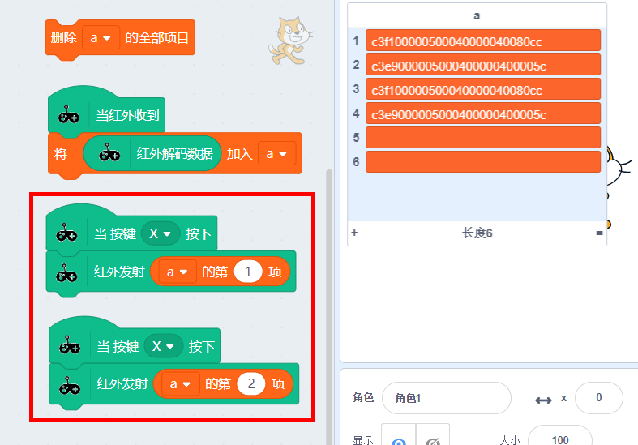

# 红外控制家用电器

## 成功加载青蛙手柄分栏，并连接上

如下图，出现绿色的勾勾图标，就证明串口已经正确连接上了

## 控制空调示例

实验准备：

1. 能被红外控制的家电和它遥控器
2. 呱比特
3. 电脑
4. USB数据线

### 连接串口

呱比特串口必须连接上！这个是国际惯例（请看前面的两篇红外教程）

### 编写程序

新建列表！列表！如图操作：列表名任意

列表成功建立：

编写一个红外解码与红外发射的程序。

- 当红外接收器接收到红外码（红外码只针对NEC），对应把解码的数据放入列表中
- 选择“删除a的全部项目”进行清空列表
- 按下按键X，进行红外码发射，发射列表的第一项

### 实验开始

我用空调遥控器，按下温度+号，对着呱比特进行发射红外码，可以看到列表就会出现了第一项。

**小知识：**空调这些复杂点点的电器，这个红外码实质是保存了很多数据，温度、制冷模式、风速等等。如果你再按一次+号。温度就又进行变化了，所以这次读回来的“+”红外码与上一次的不一样。很多用户经常卡在这里，总是以为按键码是固定的，像这种长编码都会根据数据进行变化的。

例如这里交替按温度的+号和-号，我们可以看到接收到的红外码如下

对应我们可以设置多个按键，发送不同的红外码

## 常见问题与解答

问：问什么我解码解不出来，没有反应？

答：呱比特需要连接上串口（COMX-JoyFrog）了。另外我们红外解码只支持NEC协议，市面上大部分的家电是NEC协议，也有一些比较特殊的，就没办法解出了

问：红外码我已经解出来了，为啥控制没反应？

答：我们红外解码方式是采用录制的方式，红外解码时，应避免其他强光干扰。请多按几次，确保这个按键码的红外码无误。

市面上某些家电比较特殊，红外协议时序非常严格，所以有时候这个红外发射解码的功能会不奏效。

这时，我们只能换别的家电进行控制。

